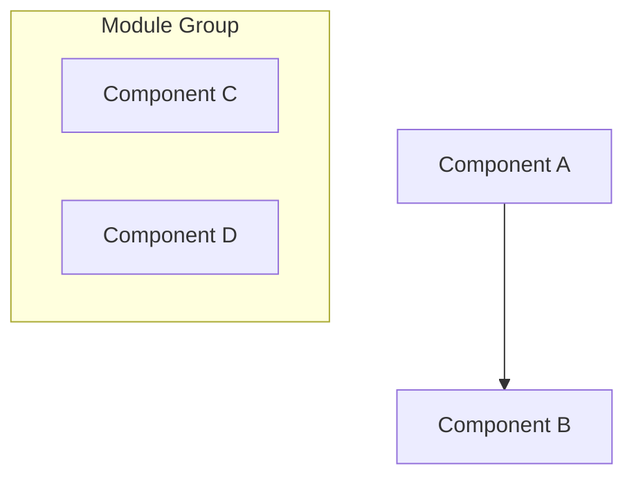
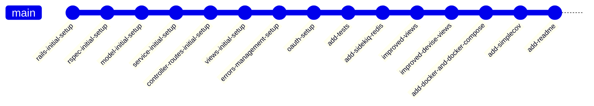
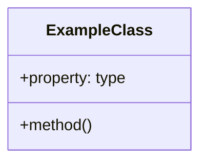
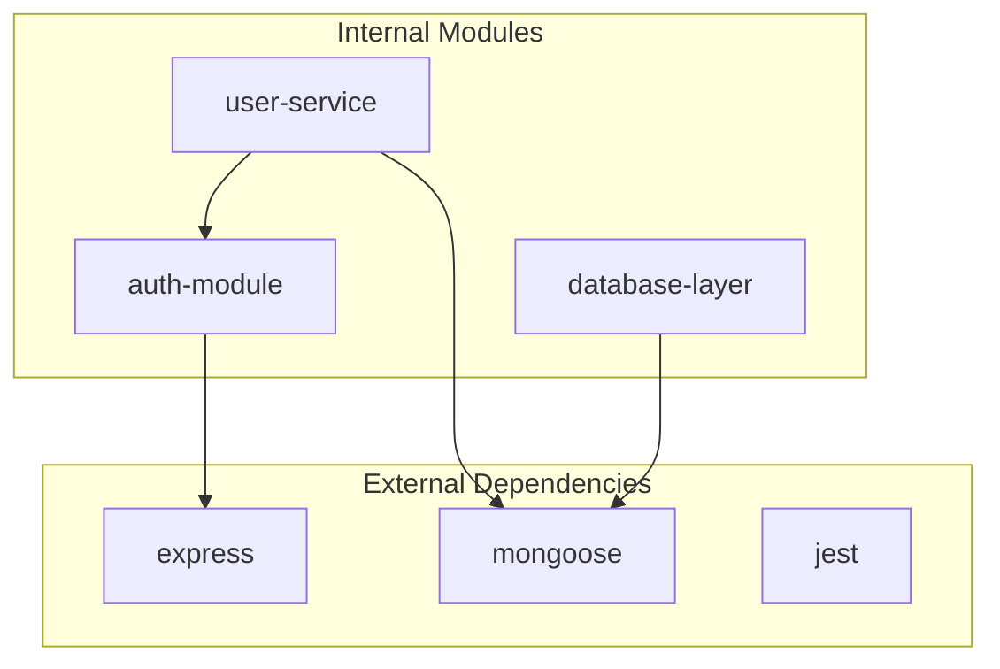
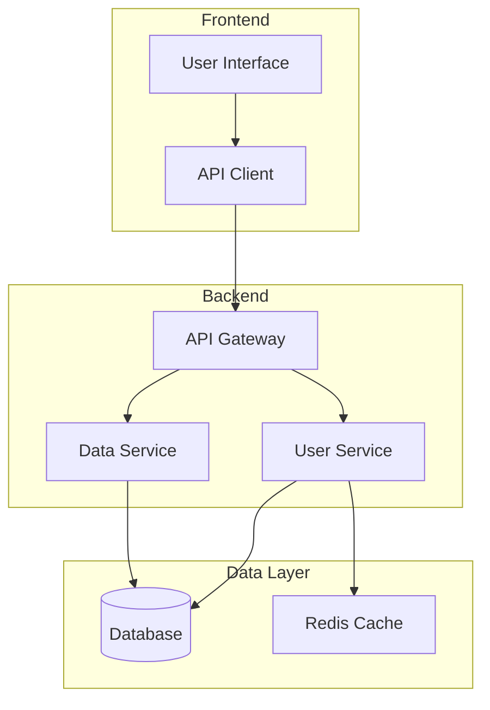

# Project Documentation Generator

**Note**: Ensure that there is exactly one blank line after each section title before the content (e.g., **Summary**\n\nYour text...).

**Context**: This prompt generates comprehensive project documentation for any external project specified by the user. This is a template within for analyzing and documenting third-party projects, tools, frameworks, or libraries.

**Instructions**: 
1. Identify the project URL from #file:README.md under "Homepage" section (look for the project name the user has specified) or follows the symlink to the external project in #folder:src if provided.
2. Fetch and analyze the project's official website, repository, and documentation
3. Review any additional resources in #folder:resources that relate to the specified project
4. Generate comprehensive documentation following the structure and formatting rules below
5. Focus on the external project being analyzed, not the zsh-today-manager system itself

## Contents

Do: Generate a comprehensive table of contents for the project documentation, including anchor links to each major section. 

**Format**: Use `- [Section Title](#section-title)` for each section, where section titles are converted to lowercase with spaces replaced by hyphens.

**Required sections**:
- Summary
- Architecture (with Key Concepts subsection)  
- Tech Stack
- Getting Started (if applicable)
- Usage Examples (if applicable)
- Contributing Guidelines (if applicable)
- Troubleshooting (if applicable)
- License (if applicable)
- References

### Summary

Do: Summarize the external project comprehensively by analyzing multiple sources:
- The project's official homepage URL (specified in README.md under Homepage section)
- Project's official documentation, GitHub repository, and README files
- Any additional resources in #folder:resources related to this project
- Project's source code structure and patterns (if accessible)
- Community resources, tutorials, and discussions about the project

**Requirements**:
- Write 2-3 paragraphs explaining the project's purpose, goals, and main functionality
- Include key features and benefits of the external project
- Mention target audience or use cases for the project
- Explain why this project is relevant or interesting to analyze
- Keep language clear and accessible

### Architecture

Do: Create a comprehensive Mermaid diagram showing the external project's architecture and data flow.

**Requirements**:
- Analyze the project's documentation, source code (if available), or architectural descriptions
- Use appropriate Mermaid diagram types (flowchart, sequence, class, etc.)
- Identify and map key components, modules, or services of the external project
- Show relationships and data flow between components
- Use subgraphs to group related functionality within the project
- Keep component names concise but descriptive
- Include external dependencies or integrations the project uses
- Base the diagram on publicly available information about the project's architecture

**Format**: Wrap the Mermaid code in ```mermaid code blocks

**Example structure**:


#### Alternative Perspectives

Do: Create additional Mermaid diagrams to provide different visual perspectives on the external project's content and architecture. Include these three alternative diagram types:

**For Ruby on Rails Projects:**

1. **Gems Dependency Diagram**: Show the key gems from the Gemfile and their relationships, plus the Active Record models and their associations using proper Mermaid syntax (e.g., `"1" --> "*"` for relationships, `User ||--o{ Post : "has many"`).

2. **Dependencies and Models**: Show the Active Record models and their associations using proper Mermaid syntax (e.g., `"1" --> "*"` for relationships, `User ||--o{ Post : "has many"`).

**For Non-Rails Projects:**

1. **Package/Module Dependencies**: Create a dependency graph showing how different packages, modules, or components depend on each other, including external libraries and internal modules.

2. **Class Diagram - Structural Relationships**: Show the conceptual entities as classes with their properties and methods, and their relationships using proper Mermaid class diagram syntax (e.g., `"1" --> "*"` for relationships).

**For All Projects:**

3. **Mind Map - Interconnected Themes**: Build a mind map diagram radiating from the central concept, showing how all themes and ideas interconnect in a holistic view.

4. **Deployment Architecture**: Show how the project is deployed across different environments, including containers, services, databases, and external dependencies.

6. **Git Graph**: Build a Git Graph Diagram using proper Mermaid syntax (see below), omit repetitive commits, and focus on the main development branches and significant commits that represent the project's evolution:


**Requirements for Alternative Perspectives**:
- Each diagram should provide a unique viewpoint of the project's architecture or workflow
- Use appropriate Mermaid syntax for each diagram type (classDiagram, stateDiagram, mindmap)
- For Rails projects: Focus on gems ecosystem and Active Record relationships; for others: structural classes
- Focus on different aspects: dependencies/models (Rails), structural (non-Rails), behavioral (state), and conceptual (mind map)
- Ensure diagrams complement rather than duplicate the main architecture diagram
- Base all diagrams on the external project's documented features and architecture
- **Use collapsible sections** to keep the main documentation clean and readable while providing detailed technical diagrams on-demand

**Benefits of Collapsible Sections**:
- Improves document readability by reducing visual clutter
- Allows users to access detailed diagrams only when needed
- Maintains comprehensive technical coverage without overwhelming casual readers
- Follows modern documentation best practices for progressive disclosure

**Format**: 
- Wrap each diagram in HTML `<details>` and `<summary>` tags for collapsible sections
- Use descriptive summary text with "(Click to expand)" instruction
- Include Mermaid code blocks within the collapsible sections

**Example format for Rails projects**:
```html
<details>
<summary><strong>1. Gems Dependency Diagram - Dependencies and Models</strong> (Click to expand)</summary>

```mermaid
graph TD
    subgraph "Core Gems"
        Rails[Rails 8.0.2]
        Devise[Devise 4.9]
        Sidekiq[Sidekiq 8.0]
    end
    
    subgraph "Models"
        User
        Post
    end
    
    Rails --> User
    Rails --> Post
    Devise --> User
    User ||--o{ Post : "has many"
```

</details>
```

**Example format for non-Rails projects**:
```html
<details>
<summary><strong>1. Class Diagram - Structural Relationships</strong> (Click to expand)</summary>



</details>

<details>
<summary><strong>2. Package/Module Dependencies</strong> (Click to expand)</summary>



</details>

<details>
<summary><strong>3. Component Architecture</strong> (Click to expand)</summary>



</details>
```

#### Key Concepts

Do: Generate a comprehensive list of key concepts, terms, and architectural patterns used in the external project.

**Requirements**:
- Extract concepts from the project's documentation, source code, and community resources
- Provide clear, concise definitions (1-2 sentences each) based on the project's own terminology
- Include both technical and domain-specific terms relevant to the project
- Order by importance or logical grouping within the project's context
- Focus on concepts that are central to understanding how the project works

**Format**: Use bullets with * and bold concept names:
* **Concept Name**: Clear definition explaining what it is and its role in the external project
* **Another Concept**: Definition with context about how it relates to the project's overall system

**Example** (for a hypothetical project):
* **Event-Driven Architecture**: The project uses asynchronous event processing for handling user interactions
* **Plugin System**: Extensible architecture allowing third-party developers to add functionality

### Tech Stack
Do: Generate a comprehensive technology stack analysis by examining the external project's structure, dependencies, and implementation details.

**Analysis Sources**:
- Project's official documentation and README files
- Repository files: package.json, requirements.txt, Gemfile, Gemfile.lock, Cargo.toml, etc.
- Build configuration files and CI/CD setups
- Deployment documentation and infrastructure descriptions
- Community discussions and technical blog posts about the project
- Any resources in #folder:resources related to the project's technology choices

**For Ruby on Rails Projects - Categories to include** (only if relevant to the external project):
* **Programming Language**: Ruby version specified in .ruby-version or Gemfile
* **Framework**: Rails version and major components (Active Record, Action Controller, etc.)
* **Authentication**: Authentication gems (Devise, OmniAuth, etc.)
* **Background Processing**: Job processing gems (Sidekiq, Resque, Delayed Job)
* **Database**: Database gems and adapters (mysql2, pg, sqlite3)
* **Testing Framework**: Testing gems (RSpec, Minitest, Factory Bot, Capybara)
* **Frontend**: Frontend-related gems (Turbo, Stimulus, Webpacker, Asset Pipeline)
* **API**: API-related gems (Jbuilder, Active Model Serializers)
* **Security**: Security-related gems (Brakeman, Bundler Audit)
* **Development Tools**: Development gems (Puma, Foreman, web-console)
* **Deployment**: Deployment gems (Kamal, Capistrano)
* **Caching**: Caching solutions (Redis, Memcached)
* **File Storage**: Storage gems (Active Storage, Paperclip, CarrierWave)
* **Environment Management**: Configuration gems (dotenv, figaro)

**For Non-Rails Projects - Categories to include** (only if relevant to the external project):
* **Programming Language**: Primary language(s) the project uses with versions if available
* **Framework**: Web frameworks, application frameworks, or development frameworks the project is built on
* **Libraries/Dependencies**: Key external libraries and packages the project depends on
* **Build Tools**: Compilation, bundling, or build automation tools the project uses
* **Testing Framework**: Unit testing, integration testing tools used in the project
* **Database**: Data storage solutions the project utilizes (SQL, NoSQL, file-based, etc.)
* **Deployment**: Platforms, containerization, cloud services the project supports or uses
* **CI/CD**: Continuous integration and deployment tools the project employs
* **Development Tools**: IDEs, linters, formatters recommended or used by the project
* **Version Control**: Git workflows, hosting platforms the project uses
* **Documentation**: Documentation generation tools the project uses
* **Monitoring**: Logging, analytics, error tracking systems the project integrates with
* **Security**: Authentication, authorization, security scanning tools the project implements

**Format**: Use bullets with * for each technology category that applies to the external project.

### Getting Started

Do: Provide step-by-step installation and setup instructions for the external project (if applicable).

**Requirements**:
- Extract installation instructions from the project's official documentation
- List system requirements and prerequisites mentioned by the project
- Include installation commands with proper shell syntax as documented by the project
- Provide configuration steps as outlined in the project's documentation
- Include verification steps to confirm successful setup (if provided by the project)
- Mention any environment variables or configuration files the project requires
- Reference the project's own installation guides and quick-start documentation

**For Ruby on Rails Projects - Additional Requirements**:
- Include Ruby version requirements from .ruby-version or Gemfile
- Document database setup steps (rails db:create, rails db:migrate)
- Include bundle install for gem dependencies
- Mention any required services (Redis, PostgreSQL, MySQL)
- Include environment variable setup (.env files)
- Document asset compilation if needed
- Include Sidekiq or background job setup if applicable

**Format**: Use numbered lists for sequential steps, code blocks for commands as documented by the project authors.

### Usage Examples

Do: Provide practical examples of how to use the external project (if applicable).

**Requirements**:
- Extract examples from the project's official documentation, README, or tutorials
- Include common use cases with example commands/code as documented by the project
- Show input and expected output based on the project's documentation
- Explain what each example demonstrates according to the project's own explanations
- Progress from basic to advanced examples as presented in the project's materials
- Use real-world scenarios provided by the project or its community
- Credit the source of examples when taken from project documentation

**Format**: Use code blocks for examples, with explanatory text before each example as provided by the project.

### Contributing Guidelines

Do: Outline how others can contribute to the external project (if it's open source and has contribution guidelines).

**Requirements**:
- Extract contribution information from the project's CONTRIBUTING.md, README, or documentation
- Explain the project's contribution process as documented by the maintainers
- Include coding standards or style guides referenced by the project
- Mention how to report issues or request features according to the project's guidelines
- Describe the development workflow as outlined by the project
- Include any testing requirements specified by the project
- Reference the project's code of conduct if available

**Format**: Use clear sections and bullet points for guidelines as provided by the project.

### Troubleshooting

Do: Address common issues and their solutions (if applicable).

**Requirements**:
- List known issues and their workarounds
- Include debugging tips
- Provide links to additional help resources
- Explain how to report new issues

**Format**: Use Q&A format or problem/solution pairs.

### License

Do: Include license information if available in the project files.

**Requirements**:
- State the license type
- Include copyright information
- Link to full license text if available

### References
Do: Compile all references and resources used to create the documentation about the external project.

**Sources to include**:
- The external project's homepage URL (from README.md Homepage section)
- Project's official documentation, GitHub repository, and wiki pages
- All files and links in #folder:resources related to this external project
- Official API documentation or technical specifications
- Community tutorials, blog posts, and learning resources about the project
- Related tools, libraries, or competing projects for context
- Academic papers or technical articles that reference the project

**Requirements**:
- Verify all URLs are accessible and current
- Group related references together (official docs, community resources, etc.)
- Provide brief descriptions for each reference explaining its relevance to understanding the project
- Include access dates for web resources
- Prioritize official sources from the project maintainers

**Format**: Use bullets with * for each reference:
* [Reference Title](URL) - Brief description of what this resource contains and why it's relevant to understanding the external project
* [Another Reference](URL) - Description of its contribution to understanding the project's functionality, architecture, or ecosystem

**Quality Guidelines**:
- Prioritize official and authoritative sources from the project itself
- Include primary sources over secondary when possible
- Ensure references add value and aren't redundant
- Focus on resources that help understand the external project, not the zsh-today-manager system

---

## Quality Assurance Guidelines

**Documentation Quality**:
- Ensure all sections are relevant to the specific external project being analyzed
- Use consistent formatting and markdown syntax
- Verify all code examples are syntactically correct according to the external project's standards
- Test all URLs and links for accessibility, especially official project resources
- Check grammar and spelling throughout
- Maintain objectivity when describing the external project

**Content Completeness**:
- Include only sections that apply to the external project
- Skip sections with "if applicable" when not relevant to the specific project
- Ensure architecture diagrams accurately reflect the external project's documented architecture
- Validate technical stack information against the external project's actual dependencies and documentation
- Base all information on publicly available, credible sources

**Consistency Guidelines**:
- Use the same terminology throughout the document, preferring the external project's own terminology
- Maintain consistent code formatting and style as used by the external project
- Follow the external project's existing documentation patterns when possible
- Ensure examples align with the external project's actual API or interface
- Distinguish clearly between official information and community-generated content

**Update Instructions**:
- Review and update documentation when the external project releases new versions
- Verify references and links remain current, especially for rapidly evolving projects
- Update version numbers and dependency information based on the latest project releases
- Refresh examples to reflect the external project's current best practices and API changes
- Note the date of analysis since external projects evolve independently


