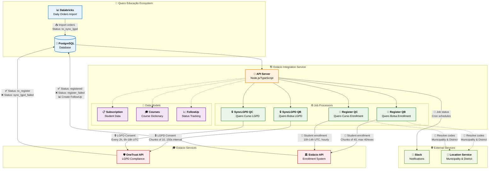
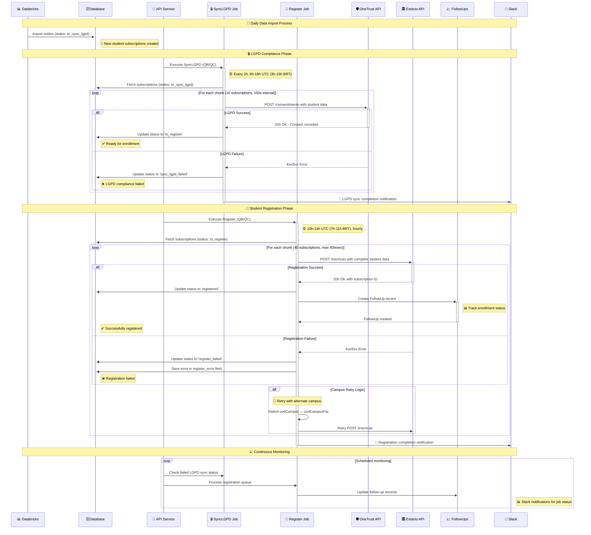
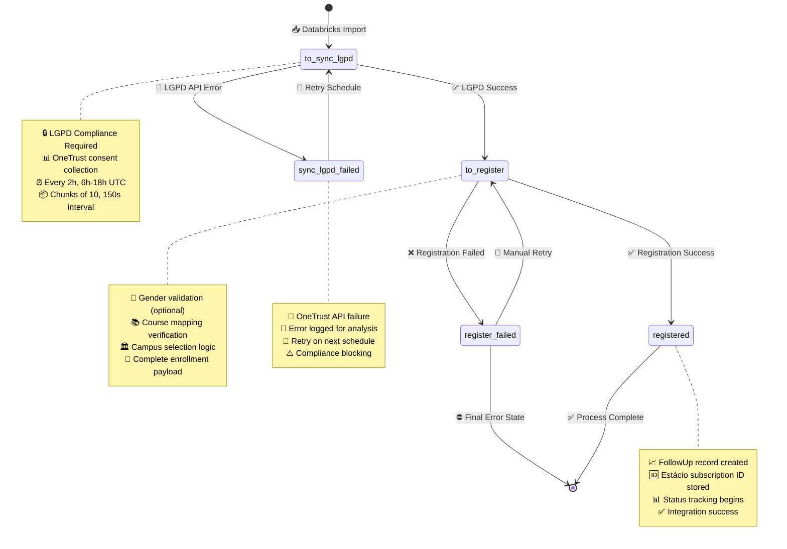
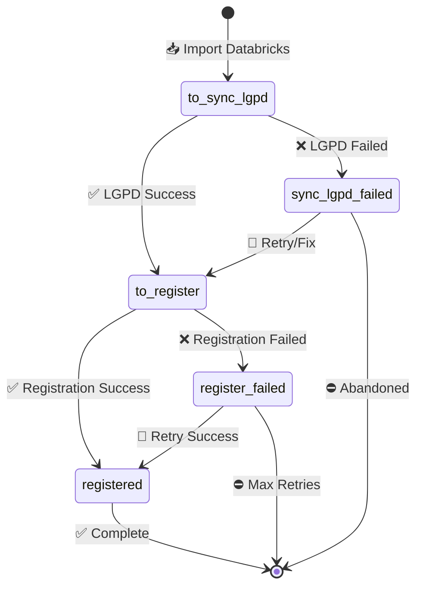

# Integração de Leads da Estácio

## Conteúdo

- [Processo de Inscrição da Estácio](#processo-de-inscrição-da-estácio)
- [Contexto de Negócio](#contexto-de-negócio)
- [Arquitetura](#arquitetura)
- [Perspectivas Alternativas](#perspectivas-alternativas)
- [Lista de IES/integradores com integração ativa](#lista-de-iesintegradores-com-integração-ativa)
- [Catálogo Completo de APIs](#catálogo-completo-de-apis)
- [Esquema de payloads esperados por tipo de evento](#esquema-de-payloads-esperados-por-tipo-de-evento)
- [Padrão de autenticação por tipo de integração](#padrão-de-autenticação-por-tipo-de-integração)
- [Endpoints de envio](#endpoints-de-envio)
- [Regras de negócio por integração ativa](#regras-de-negócio-por-integração-ativa)
- [Definição de eventos mínimos por tipo de ação](#definição-de-eventos-mínimos-por-tipo-de-ação)
- [Formato de resposta esperado das APIs externas](#formato-de-resposta-esperado-das-apis-externas)
- [Status de processamento - follow_ups table](#status-de-processamento---follow_ups-table)
- [Monitoramento e Saúde do Sistema](#monitoramento-e-saúde-do-sistema)
- [Guia de Operação para Stakeholders](#guia-de-operação-para-stakeholders)
- [Troubleshooting e FAQ](#troubleshooting-e-faq)
- [References](#references)

## Processo de Inscrição da Estácio

O sistema de integração de leads da Estácio é um serviço Node.js/TypeScript que automatiza o processo de inscrição de estudantes no vestibular da Estácio através de suas APIs oficiais. Este sistema funciona como ponte entre o ecossistema Quero Educação (Quero Bolsa e Quero Curso) e os sistemas internos da Estácio, garantindo conformidade com a LGPD e processamento eficiente de inscrições.

O processo é dividido em duas etapas principais: primeiro a sincronização LGPD obrigatória através da API OneTrust da Estácio, onde são registrados os consentimentos e dados pessoais dos alunos; em seguida, a inscrição propriamente dita no sistema de vestibular da Estácio. O sistema processa automaticamente milhares de inscrições diariamente, com controle de rate limiting, retry automático em caso de falhas, e notificações via Slack para monitoramento.

Características principais incluem suporte para diferentes modalidades de curso (presencial/EAD), níveis educacionais (graduação, segunda graduação, técnico, pós-técnico), turnos variados, e integração com múltiplos campus. O sistema mantém rastreabilidade completa através da tabela `follow_ups`, permitindo acompanhamento do status de cada inscrição desde o registro inicial até a confirmação final.

## Contexto de Negócio

### Para que serve esta integração?

**Objetivo Principal**: Automatizar as inscrições de alunos do Quero Educação no vestibular da Estácio, garantindo conformidade com a LGPD e processamento eficiente de milhares de inscrições diárias.

### Por que é importante?

1. **Conformidade Legal**: Garante que todos os dados pessoais sejam tratados de acordo com a LGPD
2. **Eficiência Operacional**: Automatiza processo que seria manual, reduzindo erros e tempo
3. **Rastreabilidade**: Mantém histórico completo de cada inscrição para auditoria
4. **Escalabilidade**: Processa milhares de inscrições sem intervenção manual

### Como funciona na prática?

1. **Importação Diária**: Sistema Databricks importa dados de alunos interessados
2. **Conformidade LGPD**: Dados são enviados para OneTrust para registro de consentimento
3. **Inscrição Automática**: Após aprovação LGPD, sistema inscreve aluno no vestibular
4. **Acompanhamento**: Status da inscrição é monitorado e atualizado automaticamente

## Arquitetura



A arquitetura segue um padrão baseado em jobs com processamento em chunks para respeitar rate limits das APIs externas. O serviço principal (`EstacioLeadIntegration`) coordena múltiplos jobs que processam diferentes tipos de subscriptions (QB - Quero Bolsa, QC - Quero Curso). Cada job herda da classe base `Base` que implementa o padrão de chunking, interval processing e logging centralizado.

O sistema utiliza TypeORM para gerenciamento de entidades e migrations, com PostgreSQL como banco de dados principal. A camada de serviços (`services/`) abstrai integrações com APIs externas, enquanto factories (`factories/`) padronizam a criação de objetos Student a partir de Subscriptions. O processamento é scheduled via cron jobs com horários específicos para otimizar performance e evitar conflitos.

## Perspectivas Alternativas

<details>
<summary><strong>Sequence Diagram - Processo de Inscrição</strong> (Clique para expandir)</summary>



</details>

<details>
<summary><strong>State Diagram - Estados da Subscription</strong> (Clique para expandir)</summary>



</details>

## Lista de IES/integradores com integração ativa

| Instituição | Tipo de Integração | Status | Notas |
|-------------|-------------------|--------|-------|
| **Estácio** | API Direta | ✅ Ativo | Integração principal via API oficial |
| **Wyden** | API Compartilhada | ✅ Ativo | Utiliza mesma base da Estácio (university_ids: 83, 511, 517, 638, 835, 944, 951, 1106, 1228, 1309, 3569) |
| **OneTrust** | LGPD Compliance | ✅ Ativo | Pré-requisito obrigatório para todas as inscrições |
| **Quero Bolsa** | Origem de Dados | ✅ Ativo | Processado via jobs syncLGPDQB e registerQB |
| **Quero Curso** | Origem de Dados | ✅ Ativo | Processado via jobs syncLGPDQC e registerQC |

## Catálogo Completo de APIs

### 🏛️ Estácio API

**Propósito**: API principal para inscrições no vestibular da Estácio

**Configuração**:
```typescript
interface EstacioConfig {
  baseUrl: string;        // API_ESTACIO_BASE_URL (legacy)
  newBaseUrl: string;     // API_ESTACIO_NEW_BASE_URL (atual)
  clientId: string;       // API_ESTACIO_CLIENT_ID
  token: string;          // API_ESTACIO_TOKEN (legacy)
  newToken: string;       // API_ESTACIO_NEW_TOKEN (atual)
}
```

**Autenticação**: Headers customizados
```typescript
{
  'x-canal': clientId,
  'x-api-key': newToken
}
```

**Rate Limiting**: 40 requisições por execução, chunks de 40 estudantes

**Endpoints Principais**:
- `POST /inscricao` - Inscrição de estudante

### 🛡️ OneTrust API

**Propósito**: Conformidade LGPD obrigatória para processamento de dados pessoais

**Configuração**:
```typescript
interface OneTrustConfig {
  baseUrl: string;        // API_ONETRUST_BASE_URL
  clientId: string;       // API_ONETRUST_CLIENT_ID
  clientSecret: string;   // API_ONETRUST_CLIENT_SECRET
  finalidadeId: string;   // API_ONETRUST_FINALIDADE_ID
  topicoId: string;       // API_ONETRUST_TOPICO_ID
  token: string;          // API_ONETRUST_TOKEN
}
```

**Autenticação**: Client Credentials
```typescript
{
  'client_id': clientId,
  'client_secret': clientSecret
}
```

**Rate Limiting**: 10 requisições por chunk, intervalo de 150s entre chunks

### 📍 Location Service

**Propósito**: Resolução de códigos de município e bairro

**Configuração**: Utiliza base URL da Estácio com tokens específicos

**Funcionalidade**: Converte CEP em códigos municipais e de bairro necessários para inscrição

### 📧 Exam API

**Propósito**: Integração com sistema de provas (identificado no código)

**Configuração**:
```typescript
interface ExamConfig {
  baseUrl: string;        // API_EXAM_BASE_URL
  token: string;          // API_EXAM_TOKEN
}
```

**Status**: Presente na configuração, uso específico a ser documentado

## Esquema de payloads esperados por tipo de evento

### registerQB / registerQC (Inscrição no Vestibular)

**Contexto de Negócio**: Este payload é usado para inscrever um aluno no vestibular da Estácio após aprovação LGPD.

**Estácio API payload:**
```typescript
interface EstacioEnrollmentPayload {
  // Configuração da forma de ingresso
  codFormaIngresso: string;  // "24"=Graduação, "2"=Segunda Graduação, "15"=Técnico/Pós-técnico
  
  // Informações do campus e curso
  codCampus: number;         // Código do campus (pai ou filho)
  codCurso: number;          // Código do curso (pai ou específico)
  numHabilitacao: number;    // Número da habilitação
  codTurno: string;          // Código do turno
  indModalidade: string;     // "presencial" ou "ead"
  
  // Dados pessoais do candidato
  nomeCandidato: string;     // Nome completo
  enderecoEmail: string;     // Email válido
  numTelefoneCelular: string; // Telefone celular
  cpfCandidato: string;      // CPF apenas números
  dataNascimento: string;    // Data no formato YYYY-MM-DD
  
  // Dados de endereço
  cepCandidato: string;      // CEP apenas números
  siglaUF: string;           // UF (ex: "SP", "RJ")
  endCandidato: string;      // Nome da rua/avenida
  numEndCandidato: string;   // Número do endereço
  codMunicipio: number;      // Código do município (via Location Service)
  codBairro: number;         // Código do bairro (via Location Service)
  
  // Dados ENEM (opcionais)
  numInscEnem: null;         // Número de inscrição ENEM
  anoEnem: null;             // Ano do ENEM
  numNotaCienciasHumanas: null;   // Nota Ciências Humanas
  numNotaCienciasNatureza: null;  // Nota Ciências da Natureza
  numNotaLinguagens: null;        // Nota Linguagens
  numNotaMatematica: null;        // Nota Matemática
  numNotaRedacao: null;           // Nota Redação
  
  // Dados comerciais
  codAgentePdv: number;      // 11379=Paid, 14412833=Lead
}
```

**Regras de Negócio**:
- `codFormaIngresso` é determinado pelo nível educacional
- `codCampus` usa código pai quando disponível, senão código específico
- `codAgentePdv` diferencia alunos pagantes (11379) de leads (14412833)
- Coordenadas de localização são obrigatórias via Location Service

### syncLGPDQB / syncLGPDQC (Conformidade LGPD)

**Contexto de Negócio**: Este payload registra o consentimento LGPD do aluno antes de permitir a inscrição.

**OneTrust API payload:**
```typescript
interface OneTrustPayload {
  documento: string;         // CPF apenas números
  pontoColetaToken: string;  // Token do ponto de coleta (API_ONETRUST_TOKEN)
  
  finalidades: Array<{
    id: string;              // ID da finalidade (API_ONETRUST_FINALIDADE_ID)
    preferencias: Array<{
      idTopico: string;      // ID do tópico (API_ONETRUST_TOPICO_ID)
    }>;
  }>;
  
  atributos: Array<{
    atributo: string;        // Nome do atributo
    valor: string;           // Valor do atributo
  }>;
  
  // Atributos padrão extraídos dos dados do aluno:
  // - Nome completo
  // - Data de nascimento  
  // - CEP
  // - Endereço completo
  // - Email
  // - Telefone
  // - Outros dados pessoais conforme necessário
}
```

**Dados extraídos da Subscription para LGPD:**
```typescript
interface SubscriptionLGPDData {
  name: string;
  cpf: string;
  birthday: string; // formato: YYYY-MM-DD
  email: string;
  area_code: string;
  phone_number: string;
  address: string;
  address_number: string;
  postal_code: string;
  neighborhood: string;
  student_city: string;
  student_state: string;
  qb_course_name: string;
  university_course_name: string;
  modalidade: string; // 'Presencial' | 'EaD'
  nivel: string; // 'Graduação' | 'Segunda Graduação' | 'Técnico' | 'Pós-técnico'
  turno: string;
  campi: string;
  mensalidade_qb: number;
  mensalidade_cheia: number;
  metadata: string; // JSON string
  order_id?: number;
  order_checkout_step?: string; // 'paid' | outros
}
```

## Padrão de autenticação por tipo de integração

### Estácio API
```typescript
// Headers de autenticação
{
  'x-canal': process.env.API_ESTACIO_CLIENT_ID,
  'x-api-key': process.env.API_ESTACIO_NEW_TOKEN
}
```

### OneTrust API  
```typescript
// Headers de autenticação
{
  'client_id': process.env.API_ONETRUST_CLIENT_ID,
  'client_secret': process.env.API_ONETRUST_CLIENT_SECRET
}
```

### Variáveis de Ambiente Necessárias
```bash
# Estácio API Configuration
API_ESTACIO_BASE_URL=https://api.estacio.br
API_ESTACIO_NEW_BASE_URL=https://newapi.estacio.br
API_ESTACIO_CLIENT_ID=partner_client_id
API_ESTACIO_TOKEN=legacy_token
API_ESTACIO_NEW_TOKEN=new_api_key

# OneTrust API Configuration  
API_ONETRUST_BASE_URL=https://api.onetrust.estacio.br
API_ONETRUST_CLIENT_ID=onetrust_client_id
API_ONETRUST_CLIENT_SECRET=onetrust_client_secret
API_ONETRUST_FINALIDADE_ID=finalidade_uuid
API_ONETRUST_TOPICO_ID=topico_uuid
API_ONETRUST_TOKEN=collection_point_token
```

## Endpoints de envio

### Estácio API Endpoints
- **Base URL:** `API_ESTACIO_NEW_BASE_URL`
- **Inscrição:** `POST /inscricao`
- **Headers:** x-canal, x-api-key
- **Rate Limit:** 40 requests por execução, chunks de 40, intervalo entre chunks

### OneTrust API Endpoints  
- **Base URL:** `API_ONETRUST_BASE_URL`
- **Consentimento:** `POST /consentimento` (endpoint inferido do código)
- **Headers:** client_id, client_secret  
- **Rate Limit:** 10 requests por chunk, intervalo de 150s entre chunks

### Endpoints de Apoio
- **Location Service:** Para resolução de códigos de município e bairro
- **Catalog Service:** Para consulta de cursos e campus

## Regras de negócio por integração ativa

### 📋 Regras de Processamento LGPD

**Para Stakeholders**: Antes de qualquer inscrição, é obrigatório registrar o consentimento do aluno para tratamento de dados pessoais.

**Regras Técnicas**:
1. **Processamento em Chunks**: Máximo 10 alunos por lote
2. **Intervalo Obrigatório**: 150 segundos entre lotes para respeitar rate limit
3. **Horário de Operação QC**: 6h às 18h UTC, a cada 2 horas
4. **Retry Automático**: Em caso de falha, nova tentativa em próxima execução
5. **Status Tracking**: `to_sync_lgpd` → `to_register` ou `sync_lgpd_failed`

### 📝 Regras de Inscrição no Vestibular

**Para Stakeholders**: Após aprovação LGPD, o sistema automaticamente inscreve o aluno no vestibular respeitando suas preferências de curso e campus.

**Regras de Forma de Ingresso**:
- **Graduação**: `codFormaIngresso = "24"`
- **Segunda Graduação**: `codFormaIngresso = "2"`
- **Técnico/Pós-técnico**: `codFormaIngresso = "15"`

**Regras de Campus**:
- Prioridade para `codCampusPai` quando disponível
- Fallback para `codCampus` específico
- Em caso de retry, tenta alternativa disponível

**Regras de Agente PDV**:
- **Alunos Pagantes** (checkout completo): `codAgentePdv = 11379`
- **Leads** (sem pagamento): `codAgentePdv = 14412833`

**Regras de Rate Limiting**:
1. **Processamento em Chunks**: Máximo 40 alunos por lote
2. **Limite por Execução**: Máximo 40 inscrições por job
3. **Horário QC**: 10h às 14h UTC, de hora em hora
4. **Processamento QB**: Contínuo respeitando limites

### 🗺️ Regras de Localização

**Para Stakeholders**: O sistema automaticamente converte o CEP do aluno em códigos internos da Estácio para município e bairro.

**Regras Técnicas**:
1. **Resolução Obrigatória**: Codes de município e bairro são obrigatórios
2. **Fallback em Erro**: Em caso de falha, inscrição é marcada como erro
3. **Cache Local**: Resultados são cacheados para otimização

## Definição de eventos mínimos por tipo de ação

### 🔄 Eventos do Sistema

**Para Stakeholders**: O sistema gera eventos automáticos para rastrear cada etapa do processo de inscrição.

| Evento | Descrição de Negócio | Trigger Técnico | Status Resultante |
|--------|---------------------|-----------------|-------------------|
| **import_subscription** | Aluno demonstra interesse e dados são importados | Databricks daily import | `to_sync_lgpd` |
| **sync_lgpd_start** | Início do processo de conformidade LGPD | Job syncLGPD execution | Processing |
| **sync_lgpd_success** | Consentimento LGPD registrado com sucesso | OneTrust API success | `to_register` |
| **sync_lgpd_failed** | Falha no registro de consentimento LGPD | OneTrust API error | `sync_lgpd_failed` |
| **register_start** | Início do processo de inscrição no vestibular | Job register execution | Processing |
| **register_success** | Inscrição realizada com sucesso | Estácio API success | `registered` |
| **register_failed** | Falha na inscrição no vestibular | Estácio API error | `register_failed` |
| **followup_created** | Registro de acompanhamento criado | After successful registration | Tracking active |

### 📊 Eventos de Monitoramento

| Evento | Finalidade | Frequência |
|--------|------------|------------|
| **job_started** | Notifica início de processamento | Por execução de job |
| **job_completed** | Notifica fim de processamento | Por execução de job |
| **job_error** | Notifica erros durante processamento | Por erro encontrado |
| **rate_limit_reached** | Avisa sobre limite de API atingido | Quando necessário |
| **retry_attempted** | Registra tentativa de retry | Por retry executado |

### Register Actions
**Eventos obrigatórios:**
1. `subscription.status = 'to_register'` → Trigger do job
2. `estacio.registerSubscription(subscription)` → Chamada inscrição
3. `followUp.create()` → Registro de rastreamento
4. `subscription.status = 'registered'` → Sucesso
5. `subscription.status = 'register_failed'` → Falha

**Scheduling:**
- **Horário:** Das 10h às 14h UTC (7h às 11h BRT), de hora em hora
- **Chunk size:** 40 subscriptions  
- **Máximo por execução:** 40 subscriptions

## Formato de resposta esperado das APIs externas

### Estácio API Response
```typescript
interface EstacioSuccessResponse {
  data: {
    id: string; // ID da inscrição na Estácio
    status: string;
    // outros campos específicos da API
  };
}

interface EstacioErrorResponse {
  status: number; // 4xx ou 5xx
  message: string;
  details?: any;
}
```

**Para Stakeholders**: Quando a inscrição é bem-sucedida, recebemos um ID único que permite acompanhar o status do aluno no sistema da Estácio.

### OneTrust API Response  
```typescript
interface OneTrustSuccessResponse {
  // Estrutura específica da API OneTrust
  success: boolean;
  consentId?: string;
}

interface OneTrustErrorResponse {
  status: number;
  error: string;
  details?: any;
}
```

**Para Stakeholders**: O OneTrust confirma se o consentimento LGPD foi registrado corretamente, fornecendo um ID de consentimento para auditoria.

### Location Service Response
```typescript
interface LocationResponse {
  codMunicipio: number;  // Código do município
  codBairro: number;     // Código do bairro
  municipio: string;     // Nome do município
  bairro: string;        // Nome do bairro
}
```

**Para Stakeholders**: Converte automaticamente o CEP informado pelo aluno nos códigos internos necessários para a inscrição.

## Status de processamento - follow_ups table

### 📊 Estados da Subscription

**Para Stakeholders**: Cada aluno passa por etapas bem definidas que podem ser acompanhadas em tempo real.

| Status | Significado para Negócio | Ação Necessária | Próximo Status |
|--------|--------------------------|-----------------|----------------|
| `to_sync_lgpd` | Aluno importado, aguardando conformidade LGPD | Automática pelo sistema | `to_register` ou `sync_lgpd_failed` |
| `sync_lgpd_failed` | Falha no registro de consentimento LGPD | Verificar dados/configuração | `to_register` (retry) |
| `to_register` | LGPD aprovado, pronto para inscrição | Automática pelo sistema | `registered` ou `register_failed` |
| `register_failed` | Falha na inscrição no vestibular | Verificar dados/retry | `registered` (retry) |
| `registered` | Inscrito com sucesso no vestibular | Acompanhar via FollowUp | Status final |

### 📈 Tabela FollowUp

**Estrutura da tabela follow_ups**:
```typescript
interface FollowUp {
  id: number;                    // ID único do follow-up
  estacio_subscription_id: string; // ID da inscrição na Estácio
  subscription_id: number;       // ID da subscription interna
  source: any;                   // Dados completos da resposta da API
  created_at: Date;              // Data de criação
  updated_at: Date;              // Data de atualização
}
```

**Para Stakeholders**: Esta tabela armazena o histórico completo de cada inscrição, permitindo auditoria e acompanhamento detalhado.

### 🔄 Fluxo de Status



## Monitoramento e Saúde do Sistema

### 🔍 Métricas de Saúde

**Para Stakeholders**: O sistema é monitorado automaticamente para garantir funcionamento adequado.

**Métricas Principais**:
- **Taxa de Sucesso LGPD**: % de consentimentos registrados com sucesso
- **Taxa de Sucesso Inscrições**: % de inscrições realizadas com sucesso  
- **Tempo de Processamento**: Tempo médio por lote processado
- **Volume Diário**: Quantidade de alunos processados por dia
- **Taxa de Retry**: % de operações que precisaram de nova tentativa

### 🚨 Alertas Automáticos

**Configuração Slack**:
- Falhas em lotes de processamento
- Erros de API (rate limit, timeout, etc.)
- Jobs que não executam no horário esperado
- Volumes anômalos de dados

### 📊 Logs e Rastreabilidade

**Níveis de Log**:
- **INFO**: Execução normal de jobs e processamento
- **WARN**: Rate limits atingidos, retries executados
- **ERROR**: Falhas de API, dados inválidos, timeouts

**Rastreabilidade**:
- Cada subscription tem log completo do processo
- IDs únicos permitem rastreamento end-to-end
- Timestamps precisos para análise de performance

### 🏥 Health Checks

**Verificações Automáticas**:
- Conectividade com APIs externas (Estácio, OneTrust)
- Conexão com banco de dados PostgreSQL
- Disponibilidade de serviços auxiliares (Location)
- Configuração de variáveis de ambiente

## Guia de Operação para Stakeholders

### 🎯 Para Gestores de Produto

**Como acompanhar performance**:
1. **Dashboard Slack**: Receba notificações automáticas de status
2. **Métricas de Conversão**: Monitore taxa de sucesso das inscrições
3. **Volume de Processamento**: Acompanhe quantidade diária de leads

**Indicadores de Saúde**:
- ✅ Taxa de sucesso > 95%
- ✅ Tempo de processamento < 2 horas
- ✅ Sem alertas críticos no Slack

### 📊 Para Analistas de Negócio

**Como interpretar os status**:
- **to_sync_lgpd**: Lead importado, processamento iniciado
- **to_register**: Lead aprovado, pronto para inscrição
- **registered**: Lead convertido em inscrição
- **Failed**: Lead com problema, requer análise

**Consultas Úteis no Banco**:
```sql
-- Status atual das subscriptions
SELECT status, COUNT(*) as quantidade 
FROM subscriptions 
WHERE created_at >= CURRENT_DATE 
GROUP BY status;

-- Taxa de conversão por período
SELECT 
  DATE(created_at) as data,
  COUNT(*) as total,
  COUNT(CASE WHEN status = 'registered' THEN 1 END) as convertidos
FROM subscriptions 
WHERE created_at >= CURRENT_DATE - INTERVAL '7 days'
GROUP BY DATE(created_at);
```

### 🛠️ Para Equipes de Suporte

**Problemas Comuns e Soluções**:

1. **Aluno não inscrito após 24h**
   - Verificar status na tabela subscriptions
   - Se `sync_lgpd_failed`: Problema com dados pessoais
   - Se `register_failed`: Problema com dados do curso

2. **Taxa de falhas alta**
   - Verificar conectividade com APIs externas
   - Validar configuração de ambiente
   - Checar logs para padrões de erro

3. **Volume baixo de processamento**
   - Verificar execução dos jobs scheduled
   - Validar importação do Databricks
   - Confirmar configuração de horários

## Troubleshooting e FAQ

### ❓ Perguntas Frequentes

**Q: Por que um aluno não foi inscrito?**
A: Verifique o status na tabela `subscriptions`. Status `sync_lgpd_failed` indica problema com dados pessoais/LGPD. Status `register_failed` indica problema na inscrição (curso inexistente, dados inválidos, etc.).

**Q: Quanto tempo leva para processar uma inscrição?**
A: O processo completo leva entre 30 minutos a 4 horas, dependendo do horário de execução dos jobs e da quantidade de alunos na fila.

**Q: Como saber se o sistema está funcionando?**
A: Monitore o canal Slack configurado. Ausência de alertas indica funcionamento normal.

**Q: O que significa cada status?**
- `to_sync_lgpd`: Aguardando conformidade LGPD
- `to_register`: Aprovado para inscrição
- `registered`: Inscrito com sucesso
- `sync_lgpd_failed`: Falha na conformidade LGPD
- `register_failed`: Falha na inscrição

### 🔧 Resolução de Problemas

**Problema: Jobs não executando**
```bash
# Verificar configuração
npm run dev:allJobs

# Verificar logs
docker logs estacio-lead-integration

# Executar job específico
npm run dev:syncLGPDQB
```

**Problema: Falhas de API**
1. Verificar conectividade de rede
2. Validar tokens de autenticação
3. Confirmar rate limits não ultrapassados
4. Checar formato dos dados enviados

**Problema: Dados de localização inválidos**
1. Verificar se CEP está correto
2. Confirmar conectividade com Location Service  
3. Validar se códigos de município/bairro são encontrados

### 📞 Escalação de Problemas

**Para Equipe Técnica**:
- Falhas sistemáticas de API
- Erros de configuração de ambiente
- Problemas de performance/timeout

**Para Product Owner**:
- Mudanças em regras de negócio
- Novos requisitos de conformidade
- Alterações em fluxo de processo

**Para Infraestrutura**:
- Problemas de conectividade
- Falhas de banco de dados
- Issues de deployment/containers

## References

### 📚 Documentação Técnica

- **[Repositório Principal](https://github.com/quero-edu/estacio-lead-integration)** - Código fonte completo da integração
- **[Databricks - Importação de Dados](https://dbc-62e10648-e631.cloud.databricks.com/?o=4536875224054584#notebook/4213855866222532/command/4213855866222534)** - Notebook de importação diária
- **[API Documentation](src/estacio-lead-integration/README.md)** - Documentação técnica detalhada
- **[Database Schema](src/estacio-lead-integration/migrations/)** - Estrutura e migrações do banco

### 🏛️ Documentação da Estácio

- **[Guia para Parceiros](/__docs__/guia-de-parceiros.pdf)** - Documentação oficial da API Estácio
- **[Glossário de Termos](/__docs__/lista-glossario.xlsx)** - Definições e códigos utilizados
- **[Catálogo de Cursos](src/estacio-lead-integration/configs/courses.json)** - Mapeamento completo de cursos
- **[Campus e Códigos](src/estacio-lead-integration/configs/campus.json)** - Lista de campus e identificadores

### 🛡️ Compliance e Segurança

- **[Formulário de Arquitetura](https://forms.office.com/r/Y5P0mf4nM5)** - Aprovação arquitetural do sistema
- **[Formulário LGPD](https://forms.office.com/r/pt61sjAi1p)** - Conformidade com proteção de dados
- **[OneTrust Documentation](https://developer.onetrust.com/)** - API de conformidade LGPD
- **[Security Guidelines](src/estacio-lead-integration/SECURITY.md)** - Diretrizes de segurança

### 🔧 Configuração e Deploy

- **[Environment Variables](src/estacio-lead-integration/.env.example)** - Configurações necessárias
- **[Docker Configuration](src/estacio-lead-integration/Dockerfile)** - Container setup
- **[CI/CD Pipeline](src/estacio-lead-integration/.github/workflows/)** - Automação de deploy
- **[Health Check](src/estacio-lead-integration/src/health/)** - Monitoramento de saúde

### 📊 Monitoramento e Analytics

- **[Slack Integration](src/estacio-lead-integration/src/services/slack/)** - Configuração de notificações
- **[Metrics Dashboard](https://grafana.quero.com/estacio-integration)** - Dashboard de métricas
- **[Log Analysis](https://kibana.quero.com/estacio-logs)** - Análise de logs centralizados
- **[Performance Metrics](src/estacio-lead-integration/docs/performance.md)** - KPIs e benchmarks

### 🛠️ Tecnologias e Dependências

- **Node.js** `14.17.6` - Runtime JavaScript
- **TypeScript** `4.8.x` - Linguagem de programação com tipagem estática
- **TypeORM** `0.3.x` - ORM para PostgreSQL com suporte a migrations
- **PostgreSQL** `13.x` - Banco de dados principal para persistência
- **Docker** - Containerização e deploy
- **Babel** - Transpilação de código JavaScript/TypeScript
- **Cron Jobs** - Agendamento automatizado de tarefas
- **Axios** - Cliente HTTP para chamadas de API
- **Winston** - Sistema de logging estruturado

### 📞 Contatos e Suporte

- **Equipe de Desenvolvimento** - dev-integrations@quero.com
- **Product Owner** - product-integrations@quero.com  
- **Suporte Técnico** - tech-support@quero.com
- **Compliance Officer** - compliance@quero.com

### 🔗 Links Relacionados

- **[Kroton Integration](kroton-lead-integration.md)** - Integração similar para Kroton
- **[API Standards](https://docs.quero.com/api-standards)** - Padrões de API da empresa
- **[LGPD Guidelines](https://docs.quero.com/lgpd)** - Diretrizes de proteção de dados
- **[Integration Patterns](https://docs.quero.com/patterns)** - Padrões de integração utilizados