# 🚀 Kafka Implementation in Ruby on Rails - Complete Guide

## 📋 Table of Contents

- [🚀 Kafka Implementation in Ruby on Rails - Complete Guide](#-kafka-implementation-in-ruby-on-rails---complete-guide)
  - [📋 Table of Contents](#-table-of-contents)
  - [Overview](#overview)
  - [Kafka Core Concepts](#kafka-core-concepts)
  - [Architecture Pattern](#architecture-pattern)
  - [Step 1: Kafka Setup in Rails](#step-1-kafka-setup-in-rails)
    - [Gemfile Configuration](#gemfile-configuration)
    - [Racecar Configuration](#racecar-configuration)
  - [Step 2: Event Publishing (Producer Pattern)](#step-2-event-publishing-producer-pattern)
    - [Base Event Publisher](#base-event-publisher)
  - [Step 3: Event Consumption (Consumer Pattern)](#step-3-event-consumption-consumer-pattern)
    - [Base Consumer Class](#base-consumer-class)
  - [Step 4: Anubis-Specific Implementation](#step-4-anubis-specific-implementation)
    - [Subscription Events Publisher](#subscription-events-publisher)
    - [Integration Status Consumer](#integration-status-consumer)
  - [Step 5: Model Integration](#step-5-model-integration)
    - [Subscription Model with Kafka Events](#subscription-model-with-kafka-events)
  - [Step 6: Service Integration](#step-6-service-integration)
    - [Institution Sender Service with Kafka](#institution-sender-service-with-kafka)
  - [Step 7: Environment Configuration](#step-7-environment-configuration)
    - [Environment Variables for Anubis](#environment-variables-for-anubis)
    - [Development Configuration](#development-configuration)
  - [Step 8: Running Consumers](#step-8-running-consumers)
    - [Procfile for Deployment](#procfile-for-deployment)
    - [Local Development](#local-development)
    - [Docker Configuration](#docker-configuration)
  - [Benefits for Anubis Project](#benefits-for-anubis-project)
  - [Best Practices](#best-practices)
    - [1. Message Design](#1-message-design)
    - [2. Error Handling](#2-error-handling)
    - [3. Monitoring](#3-monitoring)
    - [4. Testing](#4-testing)
  - [Troubleshooting](#troubleshooting)
    - [Common Issues](#common-issues)
    - [Performance Tuning](#performance-tuning)

## Overview

This guide explains how to implement Kafka in Ruby on Rails based on the successful implementation in the `src/quero-deals` project. It provides a complete blueprint for implementing Kafka in the Anubis project for handling subscription events and institution integrations.

## Kafka Core Concepts

Understanding Kafka's fundamental concepts is crucial for implementing a robust event-driven architecture. Apache Kafka is a distributed event streaming platform that excels at handling real-time data feeds with high throughput and fault tolerance.

### 🎯 Key Components Explained

**📤 Producers**: Applications that publish (send) events to Kafka topics. In our case, the Rails application acts as a producer when it publishes subscription events.

**📥 Consumers**: Applications that subscribe to (read and process) events from topics. These run as background processes that react to events asynchronously.

**📋 Topics**: Categories or channels where events are stored. Topics are partitioned for scalability and replicated for fault tolerance.

**🏢 Brokers**: Kafka servers that store data and serve clients. Multiple brokers form a Kafka cluster for high availability.

**👥 Consumer Groups**: Sets of consumers that work together to consume a topic's events, enabling horizontal scaling and load balancing.

**🔄 Partitions**: Subdivisions of topics that allow parallel processing and ordering guarantees within each partition.

### 📊 Kafka Architecture in Anubis Context

```mermaid
%%{init: {
  'theme':'base',
  'themeVariables': {
    'primaryColor':'#E8F4FD',
    'primaryBorderColor':'#4A90E2',
    'primaryTextColor':'#2C3E50',
    'secondaryColor':'#F0F8E8',
    'tertiaryColor':'#FDF2E8',
    'quaternaryColor':'#F8E8F8',
    'lineColor':'#5D6D7E',
    'fontFamily':'Inter,Segoe UI,Arial'
  }
}}%%
graph TB
    subgraph "🏢 Kafka Cluster"
        subgraph "📋 Topics & Partitions"
            T1["📝 anubis.subscriptions.created<br/>├─ Partition 0<br/>├─ Partition 1<br/>└─ Partition 2"]
            T2["📤 anubis.subscriptions.sent<br/>├─ Partition 0<br/>├─ Partition 1<br/>└─ Partition 2"]
            T3["❌ anubis.subscriptions.failed<br/>├─ Partition 0<br/>├─ Partition 1<br/>└─ Partition 2"]
            T4["🔄 anubis.subscriptions.retried<br/>├─ Partition 0<br/>└─ Partition 1"]
        end
        
        subgraph "🖥️ Brokers"
            B1["🗄️ Broker 1<br/>(Leader for some partitions)"]
            B2["🗄️ Broker 2<br/>(Replica & Leader for others)"]
            B3["🗄️ Broker 3<br/>(Replica & Backup)"]
        end
    end
    
    subgraph "📤 Producers (Rails App)"
        P1["🏗️ Subscription Model<br/>• after_create callbacks<br/>• after_update callbacks<br/>• Business logic events"]
        P2["⚙️ Institution Sender<br/>• Success events<br/>• Failure events<br/>• Retry events"]
        P3["📊 Analytics Service<br/>• Metrics events<br/>• Performance data<br/>• Usage statistics"]
    end
    
    subgraph "📥 Consumer Groups"
        subgraph "👥 anubis-integration-group"
            C1["🔄 Integration Status Consumer<br/>• Process sent events<br/>• Handle failures<br/>• Update statistics"]
            C2["📈 Analytics Consumer<br/>• Generate reports<br/>• Track metrics<br/>• Create dashboards"]
        end
        
        subgraph "👥 anubis-monitoring-group"
            C3["⚠️ Alert Consumer<br/>• Monitor failure rates<br/>• Send notifications<br/>• Trigger remediation"]
            C4["📋 Audit Consumer<br/>• Log all events<br/>• Compliance tracking<br/>• Event sourcing"]
        end
        
        subgraph "👥 anubis-external-group"
            C5["🏫 Institution Webhook Consumer<br/>• External confirmations<br/>• Status updates<br/>• Reconciliation"]
        end
    end
    
    subgraph "🔄 Event Flow"
        subgraph "📨 Message Structure"
            MSG["📦 Kafka Message<br/>┌─ Headers<br/>│  ├─ event_id: UUID<br/>│  ├─ timestamp: ISO8601<br/>│  ├─ service: 'anubis'<br/>│  └─ event_type: 'created'<br/>├─ Key: subscription_id<br/>└─ Value: JSON Payload<br/>   ├─ subscription: {}<br/>   ├─ integration: {}<br/>   └─ metadata: {}"]
        end
    end
    
    subgraph "🎯 Key Benefits"
        subgraph "⚡ Performance"
            PERF["🚀 High Throughput<br/>📊 Horizontal Scaling<br/>⏱️ Low Latency<br/>🔄 Async Processing"]
        end
        
        subgraph "🛡️ Reliability"
            REL["💾 Durable Storage<br/>🔁 Automatic Retries<br/>📋 Message Ordering<br/>✅ At-least-once Delivery"]
        end
        
        subgraph "🏗️ Architecture"
            ARCH["🔧 Loose Coupling<br/>📈 Event Sourcing<br/>🎪 Microservices Ready<br/>🔍 Observable Systems"]
        end
    end
    
    %% Connections
    P1 -->|Publish Events| T1
    P1 -->|Publish Events| T2
    P2 -->|Publish Events| T2
    P2 -->|Publish Events| T3
    P2 -->|Publish Events| T4
    P3 -->|Publish Events| T1
    
    T1 -->|Subscribe| C1
    T2 -->|Subscribe| C1
    T3 -->|Subscribe| C1
    T1 -->|Subscribe| C2
    T2 -->|Subscribe| C2
    
    T3 -->|Subscribe| C3
    T4 -->|Subscribe| C3
    T1 -->|Subscribe| C4
    T2 -->|Subscribe| C4
    T3 -->|Subscribe| C4
    
    T2 -->|Subscribe| C5
    
    %% Styling
    classDef topicStyle fill:#E8F4FD,stroke:#4A90E2,stroke-width:2px
    classDef producerStyle fill:#F0F8E8,stroke:#7BC142,stroke-width:2px
    classDef consumerStyle fill:#FDF2E8,stroke:#F39C12,stroke-width:2px
    classDef brokerStyle fill:#F8E8F8,stroke:#9B59B6,stroke-width:2px
    classDef benefitStyle fill:#E8F6F3,stroke:#1ABC9C,stroke-width:2px
    
    class T1,T2,T3,T4 topicStyle
    class P1,P2,P3 producerStyle
    class C1,C2,C3,C4,C5 consumerStyle
    class B1,B2,B3 brokerStyle
    class PERF,REL,ARCH benefitStyle
```



### 🔍 Message Flow Deep Dive

1. **📝 Event Creation**: When a subscription is created/updated in Rails, the model triggers an event publication
2. **📤 Producer Publishing**: The EventPublisher serializes data to JSON and sends it to the appropriate topic
3. **🗄️ Broker Storage**: Kafka brokers receive, replicate, and store the message across partitions
4. **📥 Consumer Polling**: Consumer groups poll topics for new messages, with each consumer handling specific partitions
5. **⚙️ Event Processing**: Consumers deserialize messages and execute business logic (update stats, send alerts, etc.)
6. **✅ Offset Commit**: After successful processing, consumers commit offsets to track progress

### 🎪 Kafka vs Traditional Messaging

| Feature | 🏢 Traditional Queue | 🚀 Kafka Topics |
|---------|---------------------|-----------------|
| **Message Persistence** | ❌ Consumed = Deleted | ✅ Configurable Retention |
| **Multiple Consumers** | ❌ One consumer per message | ✅ Multiple consumer groups |
| **Message Ordering** | ⚠️ Global ordering only | ✅ Per-partition ordering |
| **Scalability** | ❌ Limited by single broker | ✅ Horizontal partition scaling |
| **Replay Capability** | ❌ Messages lost after consumption | ✅ Replay from any offset |
| **Throughput** | ⚠️ Moderate | ✅ Very high (millions/sec) |

### 🔧 Implementation Patterns in Anubis

**Event Sourcing Pattern**: Every subscription state change becomes an immutable event, providing complete audit trail and ability to rebuild state.

**CQRS Pattern**: Separate read/write operations - writes go through Kafka events, reads can be optimized with materialized views.

**Saga Pattern**: Complex workflows (like multi-step integrations) can be orchestrated through event choreography.

**Circuit Breaker Pattern**: Consumers can implement circuit breakers to handle downstream service failures gracefully.

## Architecture Pattern

Based on analyzing the `src/quero-deals` project, here's the Kafka architecture pattern:

```mermaid
%%{init: {
  'theme':'base',
  'themeVariables': {
    'primaryColor':'#E8F4FD',
    'primaryBorderColor':'#4A90E2',
    'primaryTextColor':'#2C3E50',
    'secondaryColor':'#F0F8E8',
    'tertiaryColor':'#FDF2E8',
    'quaternaryColor':'#F8E8F8',
    'lineColor':'#5D6D7E',
    'fontFamily':'Inter,Segoe UI,Arial'
  }
}}%%
graph TB
    subgraph "Rails Application"
        A[📊 Business Logic] --> B[🚀 Event Publisher]
        B --> C[📤 Kafka Producer]
        D[📥 Kafka Consumer] --> E[🔄 Event Handler]
        E --> F[💾 Database Updates]
    end
    
    subgraph "Kafka Cluster"
        C --> G[📋 Topics]
        G --> D
    end
    
    subgraph "External Services"
        H[🏫 Institution APIs] --> I[📨 Integration Events]
        I --> G
    end
```



## Step 1: Kafka Setup in Rails

### Gemfile Configuration

Add these gems to your `Gemfile`:

```ruby
# Kafka integration gems
gem 'rdkafka', '~> 0.13.0'    # High-performance Kafka client
gem 'racecar', '~> 2.8.0'     # Consumer framework
```

### Racecar Configuration

Create the Racecar configuration file:

```ruby
# config/racecar.rb
Racecar.configure do |config|
  # Broker Configuration
  config.brokers = ENV.fetch("KAFKA_BROKERS", "localhost:9092").split(",")
  config.client_id = ENV.fetch("KAFKA_CLIENT_ID", "anubis-app")
  config.group_id = ENV.fetch("KAFKA_GROUP_ID", "anubis-consumers")
  
  # Performance Settings
  config.heartbeat_interval = ENV.fetch("KAFKA_HEARTBEAT_INTERVAL", "10000").to_i / 1000
  config.session_timeout = ENV.fetch("KAFKA_SESSION_TIMEOUT", "30000").to_i / 1000
  config.fetch_messages = ENV.fetch("KAFKA_MAX_POLL_RECORDS", "100").to_i
  
  # Security (if using SASL)
  config.security_protocol = ENV.fetch("KAFKA_SECURITY_PROTOCOL", "plaintext")
  config.sasl_mechanism = ENV.fetch("KAFKA_SECURITY_MECHANISM", "PLAIN")
  config.sasl_username = ENV.fetch("KAFKA_SECURITY_USERNAME", "")
  config.sasl_password = ENV.fetch("KAFKA_SECURITY_PASSWORD", "")
end
```

## Step 2: Event Publishing (Producer Pattern)

### Base Event Publisher

Create a singleton publisher service:

```ruby
# app/services/kafka/event_publisher.rb
module Kafka
  class EventPublisher
    include Singleton
    
    def initialize
      @producer = Rdkafka::Config.new(kafka_config).producer
    end
    
    def publish(topic:, key:, payload:, headers: {})
      message = {
        topic: topic,
        key: key,
        payload: payload.to_json,
        headers: default_headers.merge(headers)
      }
      
      delivery_handle = @producer.produce(**message)
      delivery_handle.wait # Synchronous - consider async for high throughput
      
      Rails.logger.info("✅ Event published", {
        topic: topic,
        key: key,
        event_id: headers['event_id']
      })
    rescue => e
      Rails.logger.error("❌ Failed to publish event", {
        topic: topic,
        key: key,
        error: e.message
      })
      raise
    end
    
    private
    
    def kafka_config
      {
        'bootstrap.servers': ENV.fetch("KAFKA_BROKERS", "localhost:9092"),
        'client.id': ENV.fetch("KAFKA_CLIENT_ID", "anubis-app"),
        'security.protocol': ENV.fetch("KAFKA_SECURITY_PROTOCOL", "plaintext"),
        'sasl.mechanism': ENV.fetch("KAFKA_SECURITY_MECHANISM", "PLAIN"),
        'sasl.username': ENV.fetch("KAFKA_SECURITY_USERNAME", ""),
        'sasl.password': ENV.fetch("KAFKA_SECURITY_PASSWORD", "")
      }.compact
    end
    
    def default_headers
      {
        'event_id' => SecureRandom.uuid,
        'timestamp' => Time.current.iso8601,
        'service' => 'anubis',
        'version' => '1.0'
      }
    end
  end
end
```

## Step 3: Event Consumption (Consumer Pattern)

### Base Consumer Class

Create a base consumer with common functionality:

```ruby
# app/consumers/application_consumer.rb
class ApplicationConsumer < Racecar::Consumer
  include Rails.application.routes.url_helpers
  
  private
  
  def process_message_safely(message)
    event_data = JSON.parse(message.value)
    event_id = message.headers['event_id']
    
    Rails.logger.info("📨 Processing message", {
      topic: message.topic,
      event_id: event_id,
      partition: message.partition,
      offset: message.offset
    })
    
    yield(event_data, message.headers)
    
    Rails.logger.info("✅ Message processed successfully", {
      topic: message.topic,
      event_id: event_id
    })
  rescue JSON::ParserError => e
    Rails.logger.error("❌ Invalid JSON in message", {
      topic: message.topic,
      error: e.message,
      raw_value: message.value
    })
  rescue => e
    Rails.logger.error("❌ Failed to process message", {
      topic: message.topic,
      event_id: event_id,
      error: e.message,
      backtrace: e.backtrace.first(5)
    })
    raise # Let Racecar handle retry logic
  end
end
```

## Step 4: Anubis-Specific Implementation

### Subscription Events Publisher

Create a publisher specifically for subscription events:

```ruby
# app/services/anubis/subscription_event_publisher.rb
module Anubis
  class SubscriptionEventPublisher
    TOPICS = {
      created: 'anubis.subscriptions.created',
      updated: 'anubis.subscriptions.updated',
      sent: 'anubis.subscriptions.sent',
      failed: 'anubis.subscriptions.failed',
      retried: 'anubis.subscriptions.retried'
    }.freeze
    
    def self.publish_subscription_created(subscription)
      new.publish_event(:created, subscription)
    end
    
    def self.publish_subscription_sent(subscription, response_data)
      new.publish_event(:sent, subscription, response_data: response_data)
    end
    
    def self.publish_subscription_failed(subscription, error_message)
      new.publish_event(:failed, subscription, error_message: error_message)
    end
    
    private
    
    def initialize
      @publisher = Kafka::EventPublisher.instance
    end
    
    def publish_event(event_type, subscription, extra_data = {})
      payload = build_payload(subscription, event_type, extra_data)
      
      @publisher.publish(
        topic: TOPICS[event_type],
        key: subscription.id.to_s,
        payload: payload,
        headers: {
          'event_type' => event_type.to_s,
          'integration_id' => subscription.integration_id.to_s,
          'origin' => subscription.origin
        }
      )
    end
    
    def build_payload(subscription, event_type, extra_data)
      {
        event_type: event_type,
        subscription: {
          id: subscription.id,
          integration_id: subscription.integration_id,
          order_id: subscription.order_id,
          origin: subscription.origin,
          cpf: subscription.cpf,
          status: subscription.status,
          sent_at: subscription.sent_at,
          scheduled_to: subscription.scheduled_to,
          created_at: subscription.created_at,
          updated_at: subscription.updated_at
        },
        integration: {
          id: subscription.integration.id,
          name: subscription.integration.name,
          type: subscription.integration.type
        },
        timestamp: Time.current.iso8601
      }.merge(extra_data)
    end
  end
end
```

### Integration Status Consumer

Create a consumer to handle subscription status updates:

```ruby
# app/consumers/integration_status_consumer.rb
class IntegrationStatusConsumer < ApplicationConsumer
  subscribes_to "anubis.subscriptions.sent", "anubis.subscriptions.failed"
  
  def process(message)
    process_message_safely(message) do |event_data, headers|
      case headers['event_type']
      when 'sent'
        handle_subscription_sent(event_data)
      when 'failed'
        handle_subscription_failed(event_data)
      end
    end
  end
  
  private
  
  def handle_subscription_sent(event_data)
    subscription_id = event_data['subscription']['id']
    
    # Update integration statistics
    Integration.find(event_data['integration']['id']).increment_counter(:successful_sends)
    
    # Log success for monitoring
    Rails.logger.info("📊 Integration success", {
      subscription_id: subscription_id,
      integration_name: event_data['integration']['name']
    })
  end
  
  def handle_subscription_failed(event_data)
    subscription_id = event_data['subscription']['id']
    error_message = event_data['error_message']
    
    # Update integration statistics
    Integration.find(event_data['integration']['id']).increment_counter(:failed_sends)
    
    # Create alert if failure rate is high
    AlertService.check_integration_health(event_data['integration']['id'])
    
    Rails.logger.warn("⚠️ Integration failure", {
      subscription_id: subscription_id,
      integration_name: event_data['integration']['name'],
      error: error_message
    })
  end
end
```

## Step 5: Model Integration

### Subscription Model with Kafka Events

Integrate Kafka events into your ActiveRecord model:

```ruby
# app/models/subscription.rb
class Subscription < ApplicationRecord
  belongs_to :integration
  belongs_to :integration_filter
  has_many :subscription_events, dependent: :destroy
  
  # Status enum
  enum status: {
    pending: 'pending',
    processing: 'processing',
    sent: 'sent',
    failed: 'failed',
    retry: 'retry'
  }
  
  # Callbacks for Kafka events
  after_create :publish_created_event
  after_update :publish_updated_event, if: :saved_change_to_status?
  
  # Business logic methods
  def mark_as_sent!(response_data)
    transaction do
      update!(status: :sent, sent_at: Time.current)
      create_subscription_event(
        status: :success,
        operation_name: 'send_to_institution',
        response: response_data
      )
      Anubis::SubscriptionEventPublisher.publish_subscription_sent(self, response_data)
    end
  end
  
  def mark_as_failed!(error_message, request_data = nil)
    transaction do
      update!(status: :failed)
      create_subscription_event(
        status: :error,
        operation_name: 'send_to_institution',
        error_message: error_message,
        request: request_data
      )
      Anubis::SubscriptionEventPublisher.publish_subscription_failed(self, error_message)
    end
  end
  
  private
  
  def publish_created_event
    Anubis::SubscriptionEventPublisher.publish_subscription_created(self)
  end
  
  def publish_updated_event
    if sent?
      # Event already published in mark_as_sent!
    elsif failed?
      # Event already published in mark_as_failed!
    else
      # Publish generic update event
      Anubis::SubscriptionEventPublisher.publish_subscription_updated(self)
    end
  end
end
```

## Step 6: Service Integration

### Institution Sender Service with Kafka

Create a service that integrates with Kafka events:

```ruby
# app/services/anubis/institution_sender.rb
module Anubis
  class InstitutionSender
    def initialize(subscription)
      @subscription = subscription
      @integration = subscription.integration
    end
    
    def send_data
      Rails.logger.info("📤 Sending subscription to institution", {
        subscription_id: @subscription.id,
        integration_name: @integration.name
      })
      
      @subscription.update!(status: :processing)
      
      response = make_api_request
      
      if response.success?
        @subscription.mark_as_sent!(response.body)
        Rails.logger.info("✅ Successfully sent to institution", {
          subscription_id: @subscription.id
        })
      else
        error_message = "HTTP #{response.code}: #{response.body}"
        @subscription.mark_as_failed!(error_message, @subscription.payload)
        Rails.logger.error("❌ Failed to send to institution", {
          subscription_id: @subscription.id,
          error: error_message
        })
      end
      
    rescue => e
      @subscription.mark_as_failed!(e.message, @subscription.payload)
      Rails.logger.error("❌ Exception sending to institution", {
        subscription_id: @subscription.id,
        error: e.message,
        backtrace: e.backtrace.first(3)
      })
      raise
    end
    
    private
    
    def make_api_request
      # Your HTTP client logic here
      # HTTParty, Faraday, etc.
      HTTParty.post(
        @integration.endpoint_url,
        body: @subscription.payload.to_json,
        headers: {
          'Content-Type' => 'application/json',
          'Authorization' => "Bearer #{@integration.auth_token}"
        },
        timeout: 30
      )
    end
  end
end
```

## Step 7: Environment Configuration

### Environment Variables for Anubis

Set up your environment variables:

```bash
# .env.production
# Kafka Configuration
KAFKA_BROKERS=kafka-cluster:9092
KAFKA_CLIENT_ID=anubis-production
KAFKA_GROUP_ID=anubis-consumers
KAFKA_HEARTBEAT_INTERVAL=10000
KAFKA_SESSION_TIMEOUT=30000
KAFKA_MAX_POLL_RECORDS=100

# Security (if using SASL)
KAFKA_SECURITY_PROTOCOL=sasl_plaintext
KAFKA_SECURITY_MECHANISM=PLAIN
KAFKA_SECURITY_USERNAME=anubis_user
KAFKA_SECURITY_PASSWORD=secure_password
```

### Development Configuration

```bash
# .env.development
# Kafka Configuration
KAFKA_BROKERS=localhost:9092
KAFKA_CLIENT_ID=anubis-development
KAFKA_GROUP_ID=anubis-consumers-dev
KAFKA_HEARTBEAT_INTERVAL=5000
KAFKA_SESSION_TIMEOUT=15000
KAFKA_MAX_POLL_RECORDS=50

# Security (usually plaintext in development)
KAFKA_SECURITY_PROTOCOL=plaintext
```

## Step 8: Running Consumers

### Procfile for Deployment

Configure your process management:

```procfile
# Procfile
web: bundle exec puma -C config/puma.rb
kafka_consumer: bundle exec racecar IntegrationStatusConsumer
kafka_monitoring: bundle exec racecar MonitoringConsumer
worker: bundle exec sidekiq -C config/sidekiq.yml
```

### Local Development

Running consumers in development environment:

```bash
# Start consumers in development
bundle exec racecar IntegrationStatusConsumer

# Run with logging
RAILS_ENV=development bundle exec racecar IntegrationStatusConsumer --log-level debug

# Run multiple consumers
bundle exec racecar IntegrationStatusConsumer MonitoringConsumer
```

### Docker Configuration

```dockerfile
# Dockerfile.consumer
FROM ruby:3.1

WORKDIR /app
COPY Gemfile Gemfile.lock ./
RUN bundle install

COPY . .

CMD ["bundle", "exec", "racecar", "IntegrationStatusConsumer"]
```

## Benefits for Anubis Project

1. **🔄 Asynchronous Processing**: Non-blocking institution API calls
2. **📈 Scalability**: Independent scaling of producers and consumers
3. **🛡️ Resilience**: Built-in retry mechanisms and error handling
4. **📊 Observability**: Structured logging and event tracking
5. **🔧 Decoupling**: Separation between subscription creation and processing
6. **⚡ Performance**: High-throughput message processing
7. **🔒 Reliability**: At-least-once delivery guarantees
8. **🎯 Event Sourcing**: Complete audit trail of subscription lifecycle

## Best Practices

### 1. Message Design

```ruby
# Good: Include all necessary context
{
  event_type: "subscription_created",
  subscription: { /* full subscription data */ },
  integration: { /* integration metadata */ },
  timestamp: "2023-10-07T14:30:00Z",
  version: "1.0"
}

# Bad: Minimal data requiring additional queries
{
  subscription_id: 123,
  action: "created"
}
```

### 2. Error Handling

```ruby
# Implement circuit breakers for external APIs
class InstitutionSender
  include CircuitBreaker
  
  circuit_breaker :make_api_request, 
                  failure_threshold: 5,
                  recovery_timeout: 30.seconds
end
```

### 3. Monitoring

```ruby
# Add metrics to your consumers
class IntegrationStatusConsumer < ApplicationConsumer
  def process(message)
    StatsD.increment('kafka.message.received', tags: ["topic:#{message.topic}"])
    
    process_message_safely(message) do |event_data, headers|
      StatsD.timing('kafka.message.processing_time') do
        # Process message
      end
    end
    
    StatsD.increment('kafka.message.processed.success')
  rescue => e
    StatsD.increment('kafka.message.processed.error')
    raise
  end
end
```

### 4. Testing

```ruby
# spec/services/anubis/subscription_event_publisher_spec.rb
RSpec.describe Anubis::SubscriptionEventPublisher do
  let(:subscription) { create(:subscription) }
  let(:publisher) { instance_double(Kafka::EventPublisher) }
  
  before do
    allow(Kafka::EventPublisher).to receive(:instance).and_return(publisher)
  end
  
  describe '.publish_subscription_created' do
    it 'publishes the correct event' do
      expect(publisher).to receive(:publish).with(
        topic: 'anubis.subscriptions.created',
        key: subscription.id.to_s,
        payload: hash_including(
          event_type: :created,
          subscription: hash_including(id: subscription.id)
        ),
        headers: hash_including('event_type' => 'created')
      )
      
      described_class.publish_subscription_created(subscription)
    end
  end
end
```

## Troubleshooting

### Common Issues

1. **Consumer Lag**
   ```bash
   # Check consumer lag
   kafka-consumer-groups --bootstrap-server localhost:9092 --describe --group anubis-consumers
   ```

2. **Connection Issues**
   ```ruby
   # Test Kafka connection
   config = Rdkafka::Config.new("bootstrap.servers" => "localhost:9092")
   producer = config.producer
   producer.produce(topic: "test", payload: "hello")
   ```

3. **Serialization Errors**
   ```ruby
   # Always validate JSON before publishing
   def publish_event(payload)
     JSON.parse(payload.to_json) # Validate serialization
     @producer.publish(payload: payload.to_json)
   rescue JSON::GeneratorError => e
     Rails.logger.error("Invalid payload for Kafka: #{e.message}")
     raise
   end
   ```

### Performance Tuning

1. **Producer Settings**
   ```ruby
   # For high throughput
   config = {
     'bootstrap.servers': 'localhost:9092',
     'batch.size': 16384,
     'linger.ms': 5,
     'compression.type': 'gzip'
   }
   ```

2. **Consumer Settings**
   ```ruby
   # For low latency
   Racecar.configure do |config|
     config.fetch_messages = 1
     config.heartbeat_interval = 1
     config.session_timeout = 6
   end
   ```

This implementation provides a robust, scalable foundation for the Anubis project's integration requirements while following the proven patterns from the Quero Deals project! 🎉