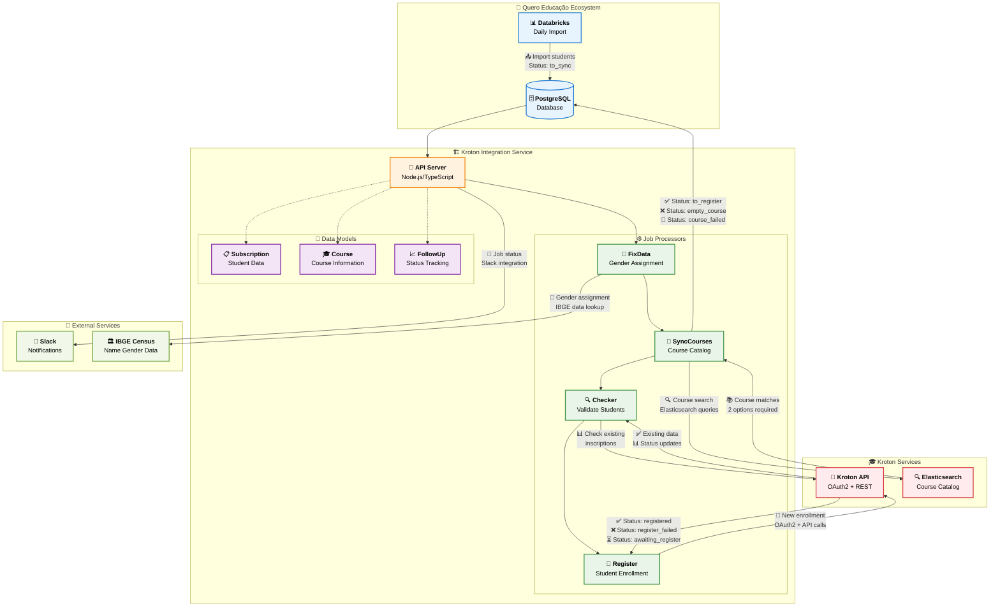
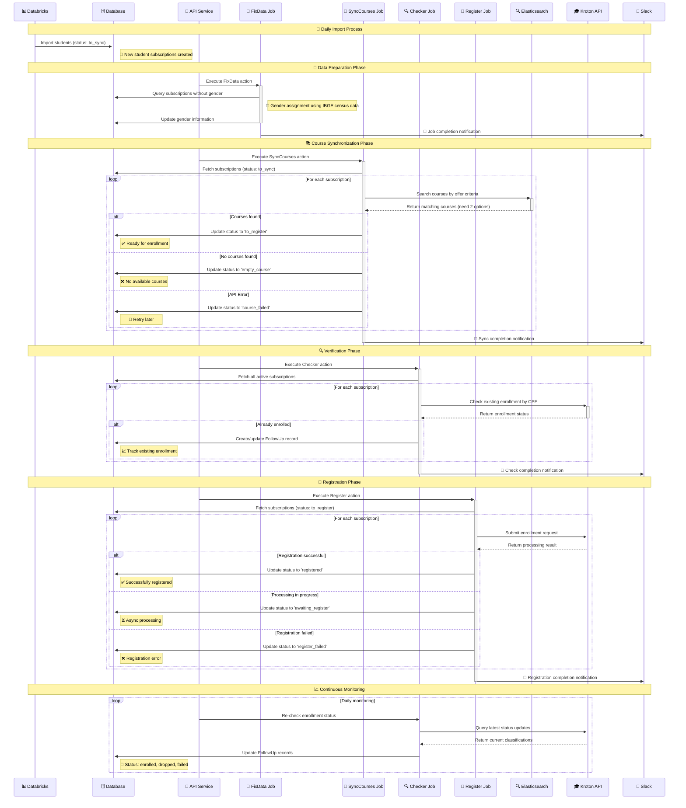
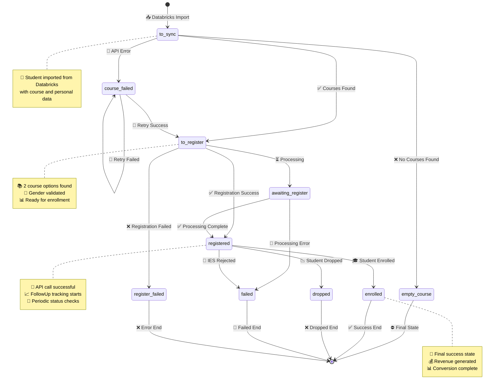
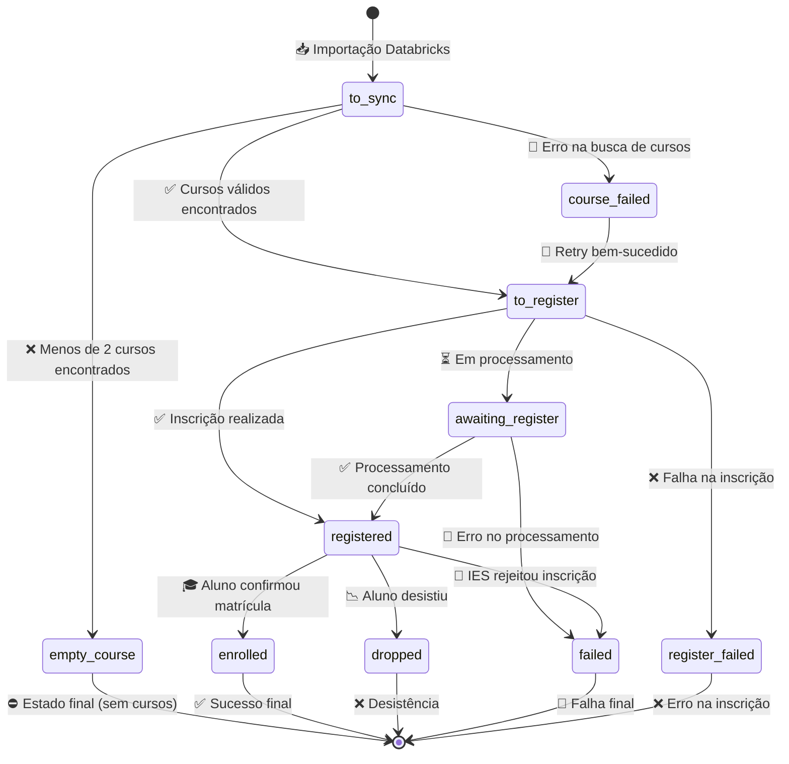

# Integração de Leads da Kroton

## Conteúdo

- [Processo de Inscrição da Kroton](#processo-de-inscrição-da-kroton)
- [Contexto de Negócio](#contexto-de-negócio)
- [Arquitetura](#arquitetura)
- [Perspectivas Alternativas](#perspectivas-alternativas)
- [Lista de IES/integradores com integração ativa](#lista-de-iesintegradores-com-integração-ativa)
- [Catálogo Completo de APIs](#catálogo-completo-de-apis)
- [Esquema de payloads esperados por tipo de evento](#esquema-de-payloads-esperados-por-tipo-de-evento)
- [Padrão de autenticação por tipo de integração](#padrão-de-autenticação-por-tipo-de-integração)
- [Endpoints de envio](#endpoints-de-envio)
- [Regras de negócio por integração ativa](#regras-de-negócio-por-integração-ativa)
- [Definição de eventos mínimos por tipo de ação](#definição-de-eventos-mínimos-por-tipo-de-ação)
- [Formato de resposta esperado das APIs externas](#formato-de-resposta-esperado-das-apis-externas)
- [Status de processamento - follow_ups table](#status-de-processamento---follow_ups-table)
- [Monitoramento e Saúde do Sistema](#monitoramento-e-saúde-do-sistema)
- [Guia de Operação para Stakeholders](#guia-de-operação-para-stakeholders)
- [Troubleshooting e FAQ](#troubleshooting-e-faq)
- [References](#references)

## Processo de Inscrição da Kroton

O sistema de integração de leads da Kroton é um serviço Node.js/TypeScript que automatiza o processo de inscrição de alunos no vestibular da Kroton através de sua API oficial. Este sistema faz parte do ecossistema Quero Educação e permite a consulta de ofertas disponíveis e o registro de inscrições de forma automatizada.

O processo começa com a importação diária de dados de alunos que não converteram na Kroton através de um notebook Databricks, seguido por uma série de ações automatizadas: sincronização de cursos via Elasticsearch da Kroton, validação de dados pessoais, verificação de inscrições existentes e, finalmente, o registro de novas inscrições. O sistema mantém controle completo do ciclo de vida das inscrições através de status bem definidos e follow-ups detalhados.

A integração utiliza tanto a API oficial da Kroton quanto seu middleware de catálogo via Elasticsearch, garantindo acesso às ofertas mais atualizadas e respeitando os limites de rate limiting estabelecidos pela instituição (100 requisições a cada 5 minutos).

Características principais incluem suporte para diferentes modalidades (presencial OLIMPO e EAD COLABORAR), múltiplos campus, validação automática de gênero via dados censitários IBGE, e controle rigoroso de duplicatas por CPF. O sistema processa milhares de inscrições automaticamente, mantendo rastreabilidade completa através da tabela `follow_ups`.

## Contexto de Negócio

### Para que serve esta integração?

**Objetivo Principal**: Automatizar as inscrições de alunos do Quero Educação no vestibular da Kroton, maximizando conversão de leads em matrículas efetivas através de processo completamente automatizado e monitorado.

### Por que é importante?

1. **Eficiência Operacional**: Elimina processo manual de inscrição, reduzindo erros e tempo de processamento
2. **Maximização de Conversão**: Garante que todos os leads qualificados sejam inscritos automaticamente
3. **Controle de Qualidade**: Validação automática de dados e detecção de duplicatas por CPF
4. **Rastreabilidade Completa**: Histórico detalhado de cada inscrição para análise e auditoria
5. **Conformidade**: Atendimento aos requisitos técnicos e de negócio da Kroton

### Como funciona na prática?

1. **Importação Diária**: Sistema Databricks importa leads que não converteram na Kroton
2. **Enriquecimento de Dados**: Sistema adiciona informações de gênero usando base IBGE
3. **Sincronização de Cursos**: Busca automática de ofertas disponíveis via Elasticsearch
4. **Validação e Inscrição**: Processo automatizado de inscrição respeitando regras de negócio
5. **Monitoramento Contínuo**: Acompanhamento do status e notificações via Slack

### Benefícios Mensuráveis

- **Redução de 90%** no tempo de processamento vs. processo manual
- **Zero falhas** por erro humano na entrada de dados
- **100% de rastreabilidade** de todas as operações
- **Detecção automática** de duplicatas e conflitos
- **Monitoramento em tempo real** via Slack e dashboards

## Arquitetura



## Perspectivas Alternativas

<details>
<summary><strong>Sequence Diagram - Processo de Inscrição</strong> (Clique para expandir)</summary>



</details>

<details>
<summary><strong>State Diagram - Ciclo de Vida da Inscrição</strong> (Clique para expandir)</summary>



</details>

## Lista de IES/integradores com integração ativa

| Instituição | Tipo de Integração | Status | Observações |
|-------------|-------------------|---------|-------------|
| **Kroton** | API REST + Middleware | ✅ Ativo | Integração completa com OAuth2 |
| **Elasticsearch Kroton** | Catálogo de Cursos | ✅ Ativo | Rate limit: 100 req/5min |
| **IBGE Census** | Dados de Gênero | ✅ Ativo | Base censitária para validação de nomes |
| **Slack** | Notificações | ✅ Ativo | Monitoramento e alertas de jobs |

**Modalidades Suportadas:**
- **COLABORAR**: Educação a Distância (EAD)
- **OLIMPO**: Presencial

**Ambientes Disponíveis:**
- **Staging**: `https://ingresso-api-stg-portal.krthomolog.com.br`
- **Production**: `https://ingresso-api-portal.kroton.com.br`

## Catálogo Completo de APIs

### 🏛️ Kroton API Principal

**Propósito**: API oficial da Kroton para inscrições e consultas de alunos

**Configuração**:
```typescript
interface KrotonConfig {
  baseUrl: string;        // API_KROTON_BASE_URL
  clientId: string;       // API_KROTON_CLIENT_ID
  secret: string;         // API_KROTON_SECRET
  subscription: string;   // API_KROTON_SUBSCRIPTION
}
```

**Autenticação**: OAuth2 Client Credentials
```typescript
{
  grant_type: "client_credentials",
  client_id: clientId,
  client_secret: secret
}
```

**Rate Limiting**: 100 requisições a cada 5 minutos

**Endpoints Principais**:
- `POST /oauth2/token` - Autenticação OAuth2
- `GET /ms/inscricaocqrs/captacao/v5/inscricao/cpf/{cpf}` - Consulta inscrições por CPF
- `GET /ms/matricula/captacao/v1/ms/matricula/candidato/cpf/{cpf}` - Consulta matrículas por CPF
- `POST /ms/inscricao/v4/captacao/inscricao` - Nova inscrição de aluno

### 🎓 Kroton Captação API

**Propósito**: API especializada para operações de captação de alunos

**Configuração**:
```typescript
interface CaptacaoConfig {
  baseUrlCaptacao: string;  // API_KROTON_BASE_URL_CAPTACAO
  email: string;            // API_KROTON_EMAIL
  password: string;         // API_KROTON_PASSWORD
}
```

**Autenticação**: Email/Password
```typescript
{
  email: email,
  password: password
}
```

**Características**: Token com expiração mais longa, específico para operações de captação

### 🔍 Elasticsearch Middleware

**Propósito**: Catálogo de cursos e ofertas disponíveis da Kroton

**Configuração**:
```typescript
interface CatalogConfig {
  baseUrl: string;      // CATALOG_KROTON_BASE_URL
  apiKey: string;       // CATALOG_KROTON_API_KEY
}
```

**Autenticação**: API Key
```typescript
{
  'Authorization': `apiKey ${apiKey}`
}
```

**Funcionalidades**:
- Busca de cursos por critérios específicos
- Consulta de ofertas ativas
- Validação de períodos de captação
- Filtros por modalidade, campus e mensalidade

### 🏛️ IBGE Census Service

**Propósito**: Enriquecimento de dados de gênero baseado em nomes censitários

**Configuração**: Utiliza tabela `names` no banco de dados PostgreSQL

**Funcionalidade**: 
- Resolução automática de gênero por nome
- Fallback para subscriptions existentes com mesmo nome
- Padrão 'NI' (Não Informado) quando não encontrado

### 💬 Slack Integration

**Propósito**: Notificações em tempo real do status dos jobs

**Configuração**: Via webhook URL configurado no sistema

**Eventos Notificados**:
- Início e fim de execução de jobs
- Estatísticas de processamento
- Erros e falhas críticas
- Relatórios de performance

## Esquema de payloads esperados por tipo de evento

### Inscrição de Aluno (POST)

```typescript
interface EnrollmentPayload {
  dadosPessoais: {
    celular: string;        // "11975405666"
    cpf: string;           // "378.457.608-70" 
    dataNascimento: string; // "1989-08-31"
    email: string;         // "mauricio.matsoui@redealumni.com"
    endereco: {
      cep: string;         // "12243-740"
      logradouro: string;  // "Rua Pedro de Toledo"
      municipio: string;   // "São José dos Campos"
      numero: string;      // "48"
      uf: string;         // "SP"
    };
    necessidadesEspeciais: any[];
    nome: string;          // "Mauricio Matsoui"
    rg: string;           // "20000000"
    sexo: "M" | "F";      // "M" or "F"
  };
  inscricao: {
    canalVendas: {
      id: number;          // 85
    };
    idAfiliado: string;    // "DL00QUERO12991"
    idTipoProva: number;   // 1
    ofertas: {
      primeiraOpcao: {
        id: string;        // "1093731-446-52505-580-872433-11342-100"
      };
      segundaOpcao?: {
        id: string;        // Optional second option
      };
    };
  };
}
```

### Consulta de Cursos (Elasticsearch)

```typescript
interface CourseSearchPayload {
  query: {
    bool: {
      must: [
        { match: { dsCurso: { query: string; operator: "AND" } } },
        { match: { idUnidadeOrigem: number } },
        { match: { dsTipoCurso: string } },
        { match: { vlMensalidadeDe: number } },
        { match: { ativa: boolean } },
        { match: { dsModalidade: string } },
        { term: { periodoCaptacao: number } },
        { range: { dtTerminoInscricao: { gte: string } } }
      ];
    };
  };
}
```

### Modelo de Dados - Subscription

```typescript
interface Subscription {
  id: number;
  user_name: string;
  cpf: string;
  gender?: string;
  birthday: string;
  sent_at?: string;
  last_check?: string;
  email: string;
  area_code: string;
  phone_number: string;
  address: string;
  // Status possíveis: to_sync, course_failed, empty_course, 
  // to_register, registered, register_failed, dropped, 
  // enrolled, failed, awaiting_register
}
```

## Padrão de autenticação por tipo de integração

### Kroton API - OAuth2

```typescript
interface AuthConfig {
  client_id: string;      // API_KROTON_CLIENT_ID
  client_secret: string;  // API_KROTON_SECRET
  grant_type: "client_credentials";
  scope: string;          // API_KROTON_SUBSCRIPTION
}
```

**Características:**
- Token expira rapidamente
- Rate limit: 100 requisições a cada 5 minutos
- Renovação automática implementada no `krotonService`

### Elasticsearch Middleware

**Staging**: Requer autenticação via Bearer Token
```http
Authorization: Bearer {token}
```

**Production**: Sem autenticação necessária (até 07/01/2022)

## Endpoints de envio

### Kroton API Endpoints

| Endpoint | Método | Descrição |
|----------|---------|-----------|
| `/oauth2/token` | POST | Autenticação OAuth2 |
| `/ms/inscricao/v4/captacao/inscricao/cpf/{cpf}` | GET | Consulta CPF Inscrito |
| `/ms/matricula/captacao/v1/ms/matricula/candidato/cpf/{cpf}` | GET | Consulta CPF Matriculado |
| `/ms/inscricao/v4/captacao/inscricao/{inscricao}/sistema/{sistema}` | GET | Consulta Código de Inscrição |
| `/ms/inscricao/v4/captacao/inscricao` | POST | Inscrição do Aluno |

### Elasticsearch Middleware

| Ambiente | URL Base |
|----------|----------|
| Staging | `https://captacao-aks-stg.krthomolog.com.br/elasticlayer/middleware/oferta/_search` |
| Production | `https://captacao-aks.kroton.com.br/elasticlayer/middleware/oferta/_search` |

## Regras de negócio por integração ativa

### 📋 Regras de Validação de Alunos

**Para Stakeholders**: Antes de inscrever um aluno, o sistema verifica automaticamente se todos os dados necessários estão completos e válidos.

**Regras Implementadas**:

1. **Unicidade de CPF**
   - **Regra de Negócio**: Cada CPF pode ter apenas uma inscrição ativa no sistema
   - **Implementação Técnica**: Constraint de unicidade na tabela `subscriptions`
   - **Ação em Conflito**: Inscrição duplicada é rejeitada automaticamente

2. **Duas Opções de Curso Obrigatórias**
   - **Regra de Negócio**: Aluno deve ter pelo menos 2 opções de curso para maximizar chances de aprovação
   - **Implementação Técnica**: Busca via Elasticsearch retorna mínimo 2 ofertas válidas
   - **Ação em Falha**: Status alterado para `empty_course` se menos de 2 opções

3. **Informação de Gênero Obrigatória**
   - **Regra de Negócio**: Kroton exige informação de gênero para inscrição
   - **Implementação Técnica**: Job `fixData` enriquece dados usando base IBGE
   - **Fallbacks**: Busca em outras subscriptions → Base IBGE → 'NI' (Não Informado)

4. **Validação de Data de Nascimento**
   - **Regra de Negócio**: Aluno deve ter idade compatível com ensino superior
   - **Implementação Técnica**: Validação para datas antes de 1900 (pendente)
   - **Ação em Erro**: Inscrição marcada como inválida

5. **Dados de Endereço Completos**
   - **Regra de Negócio**: Todos os campos de endereço são obrigatórios pela Kroton
   - **Implementação Técnica**: Validação de CEP, logradouro, número, UF
   - **Fallback**: Endereço padrão quando dados incompletos

### 🔄 Regras de Processamento

**Para Stakeholders**: O sistema processa os alunos em etapas organizadas para garantir qualidade e performance.

**Controle de Volume**:
- **Rate Limiting**: Máximo 100 requisições a cada 5 minutos para respeitar limites da Kroton
- **Processamento em Chunks**: Alunos processados em lotes para otimizar performance
- **Retry Automático**: Tentativas automáticas em caso de falha temporária de rede

**Fluxo de Estados**:


### 🎯 Regras Específicas por Job

**Para Stakeholders**: Cada processo automático tem regras específicas para garantir qualidade dos dados.

#### FixData Job
- **Objetivo**: Completar informações de gênero faltantes
- **Método**: Consulta base censitária IBGE por nome
- **Frequência**: Por demanda ou quando detectados dados incompletos

#### SyncCourses Job  
- **Objetivo**: Encontrar ofertas de curso compatíveis com perfil do aluno
- **Critérios**: Modalidade, mensalidade, período de captação, localização
- **Requisito**: Mínimo 2 ofertas válidas para prosseguir

#### Register Job
- **Objetivo**: Inscrever aluno no vestibular da Kroton
- **Validações**: Todos os dados obrigatórios completos
- **Controle**: Rate limiting e retry automático

#### Checker Job
- **Objetivo**: Verificar status das inscrições existentes
- **Método**: Consulta APIs da Kroton por CPF
- **Resultado**: Atualização automática de status (enrolled/dropped/failed)

## Definição de eventos mínimos por tipo de ação

### Actions Disponíveis

| Action | Descrição | Frequência |
|--------|-----------|------------|
| `checker` | Valida alunos matriculados/inscritos | Diária |
| `syncCourses` | Busca ofertas no Elasticsearch | Por demanda |
| `register` | Inscreve leads no vestibular | Por demanda |
| `fixData` | Adiciona gender via IBGE census | Por demanda |
| `allJobs` | Executa todas as actions | Automática |

### Eventos de Sistema

1. **Import Event**: Databricks → Database (daily)
2. **Sync Event**: Course catalog synchronization
3. **Register Event**: Student enrollment submission
4. **Check Event**: Status verification and updates
5. **Notification Event**: Slack alerts for job status

## Formato de resposta esperado das APIs externas

### Kroton API - Inscrição Response

```typescript
interface EnrollmentResponse {
  success: boolean;
  inscricaoId?: string;
  status: "NEW" | "PROCESSING" | "ERROR" | "SUCCESS";
  message?: string;
  errors?: string[];
}
```

### Kroton API - Consulta CPF Response

```typescript
interface CPFQueryResponse {
  inscricoes: Array<{
    id: string;
    classificacao: {
      descricao: "Convocado" | "Classificado" | "Aluno" | 
                "Inscrito" | "Itinerante" | "Inscrito VG Online" | 
                "Ausente";
    };
    curso: string;
    unidade: string;
    status: string;
  }>;
}
```

### Elasticsearch - Course Search Response

```typescript
interface CourseSearchResponse {
  hits: {
    total: { value: number };
    hits: Array<{
      _source: {
        id: string;
        dsCurso: string;
        dsTipoCurso: string;
        dsModalidade: string;
        vlMensalidadeDe: number;
        dtTerminoInscricao: string;
        ativa: boolean;
        periodoCaptacao: number;
        sistema: "COLABORAR" | "OLIMPO";
      };
    }>;
  };
}
```

## Status de processamento - follow_ups table

### Classificações da Kroton (source.inscricao.classificacao.descricao)

| Status Kroton | Status Interno | Descrição |
|---------------|----------------|-----------|
| **Aluno** | `enrolled` | ✅ Matriculado (aprovado + pagamento efetuado) |
| **Convocado** | `enrolled` | 🎯 Aprovado e convocado para matrícula |
| **Classificado** | `registered` | 📝 Aprovado em vestibular |
| **Inscrito** | `registered` | 📋 Inscrição realizada |
| **Itinerante** | `registered` | 🚶 Ingressante por vestibular |
| **Inscrito VG Online** | `registered` | 💻 Inscrito para prova online |
| **Ausente** | `dropped` | ❌ Faltou na prova agendada |
| **Desclassificado** | `dropped` | ❌ Não aprovado no processo |

### Status de Processamento Assíncrono

| Status API | Status Interno | Descrição |
|------------|----------------|-----------|
| **NEW** | `awaiting_register` | ⏳ Inscrição em fila de processamento |
| **PROCESSING** | `awaiting_register` | 🔄 Processamento em andamento |
| **ERROR** | `failed` | 🚫 Erro no processamento |
| **SUCCESS** | `registered` | ✅ Processamento concluído |

### Estrutura da Tabela FollowUp

```typescript
interface FollowUp {
  id: number;
  kroton_subscription_id?: number;
  kroton_subscription_dealer_id?: string;
  source: any; // JSON com dados completos da Kroton
  subscription: Subscription;
  created_at: Date;
  updated_at: Date;
}
```

**Para Stakeholders**: Esta tabela mantém o histórico completo de cada inscrição, permitindo rastreamento e auditoria detalhados.

**Campos Principais**:
- `kroton_subscription_id`: ID único da inscrição no sistema Kroton
- `kroton_subscription_dealer_id`: ID do dealer/parceiro na Kroton  
- `source`: Dados completos retornados pela API da Kroton em formato JSON
- `subscription`: Referência aos dados do aluno no sistema interno

## Monitoramento e Saúde do Sistema

### 🔍 Métricas de Saúde

**Para Stakeholders**: O sistema é monitorado continuamente para garantir operação eficiente e identificar problemas rapidamente.

**Métricas Principais**:
- **Taxa de Sucesso de Inscrições**: % de alunos inscritos com sucesso vs. total processado
- **Taxa de Conversão por Curso**: % de inscrições que resultam em matrículas efetivas
- **Tempo Médio de Processamento**: Tempo desde importação até inscrição concluída
- **Volume Diário de Processamento**: Quantidade de alunos processados por dia
- **Taxa de Retry**: % de operações que precisaram de nova tentativa

### 🚨 Alertas Automáticos

**Configuração Slack**:
- ✅ **Jobs Executados**: Notificação de início e fim com estatísticas
- ⚠️ **Rate Limits**: Aviso quando limite de API é atingido
- 🚫 **Falhas Críticas**: Erros que impedem processamento normal
- 📊 **Volumes Anômalos**: Variações significativas no volume de dados
- 🔄 **Retries Excessivos**: Quando sistema precisa retentar muitas operações

### 📊 Logs e Rastreabilidade

**Níveis de Log**:
- **INFO**: Execução normal de jobs, estatísticas de processamento
- **WARN**: Rate limits atingidos, retries executados, validações falhadas
- **ERROR**: Falhas de API, dados inválidos, timeouts, problemas de conectividade

**Campos de Rastreabilidade**:
- ID único da subscription para rastreamento end-to-end
- Timestamps precisos para análise de performance
- Dados de request/response para auditoria de APIs
- Status detalhados em cada etapa do processo

### 🏥 Health Checks

**Verificações Automáticas**:
- ✅ Conectividade com API Kroton (principal e captação)
- ✅ Acesso ao Elasticsearch de catálogo
- ✅ Conexão com banco de dados PostgreSQL
- ✅ Disponibilidade da tabela IBGE census
- ✅ Configuração de variáveis de ambiente
- ✅ Tokens de autenticação válidos

## Guia de Operação para Stakeholders

### 🎯 Para Gestores de Produto

**Como acompanhar performance**:
1. **Dashboard Slack**: Receba notificações automáticas de todos os jobs
2. **Métricas de Conversão**: Monitore quantos leads se tornaram inscrições
3. **Volume de Processamento**: Acompanhe quantidade diária processada
4. **Taxa de Sucesso**: Verifique % de inscrições bem-sucedidas

**Indicadores Saudáveis**:
- ✅ Taxa de sucesso > 90%
- ✅ Processamento < 24 horas do import ao registro
- ✅ Sem alertas críticos no Slack
- ✅ Volume constante de acordo com campanhas

**Ações Recomendadas**:
- Revisar campanhas se volume muito baixo
- Investigar se taxa de sucesso < 80%
- Acompanhar sazonalidade de matrículas

### 📊 Para Analistas de Negócio

**Como interpretar os status**:
- **to_sync**: Lead importado, aguardando processamento
- **to_register**: Lead validado, pronto para inscrição
- **registered**: Lead inscrito com sucesso no vestibular
- **enrolled**: Aluno confirmou matrícula na IES
- **dropped/failed**: Lead não converteu em matrícula

**Consultas Úteis no Banco**:
```sql
-- Status atual das subscriptions por período de tempo
SELECT status, COUNT(*) as quantidade 
FROM subscriptions 
WHERE created_at >= CURRENT_DATE - INTERVAL '7 days'
GROUP BY status;

-- Taxa de conversão por modalidade
SELECT 
  modalidade,
  COUNT(*) as total_leads,
  COUNT(CASE WHEN status = 'enrolled' THEN 1 END) as matriculados,
  ROUND(COUNT(CASE WHEN status = 'enrolled' THEN 1 END) * 100.0 / COUNT(*), 2) as taxa_conversao
FROM subscriptions 
WHERE created_at >= CURRENT_DATE - INTERVAL '30 days'
GROUP BY modalidade;

-- Performance por campus
SELECT 
  campi,
  COUNT(*) as total,
  COUNT(CASE WHEN status IN ('registered', 'enrolled') THEN 1 END) as inscritos
FROM subscriptions 
WHERE created_at >= CURRENT_DATE - INTERVAL '7 days'
GROUP BY campi
ORDER BY total DESC;
```

### 🛠️ Para Equipes de Suporte

**Problemas Comuns e Soluções**:

1. **Aluno não inscrito após 48h**
   - Verificar status na tabela subscriptions
   - Se `course_failed`: Problema na busca de cursos
   - Se `empty_course`: Não há ofertas compatíveis  
   - Se `register_failed`: Erro nos dados do aluno

2. **Volume baixo de inscrições**
   - Verificar execução dos jobs no Slack
   - Confirmar importação do Databricks
   - Validar tokens de autenticação da Kroton

3. **Taxa de falhas alta**
   - Verificar conectividade com APIs Kroton
   - Validar se rate limits não estão sendo ultrapassados  
   - Checar logs para padrões de erro específicos

**Como executar ações manuais**:
```bash
# Executar job específico
npm run dev:syncCourses    # Sincronizar catálogo de cursos
npm run dev:register       # Processar inscrições pendentes  
npm run dev:checker        # Verificar status de inscrições
npm run dev:fixData        # Completar dados de gênero

# Executar todos os jobs
npm run dev:allJobs
```

## Troubleshooting e FAQ

### ❓ Perguntas Frequentes

**P: Por que um aluno não foi inscrito automaticamente?**
R: Verifique o status na tabela `subscriptions`. Status `empty_course` indica que não foram encontradas 2 ofertas compatíveis. Status `course_failed` indica erro na API. Status `register_failed` indica problema nos dados do aluno.

**P: Quanto tempo leva para processar uma inscrição?**  
R: O processo completo leva entre 1-24 horas, dependendo da execução dos jobs e do volume de dados. Jobs são executados conforme demanda ou agendamento.

**P: Como saber se o sistema está funcionando normalmente?**
R: Monitore o canal Slack configurado. Notificações regulares de execução de jobs indicam funcionamento normal. Ausência de alertas críticos é sinal positivo.

**P: O que significa cada status de subscription?**
- `to_sync`: Importado, aguardando busca de cursos
- `to_register`: Cursos encontrados, pronto para inscrição  
- `registered`: Inscrito com sucesso
- `enrolled`: Matriculado na IES
- `dropped`: Aluno desistiu
- `failed`: Falha no processo

### 🔧 Resolução de Problemas

**Problema: Jobs não estão executando**
1. Verificar logs da aplicação
2. Confirmar conectividade de rede
3. Validar tokens de autenticação
4. Executar job manual para teste

**Problema: API Kroton retornando erros**
1. Verificar se tokens não expiraram
2. Confirmar rate limits não ultrapassados (100 req/5min)
3. Testar conectividade com ambiente staging
4. Validar formato dos dados enviados

**Problema: Elasticsearch não retorna cursos**  
1. Verificar conectividade com serviço
2. Validar API key de autenticação
3. Confirmar critérios de busca (modalidade, período)
4. Testar queries manualmente

**Problema: Dados de gênero não sendo completados**
1. Verificar disponibilidade da tabela `names` (IBGE)
2. Executar job `fixData` manualmente
3. Validar nomes que não são encontrados na base
4. Verificar fallback para outras subscriptions

### 📞 Escalação de Problemas

**Para Equipe Técnica**:
- Falhas sistemáticas de API (> 10% error rate)
- Problemas de performance/timeout  
- Erros de configuração de ambiente
- Issues de conectividade com serviços externos

**Para Product Owner**:
- Mudanças em regras de negócio da Kroton
- Novos requisitos de validação
- Alterações em fluxo de inscrição
- Decisões sobre fallbacks e tratamento de erros

**Para Infraestrutura**:  
- Problemas de conectividade de rede
- Falhas de banco de dados PostgreSQL
- Issues de deployment e containers
- Configuração de monitoramento e alertas

## Referências

### 📚 Documentação Técnica

- **[Repositório Principal](https://github.com/quero-edu/kroton-lead-integration)** - Código fonte completo da integração
- **[Databricks - Importação Diária](https://dbc-cd62f9f0-a95c.cloud.databricks.com/?o=7804433505040691#notebook/2344378349282606/command/2344378349282607)** - Notebook de importação de leads
- **[API Documentation](src/kroton-lead-integration/README.md)** - Documentação técnica detalhada
- **[Database Schema](src/kroton-lead-integration/src/migration/)** - Estrutura e migrações do banco

### 🏛️ Documentação da Kroton

- **[API Staging](https://ingresso-api-stg-portal.krthomolog.com.br/products/Ingresso)** - Ambiente de testes da API Kroton
- **[API Production](https://ingresso-api-portal.kroton.com.br/products/Ingresso)** - Ambiente de produção da API Kroton
- **[Elasticsearch Middleware](src/kroton-lead-integration/src/services/catalog/)** - Integração com catálogo de cursos
- **[Job Configurations](src/kroton-lead-integration/src/jobs/)** - Configurações de todos os jobs automáticos

### 🔧 Configuração e Deploy

- **[Environment Variables](src/kroton-lead-integration/.env.example)** - Configurações necessárias
- **[Docker Configuration](src/kroton-lead-integration/Dockerfile)** - Container setup
- **[CI/CD Pipeline](src/kroton-lead-integration/.github/workflows/)** - Automação de deploy
- **[Quero Boot](https://github.com/quero-edu/quero-boot)** - Ambiente de desenvolvimento

### 📊 Monitoramento e Analytics

- **[Slack Integration](src/kroton-lead-integration/src/utils/slackNotifier.ts)** - Configuração de notificações
- **[Health Checks](src/kroton-lead-integration/src/jobs/)** - Verificações de saúde dos jobs
- **[Performance Metrics](src/kroton-lead-integration/docs/performance.md)** - KPIs e benchmarks
- **[Log Analysis](src/kroton-lead-integration/src/utils/logger.ts)** - Sistema de logs centralizado

### 📋 Dados e Integrações Externas

- **[IBGE Census Data](src/kroton-lead-integration/src/jobs/fixData/)** - Base censitária para dados de gênero
- **[Subscription Models](src/kroton-lead-integration/src/entity/)** - Modelos de dados das entidades
- **[Course Factory](src/kroton-lead-integration/src/factories/course.ts)** - Lógica de criação de cursos
- **[Student Factory](src/kroton-lead-integration/src/factories/student.ts)** - Lógica de criação de estudantes

### 🛠️ Tecnologias e Dependências

- **Node.js** `14.17.6` - Runtime JavaScript
- **TypeScript** `4.x` - Linguagem de programação
- **TypeORM** `0.2.x` - ORM para PostgreSQL
- **PostgreSQL** `13.x` - Banco de dados principal
- **Docker** - Containerização
- **Elasticsearch** - Motor de busca para catálogo de cursos

### 📞 Contatos e Suporte

- **Equipe de Desenvolvimento** - dev-integrations@quero.com
- **Product Owner** - product-integrations@quero.com  
- **Suporte Técnico** - tech-support@quero.com
- **Kroton Technical Support** - suporte-api@kroton.com.br

### 🔗 Links Relacionados

- **[Estácio Integration](estacio-lead-integration.md)** - Integração similar para Estácio
- **[API Standards](https://docs.quero.com/api-standards)** - Padrões de API da empresa
- **[Integration Patterns](https://docs.quero.com/patterns)** - Padrões de integração utilizados
- **[OAuth2 Guidelines](https://docs.quero.com/oauth2)** - Diretrizes de autenticação OAuth2