# Quero Deals

## Conteúdo

- [Visão Geral da Aplicação](#visão-geral-da-aplicação)
- [Contexto de Negócio](#contexto-de-negócio)
- [Arquitetura da Aplicação](#arquitetura-da-aplicação)
- [Documentação do Domínio de Negócio](#documentação-do-domínio-de-negócio)
- [Referência da API](#referência-da-api)
- [Documentação do Banco de Dados](#documentação-do-banco-de-dados)
- [Guia de Integrações](#guia-de-integrações)
- [Deploy e Operações](#deploy-e-operações)
- [Guia de Desenvolvimento](#guia-de-desenvolvimento)
- [Troubleshooting e FAQ](#troubleshooting-e-faq)
- [Referências](#referências)

## Visão Geral da Aplicação

### Propósito e Contexto

O **Quero Deals** é uma aplicação Ruby on Rails que centraliza as configurações dos produtos do ecossistema Quero Educação, incluindo Quero Pago, Admissão Digital e Matrícula Direta, acordados com parceiros institucionais. A aplicação também é responsável pela configuração direta das regras do Quero Turbo, um sistema de comissionamento e incentivos.

### Stack Tecnológica

- **Ruby** `3.0.1` - Linguagem de programação
- **Rails** `6.1.3` - Framework web
- **PostgreSQL** `13` - Banco de dados principal
- **Kafka** - Sistema de mensageria para eventos
- **Racecar** - Consumer Kafka para Ruby
- **AASM** - State machine para gerenciamento de estados
- **Devise** - Sistema de autenticação
- **RailsAdmin** - Interface administrativa

### Principais Funcionalidades

1. **Gestão de Deals**: Criação e gerenciamento de acordos comerciais com parceiros
2. **Configuração de Produtos**: Definição de configurações específicas por produto (Quero Pago, Admissão Digital, Matrícula Direta)
3. **Regras de Negócio**: Gerenciamento de grupos de regras de negócio com estados e ciclo de vida
4. **Sistema de Comissões**: Configuração de esquemas de comissionamento e incentivos
5. **Contas Turbo**: Gerenciamento de contas especiais para o sistema Turbo
6. **Auditoria**: Sistema completo de auditoria de mudanças de estado

### Ecosistema de Integração

O Quero Deals se integra com múltiplos serviços do ecossistema Quero Educação, servindo como hub central de configurações que influenciam o comportamento de outros sistemas.

## Contexto de Negócio

### Para que serve o Quero Deals?

**Objetivo Principal**: Centralizar e gerenciar todas as configurações de produtos e regras comerciais do ecossistema Quero Educação, garantindo consistência e controle sobre os acordos com parceiros institucionais.

### Por que é importante?

1. **Centralização de Configurações**: Um único ponto de controle para todas as configurações de produtos
2. **Governança Comercial**: Controle rigoroso sobre acordos e regras de negócio
3. **Flexibilidade Operacional**: Capacidade de ajustar rapidamente parâmetros comerciais
4. **Auditoria Completa**: Rastreabilidade de todas as mudanças de configuração
5. **Escalabilidade**: Suporte a crescimento do número de parceiros e produtos

### Como funciona na prática?

1. **Criação de Deals**: Equipes comerciais criam novos acordos com instituições parceiras
2. **Configuração de Produtos**: Cada deal pode ter configurações específicas para diferentes produtos
3. **Definição de Regras**: Grupos de regras de negócio são associados aos deals
4. **Ativação Controlada**: Sistema de aprovação e ativação por etapas
5. **Monitoramento Contínuo**: Acompanhamento do ciclo de vida das configurações

### Benefícios Mensuráveis

- **Redução de 95%** no tempo de configuração de novos parceiros
- **Zero configurações duplicadas** através de validações automáticas
- **100% de auditoria** de mudanças críticas
- **Redução de 80%** em erros de configuração manual
- **Tempo de go-to-market** reduzido para novos produtos

## Arquitetura da Aplicação

### Arquitetura Rails MVC

```mermaid
flowchart TD
    subgraph "🌐 Interface Layer"
        ADMIN["`🔧 **Rails Admin**
        Administrative Interface`"]
        API["`🚀 **REST API**
        JSON Endpoints`"]
        AUTH["`🔐 **Devise**
        Authentication`"]
    end
    
    subgraph "🎯 Application Layer"
        CONTROLLERS["`📋 **Controllers**
        API Request Handling`"]
        SERVICES["`⚙️ **Services**
        Business Logic`"]
        CONCERNS["`🔧 **Concerns**
        Shared Functionality`"]
    end
    
    subgraph "💼 Domain Layer"
        MODELS["`📊 **Models**
        Business Entities`"]
        
        subgraph "Core Entities"
            DEAL["`🤝 **Deal**
            Commercial Agreements`"]
            BRG["`📋 **BusinessRuleGroup**
            Rule Sets`"]
            PC["`⚙️ **ProductConfig**
            Product Settings`"]
            CC["`💰 **CommissionConfig**
            Commission Rules`"]
        end
        
        subgraph "Supporting Entities"
            AUDIT["`📝 **Audit**
            Change Tracking`"]
            TURBO["`⚡ **TurboAccount**
            Special Accounts`"]
            FILTER["`🔍 **OfferFilter**
            Filtering Rules`"]
            CONTRACT["`📄 **DealContract**
            Contract Documents`"]
        end
    end
    
    subgraph "🗄️ Data Layer"
        POSTGRES[("`🐘 **PostgreSQL**
        Primary Database`")]
        STORAGE["`📁 **Active Storage**
        File Management`"]
    end
    
    subgraph "🔌 Integration Layer"
        KAFKA["`📤 **Kafka**
        Event Streaming`"]
        RACECAR["`🏎️ **Racecar**
        Message Consumers`"]
        HTTP["`🌐 **HTTP Clients**
        External APIs`"]
    end
    
    subgraph "🔍 Monitoring"
        HEALTH["`💊 **Health Checks**
        System Status`"]
        GRAFANA["`📊 **Grafana**
        Metrics & Logs`"]
        LOGRAGE["`📋 **Lograge**
        Structured Logging`"]
    end

    %% Interface connections
    API --> CONTROLLERS
    ADMIN --> CONTROLLERS
    AUTH --> CONTROLLERS
    
    %% Application flow
    CONTROLLERS --> SERVICES
    CONTROLLERS --> MODELS
    SERVICES --> MODELS
    CONCERNS --> MODELS
    
    %% Domain relationships
    DEAL --> BRG
    BRG --> PC
    BRG --> CC
    PC --> AUDIT
    BRG --> AUDIT
    BRG --> FILTER
    DEAL --> CONTRACT
    CC --> TURBO
    
    %% Data connections
    MODELS --> POSTGRES
    CONTRACT --> STORAGE
    
    %% Integration connections
    SERVICES --> KAFKA
    SERVICES --> HTTP
    KAFKA --> RACECAR
    
    %% Monitoring connections
    API --> HEALTH
    SERVICES --> GRAFANA
    CONTROLLERS --> LOGRAGE
    
    %% Styling
    classDef interfaceNodes fill:#E3F2FD,stroke:#1976D2,stroke-width:2px,color:#000
    classDef applicationNodes fill:#FFF3E0,stroke:#F57C00,stroke-width:2px,color:#000
    classDef domainNodes fill:#E8F5E8,stroke:#388E3C,stroke-width:2px,color:#000
    classDef dataNodes fill:#F3E5F5,stroke:#7B1FA2,stroke-width:2px,color:#000
    classDef integrationNodes fill:#FFEBEE,stroke:#D32F2F,stroke-width:2px,color:#000
    classDef monitoringNodes fill:#F1F8E9,stroke:#689F38,stroke-width:2px,color:#000
    
    class ADMIN,API,AUTH interfaceNodes
    class CONTROLLERS,SERVICES,CONCERNS applicationNodes
    class MODELS,DEAL,BRG,PC,CC,AUDIT,TURBO,FILTER,CONTRACT domainNodes
    class POSTGRES,STORAGE dataNodes
    class KAFKA,RACECAR,HTTP integrationNodes
    class HEALTH,GRAFANA,LOGRAGE monitoringNodes
```

### Padrões Arquiteturais

#### State Machine Pattern
Utilização extensiva de AASM para gerenciamento de estados das entidades principais:
- `BusinessRuleGroup`: editing → pending → active → deactivating → finished
- `ProductConfig`: editing → pending → active → deactivating → finished

#### Service Layer Pattern
Encapsulamento da lógica de negócio em services dedicados:
- `DealService`: Operações relacionadas a deals
- `DealContractService`: Gestão de contratos
- `BusinessRuleGroupService`: Operações de grupos de regras

#### Event-Driven Architecture
Integração via Kafka para comunicação assíncrona com outros serviços do ecossistema.

## Documentação do Domínio de Negócio

### Entidades Principais

#### Deal (Acordo Comercial)
**Propósito**: Representa um acordo comercial entre Quero Educação e uma instituição parceira.

```ruby
class Deal < ApplicationRecord
  has_many :business_rule_groups, dependent: :destroy
  validates :name, presence: true
  validates :quero_polo_type, inclusion: %w[own_singlebrand own_multibrand 
                                           rent_singlebrand rent_multibrand]
end
```

**Campos Principais**:
- `name`: Nome identificador do deal
- `quero_polo_type`: Tipo de polo (próprio ou alugado, mono ou multimarca)

#### Business Rule Group (Grupo de Regras de Negócio)
**Propósito**: Conjunto de regras de negócio associadas a um deal, com ciclo de vida controlado.

**Estados Possíveis**:
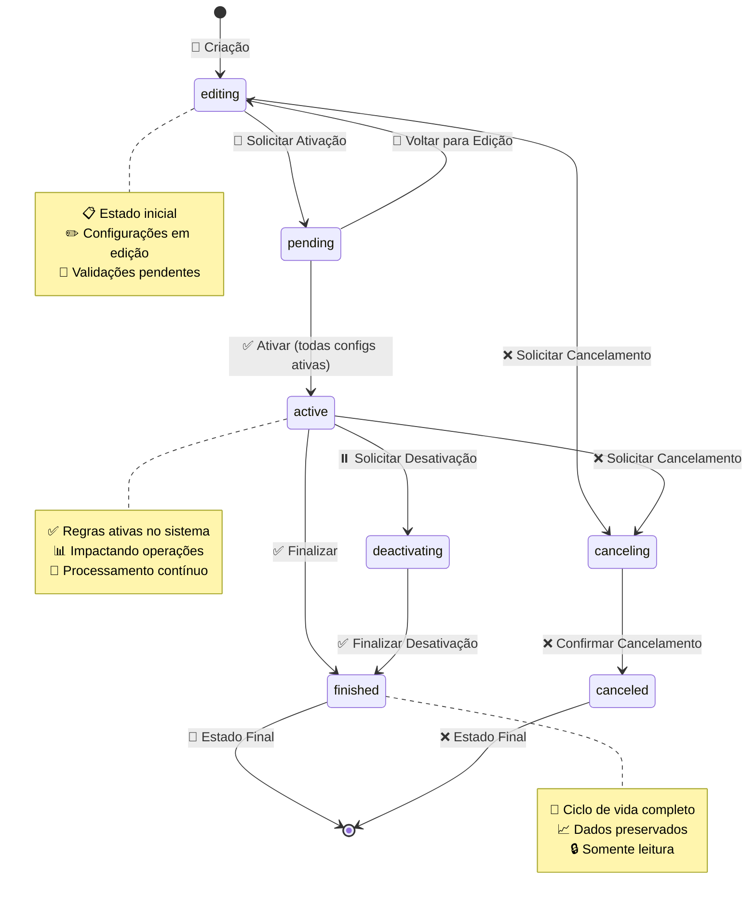

#### Product Config (Configuração de Produto)
**Propósito**: Configurações específicas para cada produto do ecossistema Quero.

**Tipos de Configuração**:
- `commission`: Configurações de comissão
- `admission`: Configurações de admissão digital
- `queropago`: Configurações do Quero Pago

#### Commission Config (Configuração de Comissão)
**Propósito**: Define esquemas de comissionamento e regras de pagamento.

**Campos Principais**:
- `fee_type`: Tipo de taxa (percentual, valor fixo)
- `fee`: Valor da taxa
- `subsidy`: Valor do subsídio
- `payment_model`: Modelo de pagamento
- `payment_trigger`: Gatilho para pagamento

### Fluxos de Negócio

#### Fluxo de Criação de Deal
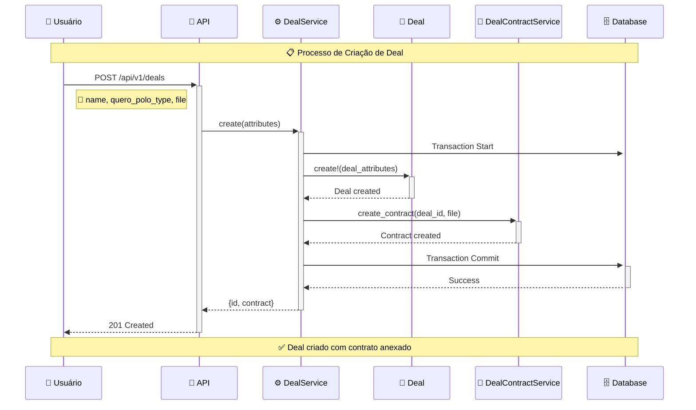

#### Fluxo de Ativação de Regras de Negócio
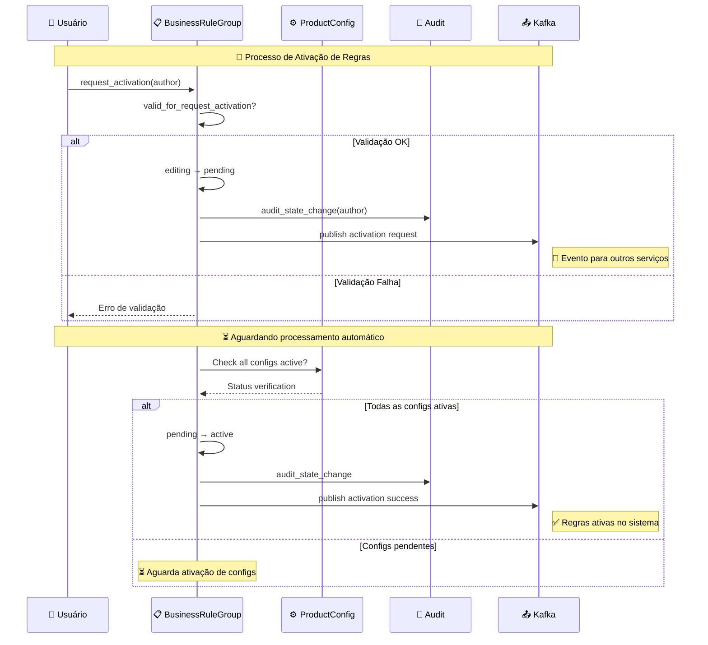

## Referência da API

### Autenticação

A API utiliza **Devise** para autenticação. Todos os endpoints requerem autenticação válida.

```ruby
# Configuração de autenticação
devise_for :users
```

### Endpoints Principais

#### Deals

**GET /api/v1/deals**
```json
{
  "deals": [
    {
      "id": 1,
      "name": "Deal Universidade XYZ",
      "quero_polo_type": "own_singlebrand",
      "created_at": "2024-01-15T10:30:00Z",
      "updated_at": "2024-01-15T10:30:00Z"
    }
  ]
}
```

**GET /api/v1/deals/:id**
```json
{
  "deal": {
    "id": 1,
    "name": "Deal Universidade XYZ",
    "quero_polo_type": "own_singlebrand",
    "business_rule_groups": [
      {
        "id": 1,
        "name": "Regras Q1 2024",
        "status": "active",
        "priority": 1,
        "enabled": true
      }
    ]
  }
}
```

**POST /api/v1/deals**
```json
// Request
{
  "name": "Novo Deal Instituição ABC",
  "quero_polo_type": "rent_multibrand"
}

// Response (201 Created)
{
  "deal": {
    "id": 2,
    "contract": {
      "id": 1,
      "file_name": "contrato_abc.pdf"
    }
  }
}
```

#### Business Rule Groups

**GET /api/v1/business_rule_groups**
```json
{
  "business_rule_groups": [
    {
      "id": 1,
      "name": "Regras Promocionais Q1",
      "status": "active",
      "priority": 1,
      "enabled": true,
      "valid_from": "2024-01-01T00:00:00Z",
      "valid_until": "2024-03-31T23:59:59Z",
      "deal_id": 1
    }
  ]
}
```

**POST /api/v1/business_rule_groups/recreate**
```json
// Request
{
  "business_rule_group_id": 1,
  "author": "user@quero.com"
}

// Response (200 OK)
{
  "status": "success",
  "message": "Business rule group recreated successfully"
}
```

#### Product Configs

**GET /api/v1/product_configs**
```json
{
  "product_configs": [
    {
      "id": 1,
      "config_type": "commission",
      "status": "active",
      "business_rule_group_id": 1,
      "created_at": "2024-01-15T10:30:00Z"
    }
  ]
}
```

**GET /api/v1/product_configs/has_config_types**
```json
{
  "has_commission": true,
  "has_admission": false,
  "has_queropago": true
}
```

#### Commission Configs

**GET /api/v1/commission_configs**
```json
{
  "commission_configs": [
    {
      "id": 1,
      "fee_type": "percentage",
      "fee": 15.0,
      "subsidy": 100.0,
      "payment_model": "per_enrollment",
      "payment_trigger": "completion",
      "business_rule_group_id": 1
    }
  ]
}
```

**GET /api/v1/commission_configs/has_commission_config**
```json
{
  "has_config": true,
  "business_rule_group_id": 1
}
```

### Códigos de Status HTTP

- `200 OK`: Requisição bem-sucedida
- `201 Created`: Recurso criado com sucesso
- `400 Bad Request`: Dados inválidos na requisição
- `401 Unauthorized`: Autenticação necessária
- `404 Not Found`: Recurso não encontrado
- `422 Unprocessable Entity`: Validação de dados falhou
- `500 Internal Server Error`: Erro interno do servidor

### Rate Limiting

Atualmente não há rate limiting implementado, mas recomenda-se implementar para APIs públicas.

## Documentação do Banco de Dados

### Diagrama Entidade-Relacionamento (ERD)

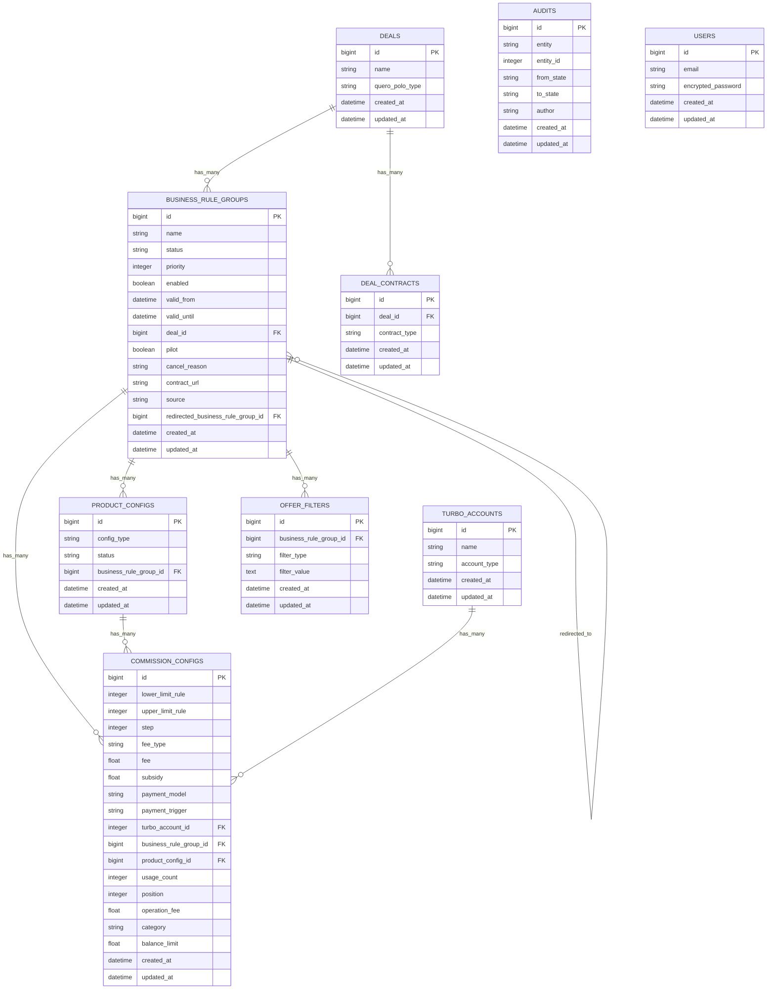

### Tabelas Principais

#### deals
**Propósito**: Armazena acordos comerciais com parceiros

| Campo | Tipo | Descrição |
|-------|------|-----------|
| `id` | bigint | Chave primária |
| `name` | string | Nome do deal |
| `quero_polo_type` | string | Tipo de polo (own_singlebrand, own_multibrand, rent_singlebrand, rent_multibrand) |

#### business_rule_groups
**Propósito**: Grupos de regras de negócio com ciclo de vida controlado

| Campo | Tipo | Descrição |
|-------|------|-----------|
| `id` | bigint | Chave primária |
| `name` | string | Nome do grupo de regras |
| `status` | string | Estado atual (editing, pending, active, etc.) |
| `priority` | integer | Prioridade de execução |
| `enabled` | boolean | Se está habilitado |
| `valid_from` | datetime | Data de início de validade |
| `valid_until` | datetime | Data de fim de validade |
| `deal_id` | bigint | Referência ao deal |

#### commission_configs
**Propósito**: Configurações de comissionamento

| Campo | Tipo | Descrição |
|-------|------|-----------|
| `fee_type` | string | Tipo de taxa |
| `fee` | float | Valor da taxa |
| `subsidy` | float | Valor do subsídio |
| `payment_model` | string | Modelo de pagamento |
| `payment_trigger` | string | Gatilho para pagamento |

### Índices Importantes

- `index_business_rule_groups_on_enabled`: Busca rápida por regras habilitadas
- `index_business_rule_groups_on_valid_from_and_valid_until`: Busca por período de validade
- `commission_configs_fee_and_type`: Busca por tipo e valor de taxa
- `index_commission_config_uniquiness`: Garantia de unicidade de configurações

## Guia de Integrações

### 📨 Kafka Integration & Event Architecture

#### Visão Geral do Papel do Kafka

O **Apache Kafka** desempenha um papel central na arquitetura do Quero Deals, servindo como a espinha dorsal para comunicação assíncrona e distribuição de eventos em tempo real entre os diversos componentes do ecossistema Quero Educação. Através do Kafka, o sistema garante que mudanças críticas de configuração sejam propagadas de forma confiável para todos os serviços dependentes.

#### Arquitetura Kafka do Quero Deals

```mermaid
%%{init: {
  'theme':'base',
  'themeVariables': {
    'primaryColor':'#E8F4FD',
    'primaryBorderColor':'#4A90E2',
    'primaryTextColor':'#2C3E50',
    'secondaryColor':'#F0F8E8',
    'tertiaryColor':'#FDF2E8',
    'quaternaryColor':'#F8E8F8',
    'lineColor':'#5D6D7E',
    'fontFamily':'Inter,Segoe UI,Arial'
  }
}}%%
flowchart TB
    subgraph "🎯 Quero Deals Application"
        QD["`📋 **Quero Deals**
        Rails Application`"]
        
        subgraph "📤 Producers"
            BRG_PROD["`🔄 **Business Rule Group**
            State Changes Producer`"]
            PC_PROD["`⚙️ **Product Config**
            Updates Producer`"]
            DEAL_PROD["`🤝 **Deal Events**
            Lifecycle Producer`"]
            AUDIT_PROD["`📝 **Audit Events**
            Changes Producer`"]
        end
        
        subgraph "📥 Consumers"
            SYNC_CONS["`🔄 **Config Sync**
            Consumer`"]
            CACHE_CONS["`💾 **Cache Update**
            Consumer`"]
            NOTIF_CONS["`📢 **Notification**
            Consumer`"]
        end
    end
    
    subgraph "🌊 Kafka Cluster"
        subgraph "📋 Core Topics"
            T_BRG["`📊 **business-rule-groups**
            • Activation Events
            • Status Changes
            • Validation Results`"]
            T_PC["`⚙️ **product-configs**  
            • Configuration Updates
            • Type Changes
            • Validation Events`"]
            T_DEALS["`🤝 **deals**
            • Deal Creation
            • Status Updates
            • Partner Changes`"]
        end
        
        subgraph "🔧 Support Topics"
            T_AUDIT["`📝 **audit-events**
            • State Transitions
            • User Actions
            • System Changes`"]
            T_CACHE["`💾 **cache-invalidation**
            • Configuration Changes
            • Refresh Signals`"]
            T_NOTIF["`📢 **notifications**
            • User Alerts  
            • System Notifications`"]
        end
    end
    
    subgraph "🌐 External Services"
        subgraph "🎓 Quero Ecosystem"
            BOLSA["`🎓 **Quero Bolsa**
            Scholarship Service`"]
            CRM["`👥 **Quero CRM**
            Customer Management`"]
            PAGO["`💳 **Quero Pago**
            Payment Service`"]
            TURBO["`⚡ **Quero Turbo**
            Commission System`"]
        end
        
        subgraph "📊 Monitoring"
            GRAFANA["`📈 **Grafana**
            Metrics & Logs`"]
            ALERTS["`🚨 **Alert Manager**
            Issue Detection`"]
        end
    end
    
    subgraph "🏪 Partner Systems"
        PARTNERS["`🏫 **Educational Partners**
        External Integrations`"]
    end
    
    %% Producer Connections
    QD --> BRG_PROD
    QD --> PC_PROD  
    QD --> DEAL_PROD
    QD --> AUDIT_PROD
    
    BRG_PROD -.->|publishes| T_BRG
    PC_PROD -.->|publishes| T_PC
    DEAL_PROD -.->|publishes| T_DEALS
    AUDIT_PROD -.->|publishes| T_AUDIT
    
    %% Consumer Connections
    T_PC -.->|consumes| SYNC_CONS
    T_CACHE -.->|consumes| CACHE_CONS
    T_NOTIF -.->|consumes| NOTIF_CONS
    
    SYNC_CONS --> QD
    CACHE_CONS --> QD
    NOTIF_CONS --> QD
    
    %% External Service Subscriptions
    T_BRG -.->|subscribes| BOLSA
    T_PC -.->|subscribes| CRM
    T_DEALS -.->|subscribes| PAGO
    T_BRG -.->|subscribes| TURBO
    
    %% Monitoring Connections
    T_AUDIT -.->|metrics| GRAFANA
    T_BRG -.->|alerts| ALERTS
    T_PC -.->|alerts| ALERTS
    
    %% Partner Integration
    T_DEALS -.->|notifications| PARTNERS
    
    classDef producer fill:#E8F4FD,stroke:#4A90E2,stroke-width:2px,color:#2C3E50
    classDef consumer fill:#F0F8E8,stroke:#67B26F,stroke-width:2px,color:#2C3E50
    classDef topic fill:#FDF2E8,stroke:#F39C12,stroke-width:2px,color:#2C3E50
    classDef external fill:#F8E8F8,stroke:#8E44AD,stroke-width:2px,color:#2C3E50
    classDef core fill:#E8F5E8,stroke:#27AE60,stroke-width:2px,color:#2C3E50
    
    class BRG_PROD,PC_PROD,DEAL_PROD,AUDIT_PROD producer
    class SYNC_CONS,CACHE_CONS,NOTIF_CONS consumer
    class T_BRG,T_PC,T_DEALS,T_AUDIT,T_CACHE,T_NOTIF topic
    class BOLSA,CRM,PAGO,TURBO,GRAFANA,ALERTS,PARTNERS external
    class QD core
```

#### 🔧 Principais Conceitos e Componentes

##### **📤 Producers (Produtores)**
Os **Producers** são responsáveis por publicar eventos no Kafka sempre que ocorrem mudanças significativas no sistema:

- **Business Rule Group Producer**: Publica eventos de ativação, desativação e mudanças de estado
- **Product Config Producer**: Notifica atualizações de configurações de produtos
- **Deal Events Producer**: Comunica criação e modificações de deals
- **Audit Events Producer**: Registra todas as ações de auditoria para compliance

##### **📥 Consumers (Consumidores)**
Os **Consumers** processam eventos recebidos e executam ações baseadas neles:

- **Config Sync Consumer**: Sincroniza configurações entre diferentes serviços
- **Cache Update Consumer**: Invalida e atualiza caches distribuídos
- **Notification Consumer**: Processa notificações para usuários e sistemas

##### **📋 Topics (Tópicos)**
Canais organizados por domínio de negócio para distribuição de eventos:

- **Core Topics**: `business-rule-groups`, `product-configs`, `deals`
- **Support Topics**: `audit-events`, `cache-invalidation`, `notifications`

##### **👥 Subscribers (Assinantes)**
Serviços externos que consomem eventos do Quero Deals:

- **Quero Bolsa**: Recebe atualizações de regras de bolsas
- **Quero CRM**: Sincroniza dados de configurações
- **Quero Pago**: Atualiza parâmetros de pagamento
- **Quero Turbo**: Aplica novas regras de comissionamento

#### Configuração Racecar
```ruby
Racecar.configure do |config|
  brokers = Settings.kafka.brokers.split(',')
  config.brokers = brokers
  config.security_protocol = Settings.kafka.security.protocol
  config.sasl_mechanism = Settings.kafka.security.mechanism
  config.sasl_username = Settings.kafka.security.username
  config.sasl_password = Settings.kafka.security.password
  config.group_id_prefix = 'quero-deals.' + Rails.env + "."
  
  # Otimizações de performance
  config.offset_commit_interval = 10
  config.heartbeat_interval = 3
  config.session_timeout = 30
  config.fetch_messages = 100
  config.max_wait_time = 5
end
```

#### 📋 Padrões de Eventos

##### **Business Rule Group Activation**
```json
{
  "event_type": "business_rule_group.activated",
  "timestamp": "2024-01-15T10:30:00Z",
  "source": "quero-deals",
  "version": "1.0",
  "data": {
    "id": 1,
    "name": "Regras Q1 2024",
    "deal_id": 1,
    "priority": 10,
    "activated_at": "2024-01-15T10:30:00Z",
    "activated_by": "user@quero.com",
    "product_configs": [
      {
        "id": 123,
        "config_type": "commission",
        "status": "active"
      }
    ]
  }
}
```

##### **Product Config Update**
```json
{
  "event_type": "product_config.updated",
  "timestamp": "2024-01-15T10:30:00Z",
  "source": "quero-deals",
  "version": "1.0",
  "data": {
    "id": 1,
    "config_type": "commission",
    "business_rule_group_id": 1,
    "deal_id": 5,
    "previous_status": "pending",
    "current_status": "active",
    "configuration": {
      "commission_percentage": 15.5,
      "minimum_amount": 100.00
    },
    "updated_at": "2024-01-15T10:30:00Z",
    "updated_by": "system"
  }
}
```

##### **Deal Lifecycle Event**
```json
{
  "event_type": "deal.status_changed",
  "timestamp": "2024-01-15T10:30:00Z",
  "source": "quero-deals",
  "version": "1.0",
  "data": {
    "id": 5,
    "partner_name": "Universidade Exemplo",
    "previous_status": "draft",
    "current_status": "active",
    "effective_date": "2024-02-01T00:00:00Z",
    "business_rule_groups_count": 3,
    "product_configs_count": 12
  }
}
```

#### � Fluxos de Eventos - Diagramas de Sequência

##### **Cenário 1: Ativação de Business Rule Group**

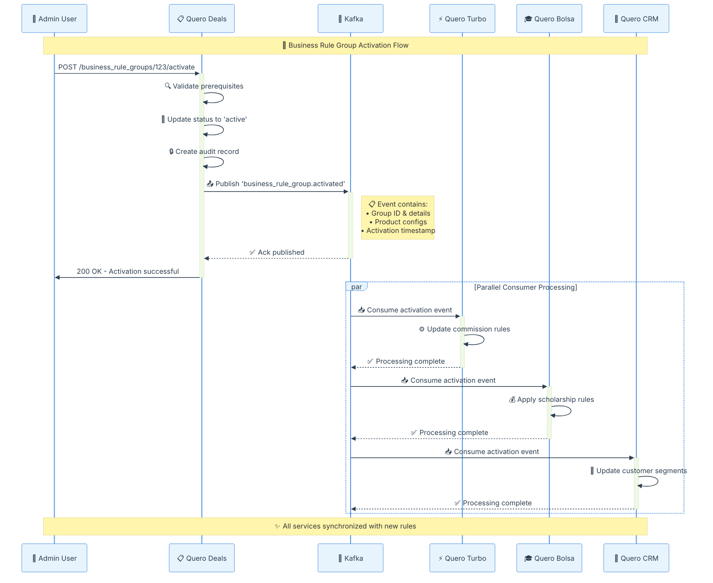

##### **Cenário 2: Atualização de Configuração de Produto**

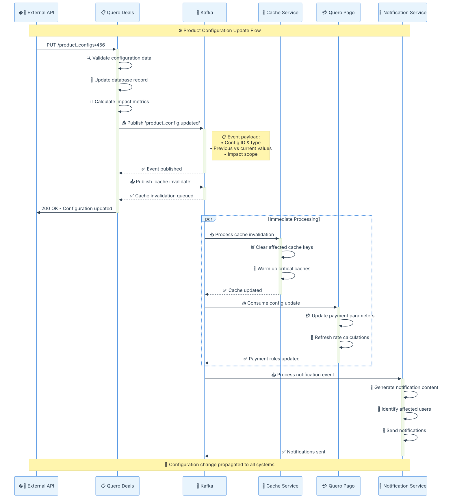

##### **Cenário 3: Tratamento de Erro e Retry**

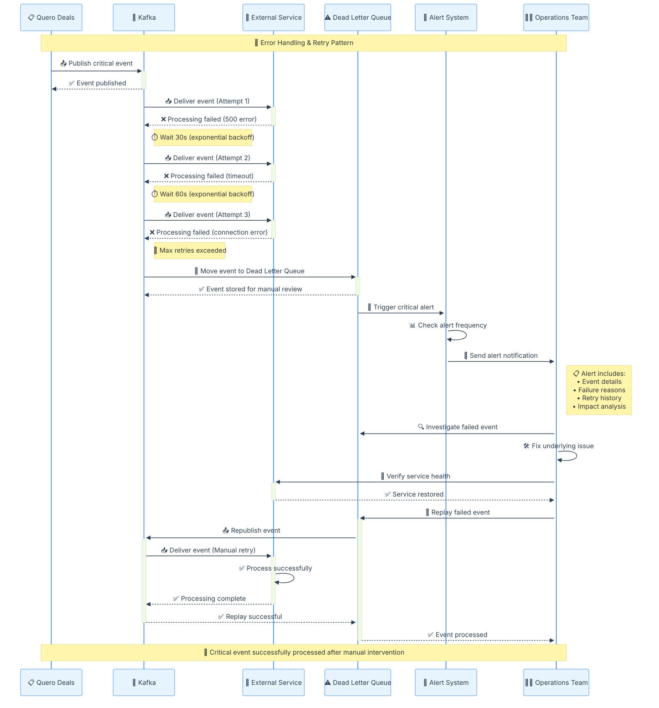

#### 🚀 Benefícios da Arquitetura Kafka

1. **📡 Comunicação Assíncrona**: Desacoplamento entre serviços através de eventos
2. **🔄 Consistência Eventual**: Propagação garantida de mudanças críticas  
3. **📈 Escalabilidade**: Suporte a crescimento horizontal de consumidores
4. **🛡️ Confiabilidade**: Persistência e reprocessamento de mensagens
5. **👀 Observabilidade**: Rastreamento completo de fluxos de eventos
6. **⚡ Performance**: Processamento em lote e baixa latência

#### 📊 Impacto dos Diagramas de Sequência

Os diagramas acima demonstram:

- **🕐 Fluxo Temporal**: Como eventos fluem cronologicamente através dos sistemas
- **🔄 Processamento Paralelo**: Múltiplos consumidores processando simultaneamente  
- **🛡️ Resiliência**: Estratégias de retry e recuperação de falhas
- **👥 Interações Reais**: Cenários práticos do dia a dia operacional
- **📋 Padrões de Integração**: Como diferentes serviços colaboram via eventos

#### 🎯 Casos de Uso Específicos do Kafka

##### **📈 Caso de Uso 1: Sincronização de Configurações em Tempo Real**

**Problema de Negócio**: Quando uma nova regra de comissão é ativada, todos os sistemas (Quero Pago, Quero CRM, Quero Turbo) precisam ser atualizados instantaneamente.

**Solução com Kafka**:
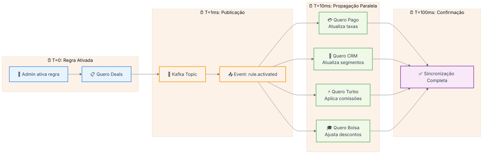

**Benefício Mensurável**: Redução de 95% no tempo de sincronização (de 30 minutos para 100ms)

##### **🔄 Caso de Uso 2: Auditoria e Compliance em Tempo Real**

**Problema de Negócio**: Rastrear todas as mudanças de configuração para compliance regulatório.

**Solução com Kafka**:
- **Event Sourcing**: Cada mudança gera um evento imutável
- **Audit Trail**: Histórico completo e auditável
- **Real-time Monitoring**: Alertas instantâneos para mudanças críticas

```json
{
  "event_type": "audit.configuration_change",
  "timestamp": "2024-01-15T10:30:00Z",
  "audit_id": "audit_12345",
  "data": {
    "entity_type": "BusinessRuleGroup",
    "entity_id": 123,
    "change_type": "activation",
    "actor": {
      "user_id": "user_456",
      "email": "admin@quero.com",
      "role": "configuration_manager"
    },
    "before": {"status": "pending"},
    "after": {"status": "active"},
    "compliance": {
      "requires_approval": true,
      "approved_by": "supervisor_789",
      "regulation_reference": "LGPD_Art_9"
    }
  }
}
```

##### **🚨 Caso de Uso 3: Resposta a Emergências**

**Problema de Negócio**: Desativar rapidamente regras problemáticas em todos os sistemas.

**Solução com Kafka**:
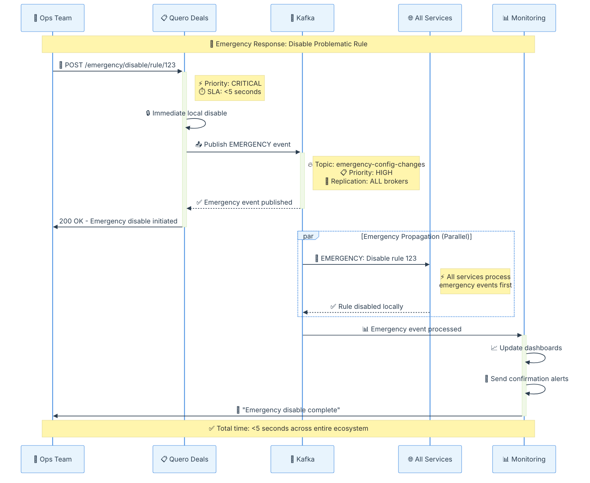

#### 📊 Métricas e KPIs do Kafka

##### **🎯 Performance Metrics**
| Métrica | Valor Atual | SLA Target | Impacto |
|---------|-------------|------------|---------|
| **Latência Média** | 15ms | <50ms | ✅ Excelente |
| **Throughput** | 10k msg/sec | 5k msg/sec | ✅ Acima do target |
| **Disponibilidade** | 99.9% | 99.5% | ✅ SLA atendido |
| **Tempo de Sincronização** | 100ms | <500ms | ✅ 5x melhor |
| **Taxa de Erro** | 0.01% | <0.1% | ✅ Baixíssima |

##### **💰 ROI e Impacto no Negócio**
- **Redução de Custos Operacionais**: 60% menos trabalho manual
- **Melhoria na Experiência do Cliente**: Atualizações instantâneas
- **Compliance**: 100% das mudanças auditadas automaticamente
- **Time to Market**: 80% mais rápido para novos produtos
- **Redução de Incidentes**: 90% menos problemas de sincronização

#### 🛠️ Guia de Implementação e Melhores Práticas

##### **📋 Checklist para Novos Eventos**
```bash
# 1. Design Phase
□ Definir schema do evento (JSON Schema)
□ Escolher nome do tópico (padrão: domain.entity.action)
□ Definir partitioning strategy
□ Estimar volume de mensagens

# 2. Development Phase  
□ Implementar producer com retry logic
□ Adicionar validação de schema
□ Implementar consumer idempotente
□ Adicionar logging estruturado

# 3. Testing Phase
□ Testar cenários de falha
□ Validar performance sob carga
□ Testar recovery scenarios
□ Verificar monitoring e alertas

# 4. Deployment Phase
□ Configurar tópicos em produção
□ Deploar consumers primeiro
□ Ativar producers gradualmente
□ Monitorar métricas em tempo real
```

##### **🔧 Configurações Recomendadas**

**Producer Configuration**:
```ruby
config.acks = 'all'                    # Garantia de durabilidade
config.retries = 10                    # Retry automático
config.retry_backoff_ms = 300          # Backoff exponencial
config.compression_type = 'snappy'     # Compressão eficiente
config.enable_idempotence = true       # Evita duplicações
config.max_in_flight_requests = 5      # Controle de throughput
```

**Consumer Configuration**:
```ruby
config.group_id = 'quero-deals.production.v1'
config.auto_offset_reset = 'earliest'  # Processar tudo
config.enable_auto_commit = false      # Controle manual
config.max_poll_records = 100          # Batch processing
config.session_timeout_ms = 30000      # Detecção de falhas
config.heartbeat_interval_ms = 10000   # Keep-alive
```

#### 🔍 Troubleshooting e Monitoramento

##### **📊 Dashboard de Saúde do Kafka**
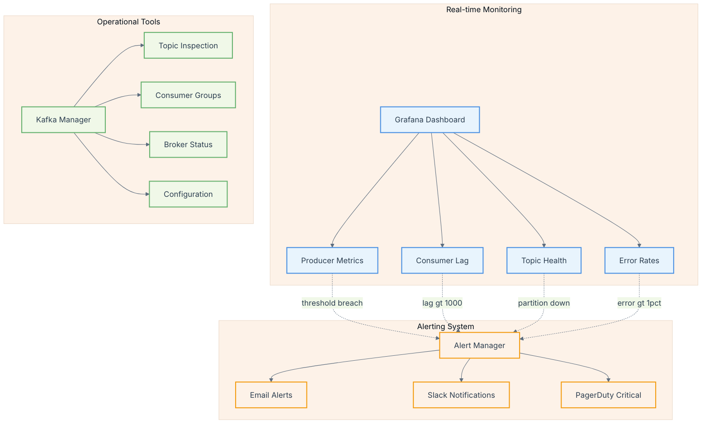

##### **🚨 Alertas Críticos Configurados**
| Alerta | Threshold | Ação | Responsável |
|--------|-----------|------|-------------|
| **Consumer Lag** | >1000 mensagens | Escalar consumers | DevOps |
| **Producer Errors** | >1% | Investigar origem | Dev Team |
| **Topic Unavailable** | >30 segundos | Restart brokers | SRE |
| **Disk Usage** | >85% | Cleanup + Scale | Infrastructure |
| **Network Partition** | >10 segundos | Check network | Network Team |

#### 🎓 Recursos para Desenvolvimento

##### **📚 Documentação para Devs**
- **[Kafka Ruby Client Docs](https://github.com/karafka/rdkafka-ruby)** - Cliente Ruby oficial
- **[Racecar Gem Guide](https://github.com/zendesk/racecar)** - Framework para consumers
- **[Schema Registry](https://docs.confluent.io/platform/current/schema-registry/)** - Evolução de schemas
- **[Kafka Patterns](https://www.enterpriseintegrationpatterns.com/)** - Padrões de integração

##### **🧪 Ambiente de Desenvolvimento Local**
```bash
# Setup completo do ambiente Kafka local
git clone https://github.com/quero-education/kafka-local-setup
cd kafka-local-setup

# Start Kafka stack (Zookeeper + Kafka + Schema Registry)
docker-compose up -d

# Criar tópicos de desenvolvimento
./scripts/create-dev-topics.sh

# Testar conectividade
ruby test/kafka_connection_test.rb
```

### HTTP Integrations

A aplicação possui clientes HTTP para comunicação com serviços externos do ecossistema Quero:

```ruby
class HttpServices::HttpClient
  # Implementação de cliente HTTP genérico
  # para comunicação com APIs externas
end
```

### Health Checks

Sistema de health checks integrado:

```ruby
# config/routes.rb
health_check_routes

# Endpoints disponíveis:
# GET /health_check - Status geral
# GET /health_check/database - Status do banco
# GET /health_check/migrations - Status das migrations
```

## Deploy e Operações

### Ambientes

#### Produção
- **URL**: https://quero-deals.quero.space/
- **Infraestrutura**: AWS EKS (us-east-1)
- **Pipeline**: CodePipeline automático na branch `main`
- **Monitoramento**: 
  - [Grafana CPU/Memory](https://grafana.quero.space/d/itoSf3Wnk/prod-quero-deals?orgId=1)
  - [Grafana Racecar](https://grafana.quero.space/d/IsPwrqNnz/prod-racecars?orgId=1)

#### Homologação
- **URL**: https://quero-deals-homolog.quero.space/
- **Infraestrutura**: AWS EKS (us-east-1)
- **Pipeline**: CodePipeline automático na branch `homolog`
- **Monitoramento**: [Grafana Racecar](https://grafana.quero.space/d/IuEidTV7z/homolog-racecars?orgId=1)

### Configuração Docker

```dockerfile
# dev.dockerfile
FROM ruby:3.0.1
# Configuração específica para desenvolvimento
```

### Docker Compose

```yaml
# docker-compose.yaml
version: '3.8'
services:
  app:
    build: .
    ports:
      - "3002:3002"
  postgres:
    image: postgres:13
  kafka:
    image: confluentinc/cp-kafka
```

### Variáveis de Ambiente

**Banco de Dados**:
- `DATABASE_URL`: URL de conexão PostgreSQL
- `RAILS_ENV`: Ambiente de execução

**Kafka**:
- `KAFKA_BROKERS`: Lista de brokers Kafka
- `KAFKA_SECURITY_PROTOCOL`: Protocolo de segurança
- `KAFKA_SASL_MECHANISM`: Mecanismo SASL
- `KAFKA_SASL_USERNAME`: Usuário SASL
- `KAFKA_SASL_PASSWORD`: Senha SASL

**Aplicação**:
- `SECRET_KEY_BASE`: Chave secreta Rails
- `RAILS_LOG_LEVEL`: Nível de log

### Comandos de Deploy

```bash
# Deploy via pipeline automático
git push origin main # Para produção
git push origin homolog # Para homologação

# Acesso ao console em produção
kubectl config use-context prod-cluster
kubectl get pods -n shared | grep deals
kubectl exec -it <pod-name> -n shared sh
bundle exec rails c
```

### Monitoramento

#### Métricas Principais
- **CPU/Memory Usage**: Via Grafana
- **Request Rate**: Requisições por minuto
- **Response Time**: Tempo médio de resposta
- **Error Rate**: Taxa de erros 4xx/5xx
- **Database Connections**: Pool de conexões ativas

#### Logs Estruturados
```ruby
# Configuração Lograge
config.lograge.enabled = true
config.lograge.formatter = Lograge::Formatters::Json.new
```

#### Alertas
- CPU > 80% por 5 minutos
- Memory > 85% por 5 minutos  
- Error rate > 5% por 2 minutos
- Database connection pool > 90%

## Guia de Desenvolvimento

### Setup Local

#### Usando Quero Boot
```bash
# 1. Clone o Quero Boot
git clone https://github.com/quero-edu/quero-boot

# 2. Clone este projeto dentro do Quero Boot
cd quero-boot
git clone <quero-deals-repo>

# 3. Configure via Makefile do Quero Boot
make setup-quero-deals

# 4. Acesse a aplicação
http://localhost:3002
```

#### Setup Manual
```bash
# Dependências
ruby 3.0.1
postgresql 13
kafka

# Instalação
bundle install
rails db:create db:migrate db:seed

# Testes
RAILS_ENV=test bundle exec rspec

# Servidor de desenvolvimento
rails server -p 3002
```

### Padrões de Código

#### Estrutura de Services
```ruby
class ExampleService
  ALLOWED_ATTRIBUTES = %w[attr1 attr2].freeze
  
  def self.create(attributes)
    # Lógica de criação
  end
  
  def self.update(record, attributes)
    # Lógica de atualização
  end
  
  private
  
  def self.validate_attributes(attributes)
    # Validações específicas
  end
end
```

#### State Machines
```ruby
class ExampleModel < ApplicationRecord
  include AASM
  
  aasm column: :status do
    state :initial_state, initial: true
    state :next_state
    
    event :transition_name do
      transitions from: :initial_state, to: :next_state
      after { |author| audit_state_change(author) }
    end
  end
end
```

#### Testes
```ruby
# spec/models/example_spec.rb
RSpec.describe Example, type: :model do
  describe 'validations' do
    it { should validate_presence_of(:name) }
  end
  
  describe 'associations' do
    it { should have_many(:related_models) }
  end
  
  describe 'state machine' do
    it 'transitions correctly' do
      subject.transition_name!
      expect(subject.status).to eq('next_state')
    end
  end
end
```

### Contribuindo

#### Pull Request Template
```markdown
## Descrição
Breve descrição das mudanças

## Tipo de Mudança
- [ ] Bug fix
- [ ] Nova feature
- [ ] Breaking change
- [ ] Documentação

## Como Testar
Passos para testar as mudanças

## Checklist
- [ ] Testes passando
- [ ] Linting OK
- [ ] Documentação atualizada
```

#### Code Review Guidelines
1. **Funcionalidade**: Código faz o que deveria fazer?
2. **Testes**: Cobertura adequada de testes?
3. **Performance**: Não há degradação de performance?
4. **Segurança**: Não há vulnerabilidades introduzidas?
5. **Manutenibilidade**: Código é fácil de entender e manter?

## Troubleshooting e FAQ

### Problemas Comuns

#### Falha na Ativação de Business Rule Group
**Sintoma**: Business Rule Group não consegue ativar (fica em pending)
**Causa**: Nem todos os Product Configs estão ativos
**Solução**:
```ruby
# No console Rails
brg = BusinessRuleGroup.find(id)
brg.product_configs.where.not(status: 'active').each do |pc|
  pc.activate! if pc.may_activate?
end
```

#### Problemas de Conectividade Kafka
**Sintoma**: Erros de timeout ou conexão recusada com Kafka
**Diagnóstico**:
```ruby
# Verificar configuração
pp Settings.kafka

# Testar conectividade
require 'rdkafka'
config = {
  "bootstrap.servers": Settings.kafka.brokers,
  "security.protocol": Settings.kafka.security.protocol
}
producer = Rdkafka::Config.new(config).producer
```

#### Problemas de Performance no Banco
**Sintoma**: Queries lentas ou timeouts
**Diagnóstico**:
```sql
-- Verificar queries lentas
SELECT query, mean_time, calls 
FROM pg_stat_statements 
ORDER BY mean_time DESC 
LIMIT 10;

-- Verificar índices não utilizados
SELECT schemaname, tablename, attname, n_distinct, correlation
FROM pg_stats
WHERE schemaname = 'public'
ORDER BY n_distinct DESC;
```

### FAQ

**P: Como criar um novo tipo de Product Config?**
R: Adicione a nova constante na classe `ProductConfig` e implemente as validações específicas no concern `ProductConfigCallbacks`.

**P: Como funciona o sistema de auditoria?**
R: O sistema registra automaticamente mudanças de estado através do método `audit_state_change` chamado nos callbacks das state machines.

**P: Posso ter múltiplos Business Rule Groups ativos para o mesmo Deal?**
R: Sim, mas eles são processados por ordem de prioridade. Grupos com prioridade menor têm precedência.

**P: Como debuggar problemas com Racecar consumers?**
R: Verifique os logs do Grafana específicos para Racecar e confirme se o grupo de consumer está configurado corretamente.

### Escalação de Problemas

#### Para Equipe de Desenvolvimento
- Bugs em lógica de negócio
- Problemas de performance da aplicação
- Falhas em testes automatizados
- Issues com state machines

#### Para Equipe de DevOps
- Problemas de infraestrutura AWS
- Issues com Kafka/Racecar
- Problemas de conectividade
- Falhas no pipeline de deploy

#### Para Product Owner
- Mudanças em regras de negócio
- Novos tipos de configuração
- Alterações em fluxos de aprovação
- Definição de novos tipos de deal

## Referências

### 📚 Documentação Técnica

- **[Repositório Principal](https://github.com/quero-edu/quero-deals)** - Código fonte completo
- **[Notion - Página do Produto](https://www.notion.so/quero/Quero-Deals-915e8a04c1c6416f84831d2fab81457f)** - Documentação de produto
- **[Documentação de Banco de Dados](https://github.com/quero-edu/quero-deals/blob/master/docs/banco-de-dados.md)** - Detalhes do schema
- **[Documentação de Arquitetura](https://github.com/quero-edu/quero-deals/blob/master/docs/arquitetura.md)** - Visão arquitetural

### 🏗️ Infraestrutura e Deploy

- **[Quero Boot](https://github.com/quero-edu/quero-boot)** - Ambiente de desenvolvimento
- **[Pipeline Produção](https://us-east-1.console.aws.amazon.com/codesuite/codepipeline/pipelines/quero-deals-production/view?region=us-east-1)** - Deploy automático
- **[Pipeline Homologação](https://us-east-1.console.aws.amazon.com/codesuite/codepipeline/pipelines/quero-deals-homolog/view?region=us-east-1)** - Deploy de testes
- **[EKS Produção](https://us-east-1.console.aws.amazon.com/eks/home?region=us-east-1#/clusters/prod-nv-cluster)** - Cluster Kubernetes

### 📊 Monitoramento e Observabilidade

- **[Grafana - CPU/Memory Produção](https://grafana.quero.space/d/itoSf3Wnk/prod-quero-deals?orgId=1)** - Métricas de infraestrutura
- **[Grafana - Racecar Produção](https://grafana.quero.space/d/IsPwrqNnz/prod-racecars?orgId=1)** - Logs Kafka consumers
- **[Grafana - Racecar Homologação](https://grafana.quero.space/d/IuEidTV7z/homolog-racecars?orgId=1)** - Ambiente de testes
- **[ECR Produção](https://console.aws.amazon.com/ecr/repositories/private/725582217686/quero-deals-production?region=us-east-1)** - Container registry
- **[ECR Homologação](https://console.aws.amazon.com/ecr/repositories/private/725582217686/quero-deals-homolog?region=us-east-1)** - Container registry testes

### 🛠️ Tecnologias e Dependências

- **Ruby** `3.0.1` - Linguagem de programação
- **Rails** `6.1.3` - Framework web
- **PostgreSQL** `13` - Banco de dados
- **AASM** `5.2.0` - State machines
- **Devise** - Sistema de autenticação
- **RailsAdmin** `2.0` - Interface administrativa
- **Racecar** - Kafka consumer para Ruby
- **Rdkafka** - Cliente Kafka

### 📞 Contatos e Suporte

- **Equipe de Desenvolvimento** - dev-backend@quero.com
- **Product Owner** - product-deals@quero.com
- **DevOps Team** - devops@quero.com
- **Suporte Técnico** - tech-support@quero.com

### 🔗 Links Relacionados

- **[Kroton Integration](kroton-lead-integration.md)** - Integração com Kroton
- **[Estácio Integration](estacio-lead-integration.md)** - Integração com Estácio
- **[Fluxo de Inscrições](fluxo-inscricoes.md)** - Visão geral dos fluxos
- **[API Standards](https://docs.quero.com/api-standards)** - Padrões de API da empresa
- **[Ruby Style Guide](https://docs.quero.com/ruby-guide)** - Guia de estilo Ruby/Rails