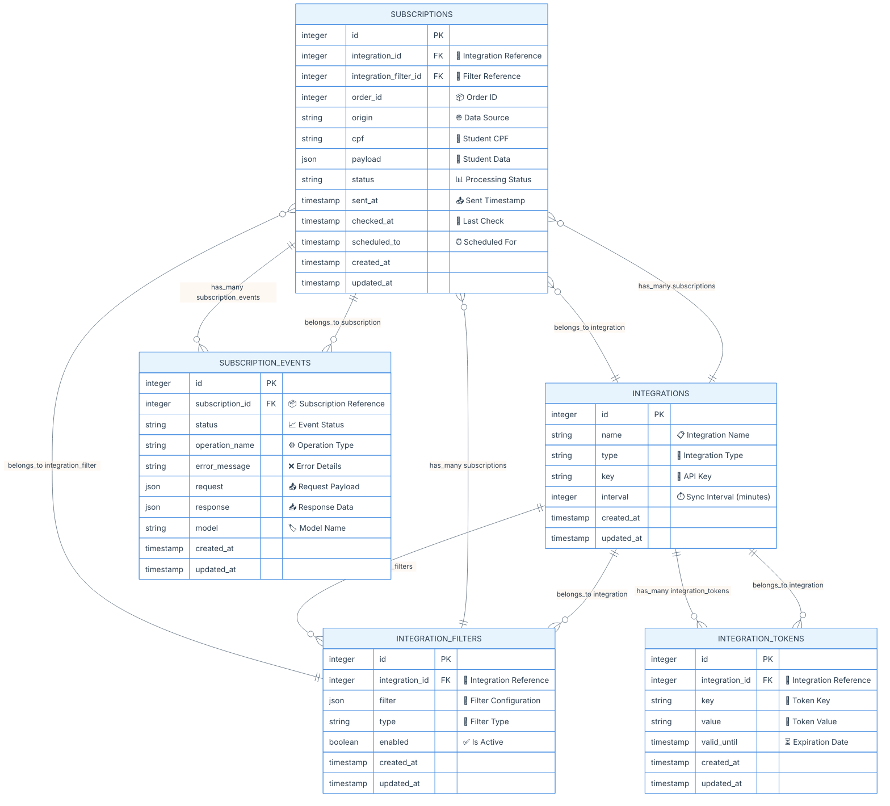
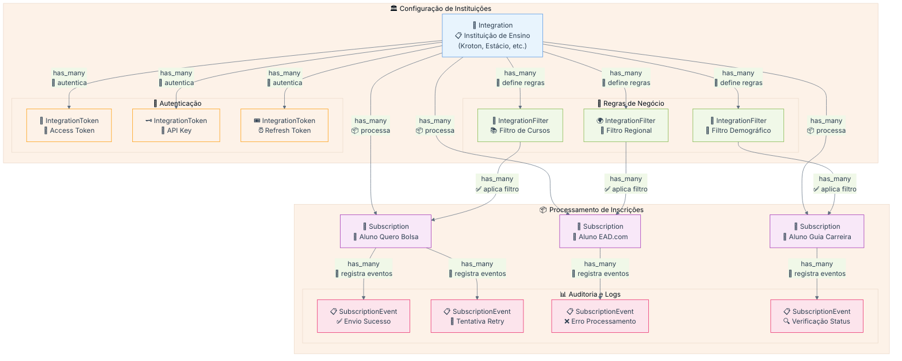
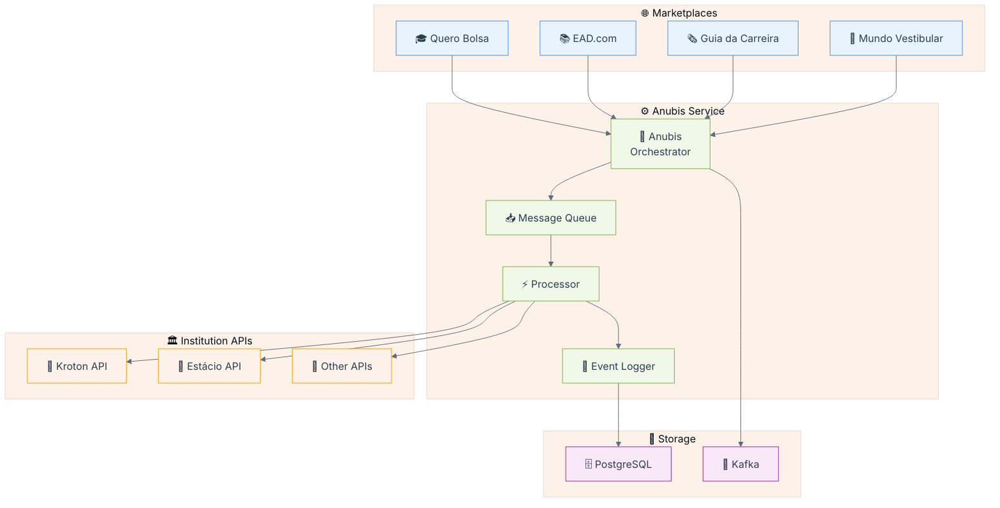
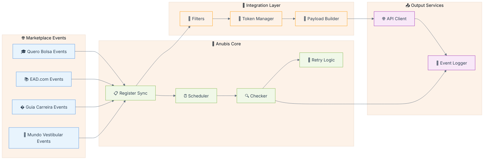
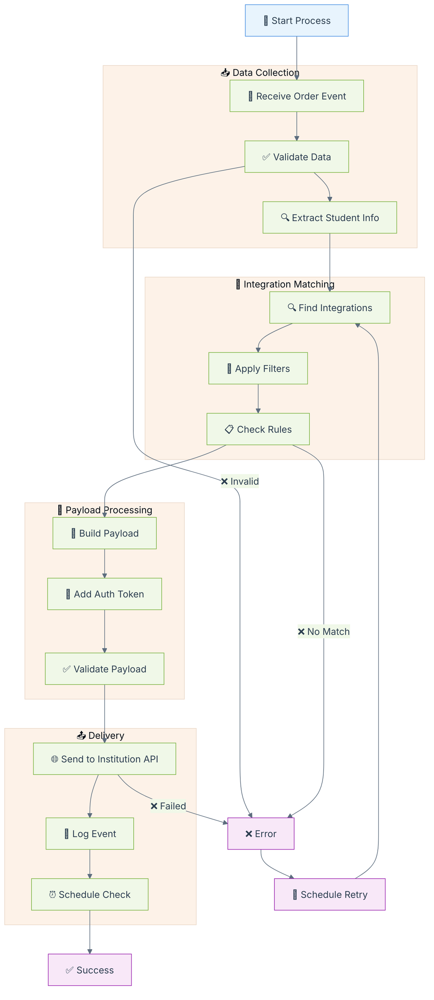
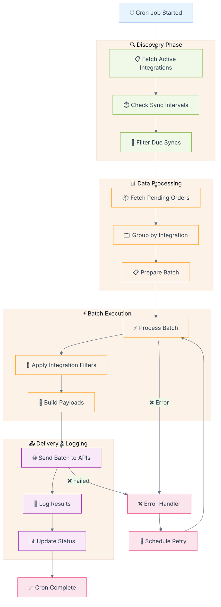
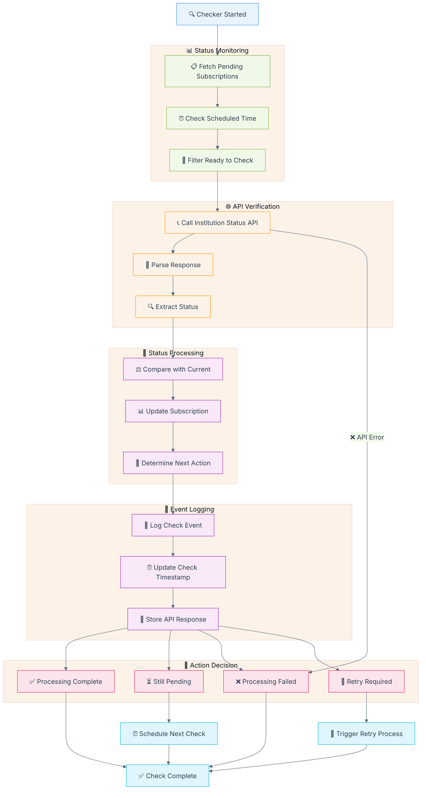

#  Anubis Projeto - Requisitos

## Descrição

O Anubis é um microserviço responsável pela orquestração do envio de dados de alunos pagantes para APIs de instituições de ensino superior, como Kroton e Estácio. Ele gerencia o fluxo de inscrições vindas do Quero Bolsa e dos novos marketplaces (Ead.com, Guia da Carreira e Mundo Vestibular), organizando os payloads e registrando logs estruturados com o status das tentativas, além de implementar mecanismos automáticos de retry para falhas temporárias.

O escopo do serviço não inclui o envio de leads do Quero Captação, alunos pagantes de outros produtos da Qeevo, agendamento de envios ou interface para reenvio manual de falhas. O foco está na integração eficiente e segura dos dados de alunos pagantes entre os sistemas internos e as APIs das instituições parceiras.


## Modelo de Dados (ER Diagram)

📊 Diagrama Entidade-Relacionamento



### 📋 Informações Relevantes do Modelo de Dados

#### 🏛️ Entidades Principais e Seus Propósitos

**🔌 Integration (Integrações)**
- **Propósito**: Representa cada API de instituição de ensino (Kroton, Estácio, etc.)
- **Campos Críticos**:
  - `name`: Nome da instituição para identificação
  - `type`: Tipo de integração (REST, SOAP, GraphQL)
  - `key`: Chave de identificação única da API
  - `interval`: Intervalo em minutos para sincronização via cron

**🎯 IntegrationFilter (Filtros de Integração)**
- **Propósito**: Define regras de negócio específicas por instituição
- **Campos Críticos**:
  - `filter`: JSON contendo regras (ex: cursos aceitos, regiões, faixa etária)
  - `type`: Tipo de filtro (course, region, demographic, etc.)
  - `enabled`: Flag para ativar/desativar filtro dinamicamente

**📦 Subscription (Inscrições)**
- **Propósito**: Representa cada inscrição de aluno a ser processada
- **Campos Críticos**:
  - `order_id`: ID do pedido no sistema origem (Quero Bolsa, etc.)
  - `origin`: Marketplace de origem (quero_bolsa, ead_com, etc.)
  - `cpf`: CPF do aluno para identificação única
  - `payload`: Dados completos do aluno em formato JSON
  - `status`: Estado atual (pending, sent, confirmed, failed)
  - Timestamps para controle de fluxo temporal

**🔐 IntegrationToken (Tokens de Autenticação)**
- **Propósito**: Gerencia tokens de acesso às APIs das instituições
- **Campos Críticos**:
  - `key`: Tipo de token (access_token, api_key, bearer, etc.)
  - `value`: Valor do token criptografado
  - `valid_until`: Data de expiração para renovação automática

**📝 SubscriptionEvent (Log de Eventos)**
- **Propósito**: Auditoria completa de todas as operações
- **Campos Críticos**:
  - `status`: Resultado da operação (success, error, retry)
  - `operation_name`: Nome da operação (register_sync, checker, cron)
  - `error_message`: Detalhes de erro para debugging
  - `request`/`response`: Payloads completos para análise

#### 🔄 Relacionamentos e Fluxo de Dados

🏗️ Hierarquia de Dependências



**Fluxo de Processamento:**
1. **Integration** define a instituição de destino
2. **IntegrationFilter** determina quais alunos são elegíveis
3. **Subscription** armazena dados do aluno para processamento
4. **IntegrationToken** fornece autenticação para API calls
5. **SubscriptionEvent** registra cada tentativa e resultado

#### 📊 Estados e Transições

**Status da Subscription:**
- `pending`: Aguardando processamento
- `filtered`: Não passou nos filtros da instituição
- `sent`: Enviado para API da instituição
- `confirmed`: Confirmado pela instituição
- `failed`: Falha no processamento
- `retry`: Agendado para nova tentativa

**Tipos de SubscriptionEvent:**
- `register_sync`: Processamento individual em tempo real
- `register_cron`: Processamento em lote via cron
- `checker`: Verificação de status na instituição
- `token_refresh`: Renovação de tokens
- `retry_attempt`: Tentativa de reenvio

#### 🛡️ Considerações de Segurança e Performance

**Segurança:**
- CPF deve ser hasheado/criptografado em produção
- Tokens devem ser armazenados com criptografia
- Payload pode conter dados sensíveis - considerar anonimização

**Performance:**
- Indexar `order_id`, `cpf`, `status` para consultas rápidas
- Particionamento de `SubscriptionEvent` por data
- Cache de `IntegrationFilter` para reduzir consultas
- Cleanup automático de eventos antigos

**Monitoramento:**
- Métricas por status de subscription
- Alertas para falhas em integrações específicas
- Dashboard de performance por instituição

## Fluxos do Projeto

### 🏗️ Visão Geral do Sistema (Overview)

🏗️ Diagrama de Visão Geral do Sistema



**📋 Explicação da Visão Geral:**

O Anubis atua como um **orquestrador central** que recebe dados de alunos pagantes de múltiplos marketplaces educacionais e os distribui para as APIs das instituições de ensino superior. O fluxo é unidirecional e assíncrono:

- **Entrada de Dados**: Quero Bolsa, EAD.com, Guia da Carreira e Mundo Vestibular enviam informações de inscrições
- **Processamento**: O Anubis valida, transforma e enfileira os dados para processamento
- **Distribuição**: Os dados são enviados para APIs de instituições como Kroton, Estácio e outras
- **Persistência**: PostgreSQL armazena os dados estruturados e logs, enquanto Kafka gerencia mensagens assíncronas
- **Monitoramento**: Cada operação é logada para auditoria e debugging

### 🔧 Arquitetura de Serviços

🔧 Diagrama da Arquitetura de Serviços



**⚙️ Explicação da Arquitetura de Serviços:**

Esta arquitetura modular divide o Anubis em **componentes especializados** que trabalham em conjunto:

- **Eventos de Marketplaces**: Quero Bolsa, EAD.com, Guia da Carreira e Mundo Vestibular enviam eventos de inscrições de alunos pagantes
- **Núcleo de Processamento**: 
  - **Register Sync**: Processa inscrições em tempo real
  - **Scheduler**: Agenda tarefas e verificações periódicas
  - **Checker**: Monitora status das integrações
  - **Retry Logic**: Gerencia reenvios automáticos em caso de falha
- **Camada de Integração**:
  - **Filters**: Aplicam regras de negócio específicas por instituição
  - **Token Manager**: Gerencia autenticação e tokens de acesso
  - **Payload Builder**: Constrói dados no formato esperado por cada API
- **Serviços de Saída**:
  - **API Client**: Comunica com APIs externas das instituições
  - **Event Logger**: Registra todos os eventos para auditoria

#### 📋 Fluxo Register Sync

📋 Diagrama do Fluxo Register Sync



**🔄 Explicação do Register Sync:**

O **Register Sync** é o processo principal de sincronização em tempo real que processa cada inscrição individualmente:

1. **Coleta de Dados**:
   - Recebe eventos de inscrição dos marketplaces
   - Valida integridade e formato dos dados
   - Extrai informações do aluno (CPF, dados pessoais, curso)

2. **Matching de Integração**:
   - Busca integrações ativas para a instituição
   - Aplica filtros específicos (curso, região, perfil do aluno)
   - Verifica regras de negócio antes do envio

3. **Preparação do Payload**:
   - Constrói payload no formato esperado pela API da instituição
   - Adiciona tokens de autenticação válidos
   - Valida estrutura final do payload

4. **Entrega e Logging**:
   - Envia dados para API da instituição
   - Registra evento com status de sucesso/falha
   - Agenda verificação posterior do status de processamento

5. **Tratamento de Erros**:
   - Em caso de falha, programa retry automático
   - Mantém contador de tentativas
   - Escalona para intervenção manual após limite de tentativas

#### ⏰ Fluxo Register Cron

⏰ Diagrama do Fluxo Register Cron



**⏰ Explicação do Register Cron:**

O **Register Cron** é o processo batch que executa periodicamente para processar volumes maiores de dados:

1. **Fase de Descoberta**:
   - Executa em intervalos programados (ex: a cada hora)
   - Busca todas as integrações ativas no sistema
   - Filtra integrações que estão no tempo de sincronização
   - Identifica quais precisam de processamento batch

2. **Processamento de Dados**:
   - Busca pedidos pendentes no período
   - Agrupa por integração para otimizar processamento
   - Prepara lotes (batches) para envio em massa

3. **Execução em Lote**:
   - Processa múltiplas inscrições simultaneamente
   - Aplica filtros de integração em massa
   - Constrói payloads otimizados para envio batch

4. **Entrega e Monitoramento**:
   - Envia lotes para APIs das instituições
   - Registra resultados de cada lote processado
   - Atualiza status de todas as inscrições processadas

5. **Recuperação de Erros**:
   - Identifica lotes que falharam
   - Agenda reprocessamento automático
   - Mantém métricas de performance e taxa de sucesso

**💡 Diferença entre Sync e Cron:**
- **Sync**: Processa inscrições individuais em tempo real
- **Cron**: Processa lotes de inscrições em intervalos programados

#### 🔍 Fluxo Checker

🔍 Diagrama do Fluxo Checker



**🔍 Explicação do Fluxo Checker:**

O **Checker** é o componente responsável por **monitorar o status de processamento** das inscrições nas instituições:

1. **Monitoramento de Status**:
   - Executa periodicamente para verificar inscrições pendentes
   - Identifica inscrições que precisam de verificação de status
   - Filtra apenas aquelas que atingiram o tempo de verificação programado

2. **Verificação via API**:
   - Chama APIs de status das instituições para consultar andamento
   - Faz parsing das respostas que podem ter formatos diferentes por instituição
   - Extrai informações relevantes sobre o status atual da inscrição

3. **Processamento de Status**:
   - Compara status atual com status anterior armazenado
   - Atualiza informações da inscrição no banco de dados
   - Determina próxima ação baseada no novo status

4. **Logging de Eventos**:
   - Registra cada verificação realizada
   - Atualiza timestamp da última verificação
   - Armazena resposta completa da API para auditoria

5. **Decisões de Fluxo**:
   - **Sucesso**: Inscrição foi processada com sucesso pela instituição
   - **Pendente**: Ainda em processamento, agenda próxima verificação
   - **Falha**: Processamento falhou na instituição, marca como erro
   - **Retry**: Problema temporário, agenda nova tentativa de envio

**🎯 Objetivo do Checker:**
Garantir que todas as inscrições enviadas sejam devidamente processadas pelas instituições, fornecendo visibilidade completa do pipeline de integração e permitindo intervenções quando necessário.

## 📋 Requisitos Funcionais

### 🔄 Processamento de Inscrições
- **RF001**: O sistema deve receber inscrições de alunos pagantes dos marketplaces (Quero Bolsa, EAD.com, Guia da Carreira, Mundo Vestibular)
- **RF002**: O sistema deve validar dados obrigatórios antes do processamento (CPF, dados pessoais, curso)
- **RF003**: O sistema deve aplicar filtros específicos por instituição antes do envio
- **RF004**: O sistema deve construir payloads no formato esperado por cada API de instituição
- **RF005**: O sistema deve gerenciar tokens de autenticação automaticamente

### 📤 Integração com APIs
- **RF006**: O sistema deve enviar dados para APIs de instituições de ensino superior
- **RF007**: O sistema deve implementar retry automático para falhas temporárias (máximo 3 tentativas)
- **RF008**: O sistema deve verificar status de processamento nas instituições periodicamente
- **RF009**: O sistema deve processar respostas em diferentes formatos (JSON, XML, etc.)

### 📊 Monitoramento e Auditoria
- **RF010**: O sistema deve registrar logs estruturados de todas as operações
- **RF011**: O sistema deve manter histórico completo de tentativas e respostas
- **RF012**: O sistema deve gerar métricas de performance por instituição
- **RF013**: O sistema deve alertar sobre falhas críticas e integrações inativas

## 🛡️ Requisitos Não-Funcionais

### 🚀 Performance
- **RNF001**: O sistema deve processar até 10.000 inscrições por hora
- **RNF002**: Tempo de resposta máximo de 5 segundos para processamento individual
- **RNF003**: Processamento em lote deve completar em até 30 minutos
- **RNF004**: APIs de instituições devem ter timeout de 30 segundos

### 🔒 Segurança
- **RNF005**: CPFs devem ser armazenados com hash SHA-256
- **RNF006**: Tokens de API devem ser criptografados em repouso
- **RNF007**: Logs não devem expor dados sensíveis dos alunos
- **RNF008**: Comunicação com APIs deve usar HTTPS/TLS 1.2+

### 📈 Escalabilidade
- **RNF009**: Sistema deve suportar crescimento de 50% ao ano no volume
- **RNF010**: Banco de dados deve suportar particionamento por data
- **RNF011**: Sistema deve funcionar em arquitetura de microserviços
- **RNF012**: Deve permitir adição de novas instituições sem impacto

### 🔧 Confiabilidade
- **RNF013**: Disponibilidade mínima de 99.5% (excluindo manutenções)
- **RNF014**: Backup automático diário dos dados críticos
- **RNF015**: Recuperação em caso de falha em até 1 hora
- **RNF016**: Retenção de logs por no mínimo 6 meses

## 🎯 Critérios de Aceitação

### ✅ Cenários de Sucesso
1. **Processamento Normal**: Inscrição válida é enviada e confirmada pela instituição
2. **Aplicação de Filtros**: Inscrição é filtrada corretamente baseada nas regras
3. **Retry Automático**: Falha temporária é recuperada automaticamente
4. **Monitoramento**: Dashboards mostram métricas em tempo real

### ❌ Cenários de Erro
1. **Dados Inválidos**: Sistema rejeita e loga inscrições com dados inconsistentes
2. **API Indisponível**: Sistema agenda retry e notifica equipe de operações
3. **Token Expirado**: Sistema renova automaticamente ou alerta para renovação manual
4. **Limite de Tentativas**: Após 3 falhas, marca para intervenção manual

## 🚫 Exclusões do Escopo

- **Não incluído**: Envio de leads do Quero Captação
- **Não incluído**: Alunos pagantes de outros produtos Qeevo
- **Não incluído**: Interface para reenvio manual de falhas
- **Não incluído**: Agendamento customizado de envios
- **Não incluído**: Relatórios financeiros ou de cobrança

## 🛠️ Especificações Técnicas Rails

### 📦 Stack Tecnológico
- **Framework**: Rails 8.0.3
- **Ruby Version**: 3.4.5
- **Database**: PostgreSQL 17
- **Job Processing**: Solid Queue (produção), Async (desenvolvimento)
- **Cache**: Solid Cache
- **WebSocket**: Solid Cable
- **Deployment**: Kamal + Docker

### 🏗️ Arquitetura de Componentes Rails

#### 📋 Models & Associations
```ruby
# app/models/integration.rb
class Integration < ApplicationRecord
  has_many :integration_filters, dependent: :destroy
  has_many :integration_tokens, dependent: :destroy
  has_many :subscriptions, dependent: :restrict_with_error
  
  validates :name, presence: true, uniqueness: true
  validates :type, inclusion: { in: %w[rest soap graphql] }
  validates :interval, numericality: { greater_than: 0 }
  
  scope :active, -> { where(enabled: true) }
  scope :due_for_sync, -> { where('last_sync_at < ?', interval.minutes.ago) }
end

# app/models/subscription.rb
class Subscription < ApplicationRecord
  include AASM
  
  belongs_to :integration
  belongs_to :integration_filter
  has_many :subscription_events, dependent: :destroy
  
  validates :cpf, presence: true, format: { with: /\A\d{11}\z/ }
  validates :order_id, presence: true, uniqueness: true
  
  aasm column: :status do
    state :pending, initial: true
    state :filtered, :sent, :confirmed, :failed, :retry
    
    event :filter_out do
      transitions from: :pending, to: :filtered
    end
    
    event :send_to_institution do
      transitions from: [:pending, :retry], to: :sent
    end
    
    event :confirm_processing do
      transitions from: :sent, to: :confirmed
    end
    
    event :mark_failed do
      transitions from: [:pending, :sent, :retry], to: :failed
    end
    
    event :schedule_retry do
      transitions from: [:sent, :failed], to: :retry
    end
  end
end
```

#### 🔄 Jobs & Background Processing
```ruby
# app/jobs/register_sync_job.rb
class RegisterSyncJob < ApplicationJob
  queue_as :high_priority
  retry_on StandardError, wait: :exponentially_longer, attempts: 3
  
  def perform(subscription_id)
    subscription = Subscription.find(subscription_id)
    RegisterSyncService.new(subscription).call
  end
end

# app/jobs/register_cron_job.rb
class RegisterCronJob < ApplicationJob
  queue_as :default
  
  def perform
    Integration.active.due_for_sync.find_each do |integration|
      RegisterBatchService.new(integration).call
    end
  end
end

# app/jobs/checker_job.rb
class CheckerJob < ApplicationJob
  queue_as :low_priority
  
  def perform
    subscriptions = Subscription.sent
                              .where('checked_at < ? OR checked_at IS NULL', 1.hour.ago)
    
    subscriptions.find_each do |subscription|
      CheckerService.new(subscription).call
    end
  end
end
```

#### 🎯 Services & Business Logic
```ruby
# app/services/register_sync_service.rb
class RegisterSyncService < ApplicationService
  def initialize(subscription)
    @subscription = subscription
    @integration = subscription.integration
  end
  
  def call
    return filter_subscription unless passes_filters?
    
    payload = build_payload
    response = send_to_api(payload)
    
    if response.success?
      @subscription.send_to_institution!
      schedule_status_check
    else
      handle_failure(response)
    end
    
    log_event(response)
  end
  
  private
  
  def passes_filters?
    @subscription.integration_filter.apply(@subscription)
  end
  
  def build_payload
    PayloadBuilder.new(@subscription, @integration).build
  end
  
  def send_to_api(payload)
    ApiClient.new(@integration).post(payload)
  end
end

# app/services/application_service.rb
class ApplicationService
  def self.call(*args, &block)
    new(*args, &block).call
  end
end
```

#### 🔌 API Integration
```ruby
# app/lib/api_client.rb
class ApiClient
  def initialize(integration)
    @integration = integration
    @base_url = integration.base_url
    @timeout = 30.seconds
  end
  
  def post(payload)
    connection.post do |req|
      req.url endpoint_path
      req.headers = headers
      req.body = payload.to_json
    end
  rescue Faraday::TimeoutError => e
    ApiResponse.new(success: false, error: "Timeout: #{e.message}")
  end
  
  private
  
  def connection
    @connection ||= Faraday.new(url: @base_url) do |f|
      f.request :json
      f.response :json
      f.adapter Faraday.default_adapter
      f.options.timeout = @timeout
    end
  end
  
  def headers
    token = @integration.current_token
    {
      'Content-Type' => 'application/json',
      'Authorization' => "Bearer #{token.decrypt_value}"
    }
  end
end
```

### 📊 Database Considerations

#### 🗂️ Indexing Strategy
```sql
-- db/migrate/add_performance_indexes.rb
class AddPerformanceIndexes < ActiveRecord::Migration[8.0]
  def change
    add_index :subscriptions, [:status, :created_at]
    add_index :subscriptions, [:integration_id, :status]
    add_index :subscriptions, :cpf, using: :hash
    add_index :subscription_events, [:subscription_id, :created_at]
    add_index :integration_tokens, [:integration_id, :valid_until]
    
    # Partial indexes for common queries
    add_index :subscriptions, :checked_at, 
              where: "status = 'sent'", 
              name: 'idx_subscriptions_sent_checked_at'
  end
end
```

#### 🔒 Security Enhancements
```ruby
# app/models/concerns/encryptable.rb
module Encryptable
  extend ActiveSupport::Concern
  
  included do
    encrypts :cpf, deterministic: true
    encrypts :value, deterministic: false  # for tokens
  end
end

# config/application.rb
config.force_ssl = true  # in production
config.active_record.encryption.primary_key = ENV['AR_ENCRYPTION_PRIMARY_KEY']
config.active_record.encryption.deterministic_key = ENV['AR_ENCRYPTION_DETERMINISTIC_KEY']
```

### 🚀 Deployment & Operations

#### 📈 Monitoring & Metrics
```ruby
# app/controllers/health_controller.rb
class HealthController < ApplicationController
  def check
    render json: {
      status: 'healthy',
      timestamp: Time.current,
      database: database_healthy?,
      redis: redis_healthy?,
      queue: queue_healthy?
    }
  end
  
  private
  
  def database_healthy?
    ActiveRecord::Base.connection.execute('SELECT 1')
    true
  rescue => e
    false
  end
end

# config/schedule.rb (usando whenever gem)
every 5.minutes do
  runner "CheckerJob.perform_later"
end

every 1.hour do
  runner "RegisterCronJob.perform_later"
end

every 1.day, at: '2:00 am' do
  runner "CleanupOldEventsJob.perform_later"
end
```

#### 🔧 Configuration Management
```yaml
# config/database.yml
production:
  adapter: postgresql
  host: <%= ENV['DB_HOST'] %>
  database: <%= ENV['DB_NAME'] %>
  username: <%= ENV['DB_USER'] %>
  password: <%= ENV['DB_PASSWORD'] %>
  pool: <%= ENV['DB_POOL'] || 25 %>
  timeout: 5000
  
# config/environments/production.rb
config.active_job.queue_adapter = :solid_queue
config.cache_store = :solid_cache_store
config.log_level = :info
config.force_ssl = true
```

### 🧪 Testing Strategy

#### 🔍 RSpec Configuration
```ruby
# spec/services/register_sync_service_spec.rb
RSpec.describe RegisterSyncService do
  describe '#call' do
    let(:integration) { create(:integration) }
    let(:subscription) { create(:subscription, :pending, integration: integration) }
    let(:service) { described_class.new(subscription) }
    
    context 'when subscription passes filters' do
      before { allow_any_instance_of(IntegrationFilter).to receive(:apply).and_return(true) }
      
      it 'sends subscription to institution' do
        expect { service.call }.to change { subscription.reload.status }.to('sent')
      end
      
      it 'creates a subscription event' do
        expect { service.call }.to change { SubscriptionEvent.count }.by(1)
      end
    end
  end
end

# spec/factories/subscriptions.rb
FactoryBot.define do
  factory :subscription do
    association :integration
    association :integration_filter
    order_id { Faker::Number.unique.number(digits: 8) }
    origin { 'quero_bolsa' }
    cpf { Faker::IDNumber.valid }
    payload { { name: Faker::Name.name, course: Faker::Educator.course_name } }
    status { 'pending' }
    
    trait :sent do
      status { 'sent' }
      sent_at { 1.hour.ago }
    end
  end
end
```

## Outras docs

- Página do produto: https://www.notion.so/quero
- [Anubis Docs](https://github.com/quero-edu/anubis/tree/main/docs)

