#  Anubis Projeto - Requisitos

## Descrição

O Anubis é um microserviço responsável pela orquestração do envio de dados de alunos pagantes para APIs de instituições de ensino superior, como Kroton e Estácio. Ele gerencia o fluxo de inscrições vindas do Quero Bolsa e dos novos marketplaces (Ead.com, Guia da Carreira e Mundo Vestibular), organizando os payloads e registrando logs estruturados com o status das tentativas, além de implementar mecanismos automáticos de retry para falhas temporárias.

O escopo do serviço não inclui o envio de leads do Quero Captação, alunos pagantes de outros produtos da Qeevo, agendamento de envios ou interface para reenvio manual de falhas. O foco está na integração eficiente e segura dos dados de alunos pagantes entre os sistemas internos e das APIs das instituições parceiras.

**Tecnologias predominantes**

```mermaid
%%{init: {
  'theme':'base',
  'themeVariables': {
  'primaryColor':'#E8F4FD',
  'primaryBorderColor':'#4A90E2',
  'primaryTextColor':'#2C3E50',
  'secondaryColor':'#F0F8E8',
  'tertiaryColor':'#FDF2E8',
  'quaternaryColor':'#F8E8F8',
  'lineColor':'#5D6D7E',
  'fontFamily':'Inter,Segoe UI,Arial'
  }
}}%%
graph TB
  subgraph "💎 Core Technologies"
    RUBY[💎 Ruby 3.4.5<br/>Language Runtime]
    RAILS[🚂 Rails 8.0.3<br/>Web Framework]
    PG[🐘 PostgreSQL 17<br/>Database]
    REDIS[🟥 Redis<br/>Cache & Queue]
    JSONSCHEMER[🧩 json_schemer 2.4<br/>JSON Schema Validator]
  end

  subgraph "🔌 API & Integration"
    HTTP[🌐 Net::HTTP<br/>Ruby Standard Library]
    OJ[⚡ OJ 3.15.0<br/>Fast JSON Parser]
  end

  subgraph "📨 Event Streaming"
    KAFKA[📋 Kafka<br/>Event Streaming]
    RDKAFKA[🚀 RDKafka 0.23.1<br/>Kafka Client]
    RACECAR[🏎️ Racecar 2.12<br/>Kafka Consumer]
  end

  subgraph "🧪 Testing & Quality"
    RSPEC[🧪 RSpec Rails 8.0<br/>Testing Framework]
    SIMPLECOV[📊 SimpleCov 0.22.0<br/>Code Coverage]
    FACTORY[🏭 FactoryBot Rails 6.5<br/>Test Data]
    FAKER[🎭 Faker 3.5<br/>Fake Data Generator]
    SHOULDA[✅ Shoulda Matchers 6.5<br/>Test Matchers]
    BRAKEMAN[🛡️ Brakeman<br/>Security Scanner]
    RUBOCOP[🎨 RuboCop Omakase<br/>Code Style]
    RSPECRETRY[🔁 RSpec Retry<br/>Flaky Test Handler]
  end

  subgraph "⚙️ State & Workflow"
    AASM[🎯 AASM 5.5<br/>State Machine]
  end

  subgraph "🛠️ Development Tools"
    TIDEWAVE[🌊 Tidewave 0.3.1<br/>Development Helpers]
    KAMAL[🚀 Kamal<br/>Docker Deploy]
  end

  %% Core Dependencies
  RUBY --> RAILS
  RAILS --> PG
  RAILS --> REDIS
  RAILS --> JSONSCHEMER

  %% API Integration Flow
  RAILS --> HTTP
  HTTP --> OJ

  %% Event Streaming Flow
  RAILS --> RDKAFKA
  RDKAFKA --> KAFKA
  RDKAFKA --> RACECAR

  %% Testing Dependencies
  RAILS --> RSPEC
  RSPEC --> FACTORY
  RSPEC --> FAKER
  RSPEC --> SHOULDA
  RSPEC --> SIMPLECOV
  RSPEC --> RSPECRETRY

  %% State Management
  RAILS --> AASM

  %% Development Tools
  RAILS --> TIDEWAVE
  RAILS --> KAMAL

  %% Quality Tools
  RAILS --> BRAKEMAN
  RAILS --> RUBOCOP

  %% Styling
  classDef coreStyle fill:#E8F4FD,stroke:#4A90E2,stroke-width:3px
  classDef apiStyle fill:#F0F8E8,stroke:#67C52A,stroke-width:2px
  classDef eventStyle fill:#FDF2E8,stroke:#F39C12,stroke-width:2px
  classDef testStyle fill:#F8E8F8,stroke:#9B59B6,stroke-width:2px
  classDef stateStyle fill:#E8F6F3,stroke:#1ABC9C,stroke-width:2px
  classDef devStyle fill:#FEF9E7,stroke:#F1C40F,stroke-width:2px
  classDef infraStyle fill:#EBF5FB,stroke:#3498DB,stroke-width:2px

  class RUBY,RAILS,PG,REDIS coreStyle
  class HTTP,OJ apiStyle
  class KAFKA,RDKAFKA,RACECAR eventStyle
  class RSPEC,SIMPLECOV,FACTORY,FAKER,SHOULDA,BRAKEMAN,RUBOCOP,RSPECRETRY testStyle
  class AASM stateStyle
  class TIDEWAVE,KAMAL devStyle
```


## Modelo de Dados (ER Diagram)

📊 Diagrama Entidade-Relacionamento

<details>
<summary>📊 ER Diagram - Database Schema & Relationships</summary>

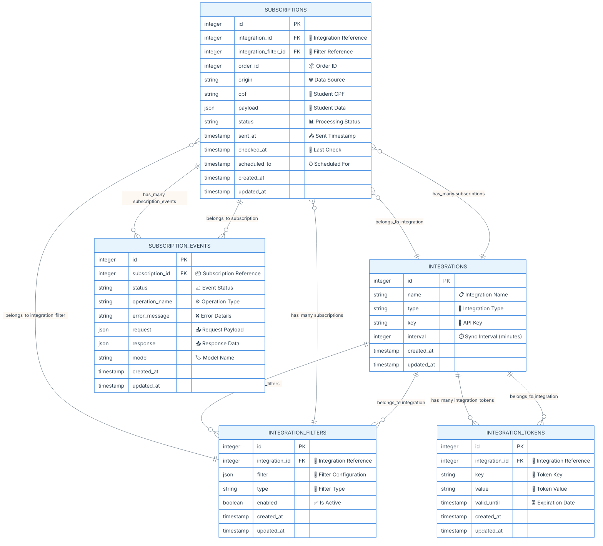

</details>

## Arquitetura do Projeto

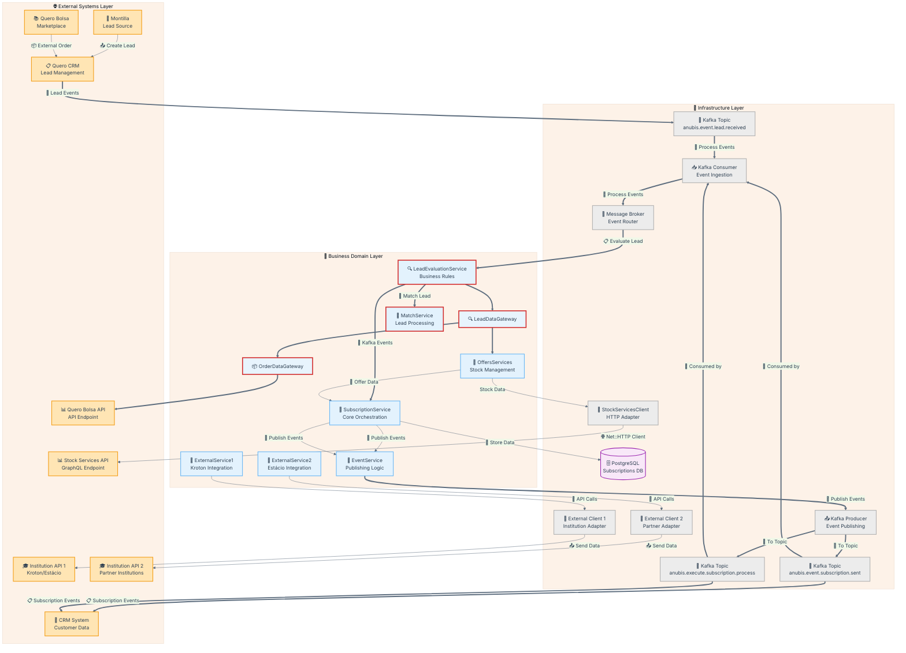

## 📚 Explicação da Arquitetura de Serviços

### 🎯 **Visão Geral da Arquitetura**

A arquitetura dos serviços segue o padrão de **3 camadas (3-Tier Architecture)** com responsabilidades bem definidas:

1. **📱 Presentation Layer**: Controllers que recebem requisições HTTP
2. **🎪 Business Logic Layer**: Serviços que implementam a lógica de negócio
3. **🔌 Data Access Layer**: Clientes que fazem interface com APIs externas

### 🔍 **Análise Detalhada por Serviço**

#### 1. 🔌 **StockServicesClient - Data Access Layer**

**Responsabilidades:**
- **🛡️ Resiliência**: Tratamento robusto de erros (GraphQL, HTTP, parsing, conectividade) e timeouts configuráveis

**Fluxo de Dados:**

<details>
<summary>📊 Sequence Diagram - StockServicesClient Flow</summary>

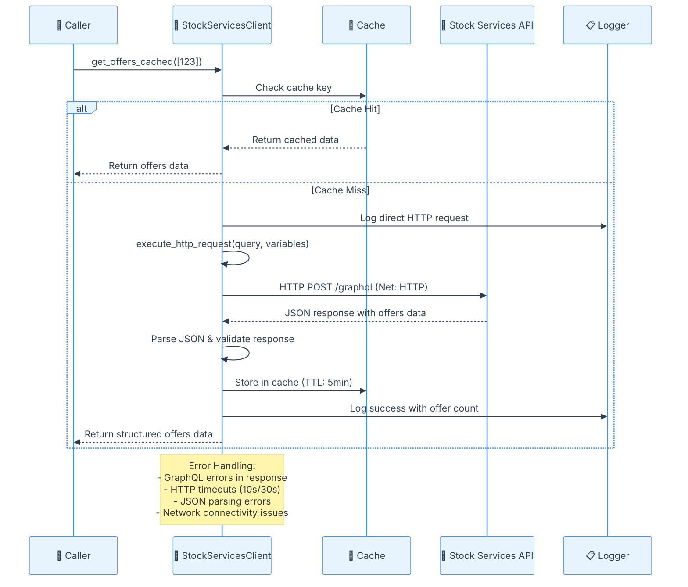

</details>

**Características Técnicas:**

- **🔄 Singleton Pattern**: Uma instância por aplicação
- **🌐 Direct HTTP**: Implementação com Net::HTTP (Ruby standard library)
- **⏱️ Timeout Configuration**: Controle granular de timeouts (open: 10s, read: 30s)
- **🔐 Security Headers**: User-Agent e headers de proteção CSRF
- **📊 Monitoring**: Logs estruturados para observabilidade
- **🌍 Environment-aware**: URLs dinâmicas baseadas no ambiente Rails
- **🛡️ Robust Error Handling**: Exceções customizadas para erros de GraphQL, HTTP, parsing e conectividade
- **📦 Contract Compliance**: Busca todos os campos necessários para SubscriptionPayload

#### 2. 🎪 **OffersServices - Business Logic Layer**

**Responsabilidades:**

- **🎯 Propósito**: Orquestração da lógica de negócio para ofertas, garantindo o mapeamento fiel ao contrato SubscriptionPayload
- **🔧 Padrão**: Service Object com injeção de dependência testável (StockServicesClient, SchemaValidator)
- **✅ Validação**: Validação rigorosa de entrada, regras de negócio e schema do payload (JSON Schema)
- **🏗️ Transformação**: Mapeamento estruturado dos dados, conversão camelCase para snake_case, enriquecimento de metadados
- **📊 Batch Processing**: Suporte a processamento em lote de até 100 ofertas
- **🛡️ Error Handling**: Exceções customizadas para erros de argumento, schema, campos obrigatórios e integração

**Interface Pública:**
```ruby
# Busca e valida uma oferta individual
fetch_offer(offer_id) -> Hash (snake_case)

# Busca e valida múltiplas ofertas (até 100)
fetch_offers(offer_ids) -> Array[Hash] (snake_case)
```

**Schema da Offer (snake_case, SubscriptionPayload):**

<details>
<summary>📊 Schema da Offer (snake_case, SubscriptionPayload)</summary>

```ruby
{
  id: Integer,
  uuid: String,
  discount_percentage: Float,
  offered_price: Float,
  metadata: Hash,
  created_at: DateTime,
  updated_at: DateTime,
  course: {
    id: Integer,
    name: String,
    level: String,
    kind: String,
    shift: String,
    campus: {
      id: Integer,
      name: String,
      city: String,
      state: String,
      address: String,
      address_adjunct: String,
      address_number: String,
      neighborhood: String,
      zipcode: String
    },
    university: {
      id: Integer,
      education_group_id: Integer
    },
    university_offer: {
      id: Integer,
      enrollment_semester: String,
      stock_type: String,
      full_price: Float
    }
  }
}
```

</details>


**Fluxo de Processamento:**

<details>
<summary>📊 Sequence Diagram - OffersServices Processing Flow</summary>

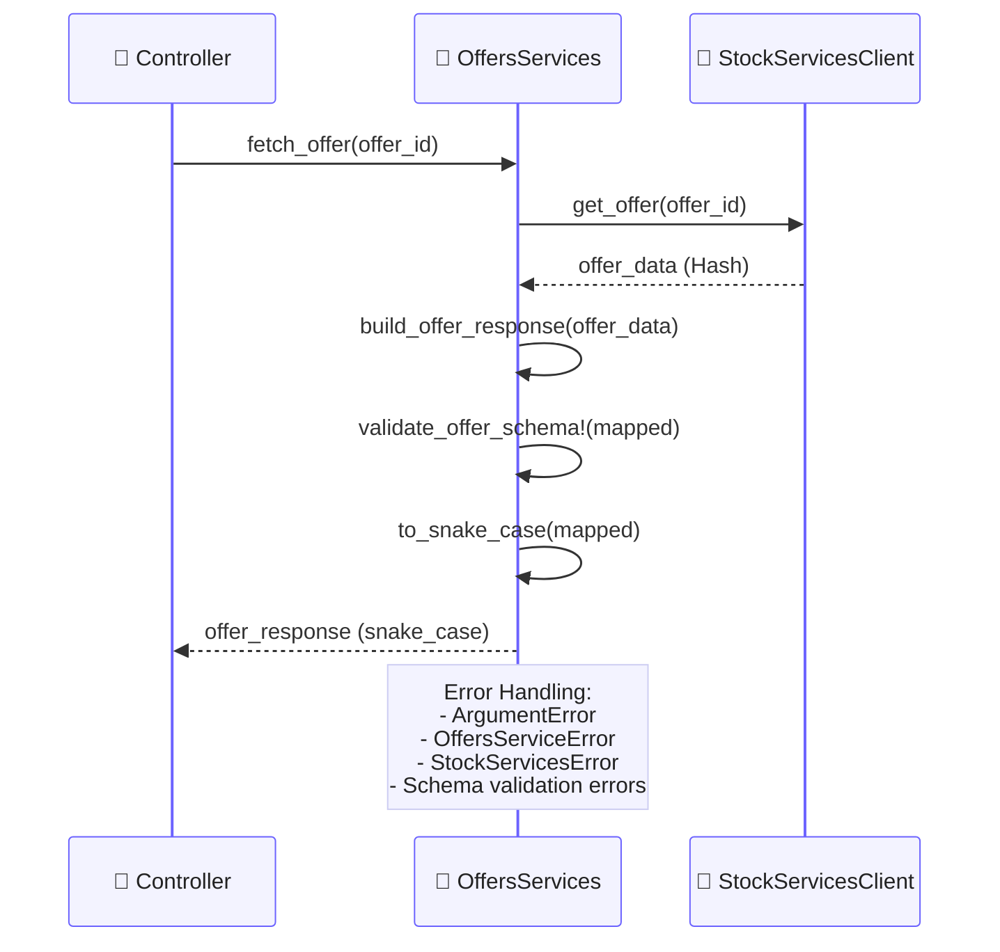

</details>

**Características Técnicas:**

**🔧 Dependency Injection**: StockServicesClient e SchemaValidator injetados para testabilidade
**📊 Data Transformation**: Mapeamento fiel ao contrato SubscriptionPayload, conversão camelCase para snake_case
**🛡️ Validation**: Validação multi-nível (argumentos, campos obrigatórios, schema JSON)
**📋 Error Handling**: Exceções customizadas para erros de argumento, schema, campos obrigatórios e integração
**📦 Batch Processing**: Suporte a até 100 ofertas por requisição
**📊 Structured Logging**: Logs detalhados com contexto e emojis
**🧪 Testability**: Fácil substituição de dependências para testes

#### 3. 📨 **EventService - Business Logic Layer**

**Responsabilidades:**

- **🎯 Propósito**: Publicação de eventos para sistemas externos via Kafka
- **🔧 Padrão**: Service Object com injeção de dependência testável
- **📋 Estruturação**: Padronização de formato de eventos com versionamento
- **🔑 Partitioning**: Estratégia de chaveamento por `subscription_id`
- **🎪 Topic Management**: Gestão centralizada de tópicos Kafka
- **✅ Payload Validation**: Validação rigorosa de estrutura e campos obrigatórios

**Interface Pública:**
```ruby
# Publica evento de inscrição enviada
event_subscription_sent(payload) -> String (event_id)

# Futuro: evento de inscrição com falha
event_subscription_failed(payload) -> String (event_id)
```

**Tópicos Kafka:**
```ruby
TOPICS = {
  subscription_sent: "anubis.event.subscription.sent"
}.freeze
```

**Fluxo de Eventos:**

<details>
<summary>📊 Sequence Diagram - EventService Flow</summary>

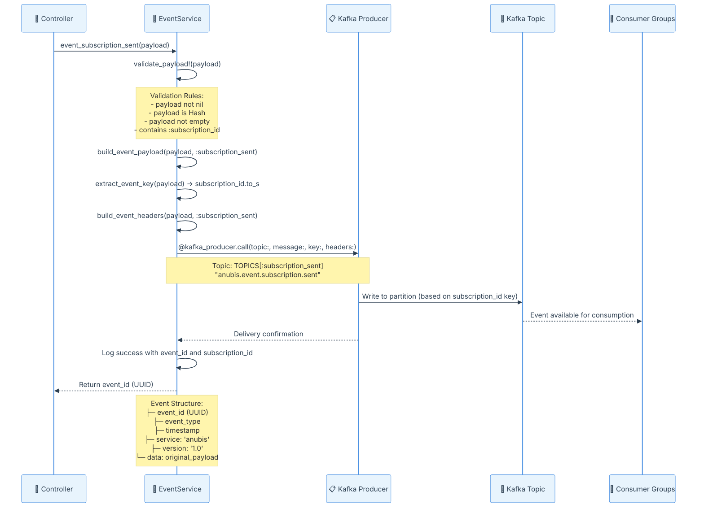

</details>

**Características Técnicas:**

- **🔑 Event Sourcing**: Padrão de eventos imutáveis com UUID
- **📋 Schema Evolution**: Versionamento de eventos ("1.0") e estrutura padronizada
- **🎯 Partitioning Strategy**: Chaveamento por `subscription_id.to_s`
- **🛡️ Error Handling**: 2 níveis (ArgumentError re-raise, outros wrapping em EventServiceError)
- **📊 Topic Management**: Constantes centralizadas (TOPICS hash)
- **🔧 Dependency Injection**: Kafka::ProducerService injetável para testes
- **✅ Comprehensive Validation**: 4 níveis de validação de payload
- **📈 Enhanced Headers**: Headers estruturados com metadados do evento


#### 4. 🧠 LeadEvaluationService - Business Logic Layer

**Responsabilidades:**
- Recebe eventos de lead do Kafka.
- Valida o schema do lead usando o SchemaValidator.
- Orquestra o fluxo de avaliação e criação de subscription.
- Chama o MatchService para encontrar filtros compatíveis.
- Cria a subscription e publica eventos conforme regras de negócio.

**Interface Pública:**
```ruby
process(lead_data) -> Subscription | nil
```

**Fluxo de Processamento:**
<details>
<summary>📊 Sequence Diagram - LeadEvaluationService Flow</summary>

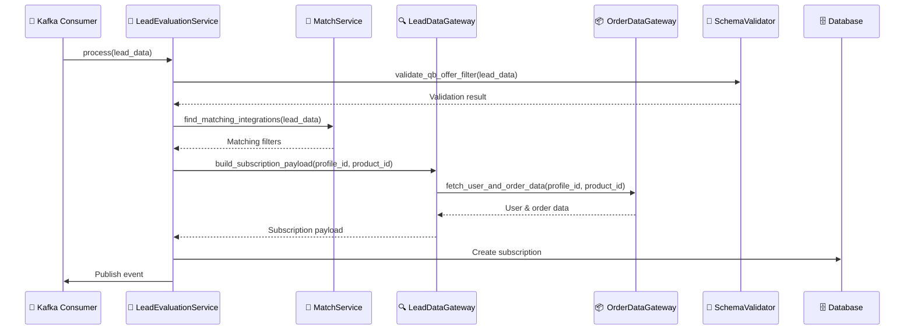

</details>

**Características Técnicas:**
- Utiliza Dependency Injection para MatchService e LeadDataGateway.
- Lida com erros de validação e publicação.
- Logging estruturado para cada etapa do processamento.

#### 5. 🎯 MatchService - Business Logic Layer

**Responsabilidades:**
- Recebe dados do lead e busca filtros ativos compatíveis.
- Realiza matching conforme regras do schema do filtro.
- Retorna lista de filtros compatíveis para avaliação.

**Interface Pública:**
```ruby
find_matching_integrations(subscription_payload) -> Array<Integration>
```

**Fluxo de Processamento:**
<details>
<summary>📊 Sequence Diagram - MatchService Flow</summary>

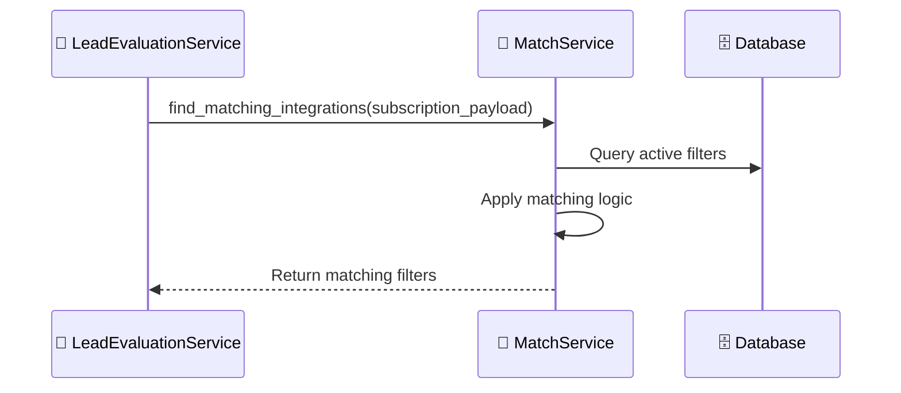

</details>

**Características Técnicas:**
- Algoritmo de matching configurável.
- Suporte a múltiplos tipos de filtro.
- Logging detalhado de resultados e critérios.

#### 6. 🔍 LeadDataGateway - Data Access Layer

**Responsabilidades:**
- Monta o payload da subscription a partir dos dados do lead.
- Realiza enriquecimento dos dados usando serviços externos (ex: StockServicesClient).
- Prepara dados para persistência e publicação.

**Interface Pública:**
```ruby
build_subscription_payload(profile_id, product_id) -> Hash
```

**Fluxo de Processamento:**
<details>
<summary>📊 Sequence Diagram - LeadDataGateway Flow</summary>

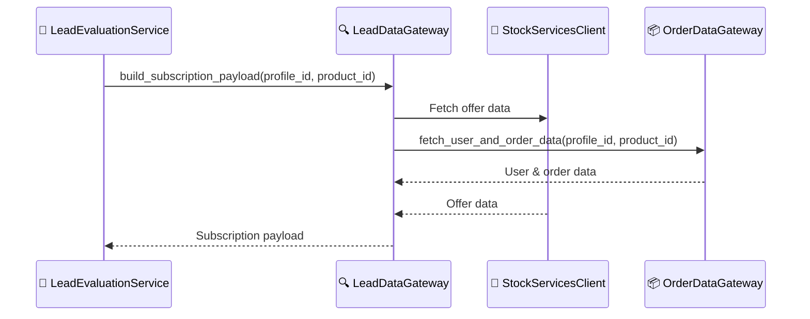

</details>

**Características Técnicas:**
- Integração com StockServicesClient e OrderDataGateway.
- Estrutura flexível para diferentes tipos de subscription.

#### 7. 📦 OrderDataGateway - Data Access Layer

**Responsabilidades:**
- Busca dados de pedidos e usuários relacionados ao lead.
- Integra com APIs externas para enriquecimento de dados.

**Interface Pública:**
```ruby
fetch_user_and_order_data(profile_id, product_id) -> Hash
```

**Fluxo de Processamento:**
<details>
<summary>📊 Sequence Diagram - OrderDataGateway Flow</summary>

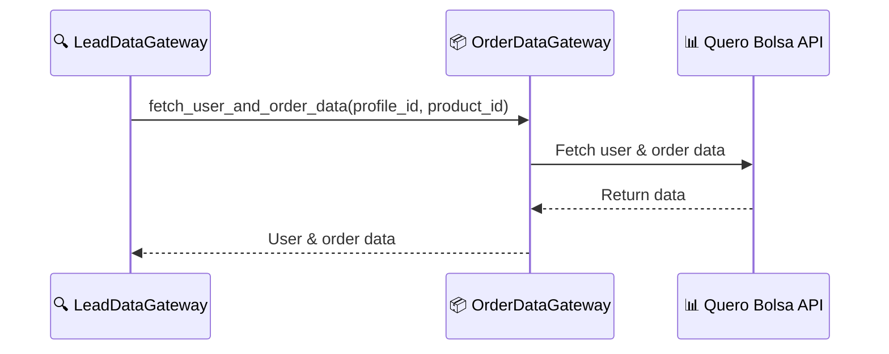

</details>

**Características Técnicas:**
- Implementação extensível para múltiplas fontes de dados.
- Tratamento de erros e timeouts.

#### 8. 🧩 SchemaValidator - Business Logic Layer

**Responsabilidades:**
- Valida schemas de filtros e payloads de lead.
- Utiliza a gem `json_schemer` para validação JSON Schema.

**Interface Pública:**
```ruby
validate_qb_offer_filter(filter_data) -> { valid: Boolean, errors: Array }
```

**Fluxo de Processamento:**
<details>
<summary>📊 Sequence Diagram - SchemaValidator Flow</summary>

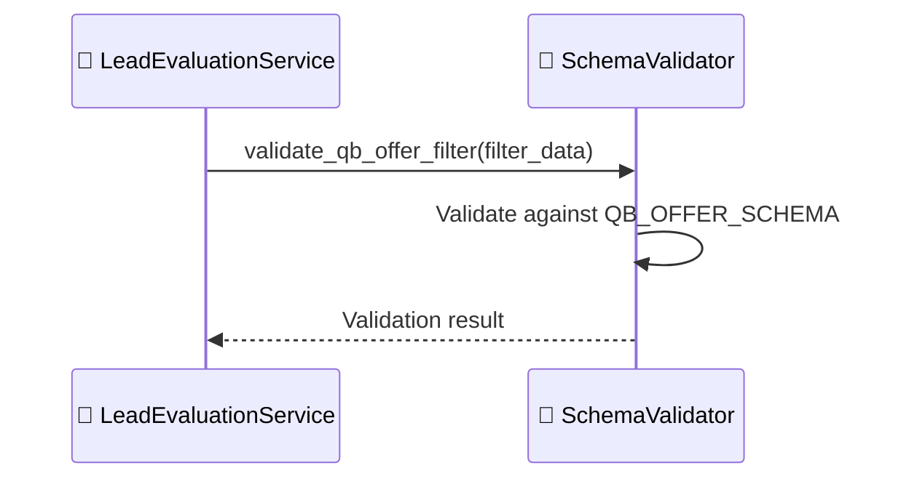

</details>

**Características Técnicas:**
- Centraliza lógica de validação de schema.
- Retorna erros detalhados para troubleshooting.
### 🔄 **Padrões Arquiteturais Implementados**

#### 1. **🏗️ Layered Architecture (Arquitetura em Camadas)**

- **Presentation**: Controllers HTTP
- **Business Logic**: Services (OffersServices, EventService)
- **Data Access**: Clients (StockServicesClient)

#### 2. **🔧 Dependency Injection**
```ruby
# Permite fácil substituição para testes
offers_service = OffersServices.new(stock_client: mock_client)
event_service = EventService.new(kafka_producer: mock_kafka_producer)

# Exemplo de uso em produção
offers_service = OffersServices.new  # usa StockServicesClient.instance por padrão
event_service = EventService.new     # usa Kafka::ProducerService por padrão

# Uso dos serviços
single_offer = offers_service.get_offer(123)
batch_offers = offers_service.get_multiple_offers([123, 456, 789])
event_id = event_service.event_subscription_sent({ subscription_id: 123, status: 'sent' })
```

#### 3. **⏱️ Timeout Management Pattern**
```ruby
# Controle granular de timeouts para resiliência
http.open_timeout = 10    # Connection timeout
http.read_timeout = 30    # Read timeout
```

#### 4. **💾 Cache-Aside Pattern**
```ruby
# Cache inteligente com TTL
Rails.cache.fetch(cache_key, expires_in: 5.minutes) do
  expensive_api_call
end
```

#### 5. **📋 Publisher-Subscriber Pattern**
```ruby
# Publicação assíncrona de eventos com estrutura padronizada
@kafka_producer.call(
  topic: TOPICS[:subscription_sent],
  message: {
    event_id: SecureRandom.uuid,
    event_type: "subscription_sent",
    timestamp: Time.current.iso8601,
    service: "anubis",
    version: "1.0",
    data: payload
  },
  key: payload[:subscription_id].to_s,
  headers: { "event_type" => "subscription_sent", "service" => "anubis" }
)
```

#### 6. 🧩 Exemplos de Aplicação dos Padrões nos Novos Serviços

Os novos serviços introduzidos seguem os mesmos padrões arquiteturais já adotados no projeto, reforçando a separação de responsabilidades, testabilidade e extensibilidade.

##### a) Layered Architecture
- **Presentation**: Controllers HTTP
- **Business Logic**: Services (OffersServices, EventService, LeadEvaluationService, MatchService, SchemaValidator)
- **Data Access**: Clients/Gateways (StockServicesClient, LeadDataGateway, OrderDataGateway)

##### b) Dependency Injection
```ruby
# Exemplo de uso com os novos serviços

# LeadEvaluationService recebe MatchService e LeadDataGateway via DI
lead_evaluation_service = LeadEvaluationService.new(
  match_service: MatchService.new,
  data_gateway: LeadDataGateway.new
)

# LeadDataGateway pode receber OrderDataGateway via DI
lead_data_gateway = LeadDataGateway.new(order_gateway: OrderDataGateway.new)

# SchemaValidator pode ser usado isoladamente ou injetado
schema_validator = SchemaValidator.new

offers_service = OffersServices.new(stock_client: StockServicesClient.instance)

# Busca e valida uma oferta individual
single_offer = offers_service.get_offer(123)

# Busca e valida múltiplas ofertas (até 100)
batch_offers = offers_service.get_multiple_offers([123, 456, 789])

# Uso dos demais serviços
result = lead_evaluation_service.process(lead_data)
matching_filters = match_service.find_matching_integrations(subscription_payload)
payload = lead_data_gateway.build_subscription_payload(profile_id, product_id)
order_data = order_data_gateway.fetch_user_and_order_data(profile_id, product_id)
validation = schema_validator.validate_qb_offer_filter(filter_data)
```

##### c) Observações
- A Dependency Injection está presente em todos os serviços, facilitando testes e extensibilidade.
- A arquitetura em camadas permanece consistente, com separação clara entre lógica de negócio e acesso a dados.

### 🎯 **Benefícios da Arquitetura**

1. **🔧 Separation of Concerns**: Cada camada tem responsabilidade específica
2. **🧪 Testability**: Injeção de dependência facilita testes unitários
3. **📈 Scalability**: Serviços podem ser escalados independentemente
4. **🛡️ Reliability**: Múltiplas camadas de tratamento de erro
5. **📊 Observability**: Logging estruturado em todas as camadas
6. **🔄 Maintainability**: Código organizado e padrões consistentes
7. **⚡ Performance**: Cache inteligente e connection pooling

---


## 🔗 Endpoint: Consulta de Dados de Pedido e Usuário (Anubis Subscription Payload)

### Descrição
Novo endpoint REST em quero_bolsa para integração do payload de assinatura do Anubis. Permite consultar dados completos de um pedido e seu usuário associado, conforme contrato de integração.

**Rota:**
`GET /api/qb/v1/orders/:order_id/user_data`


<details>
<summary><strong>Exemplo de Retorno JSON</strong></summary>

```json
{
  "order": {
    "id": 123,
    "created_at": "2025-10-24T12:34:56Z",
    "updated_at": "2025-10-24T12:35:00Z",
    "checkout_step": "completed",
    "price": 199.90,
    "user": {
      "id": 456,
      "cpf": "123.456.789-00",
      "email": "aluno@exemplo.com",
      "phone_number": "+55 11 91234-5678",
      "gender": "M",
      "birth_date": "2000-01-01",
      "full_name": "Aluno Exemplo",
      "rg": "12.345.678-9",
      "last_enem_score": 750,
      "last_enem_year": 2024,
      "address": {
        "zipcode": "01234-567",
        "address": "Rua Exemplo",
        "address_number": "123",
        "neighborhood": "Centro",
        "city": "São Paulo",
        "state": "SP"
      }
    }
  }
}
```
</details>

**Tratamento de Erros:**
- Pedido não encontrado: HTTP 404
- Usuário ausente: campo `user` retorna `null`
- Endereço ausente: campo `address` retorna `null`


<details>
<summary><strong>Diagrama de Sequência (Mermaid)</strong></summary>

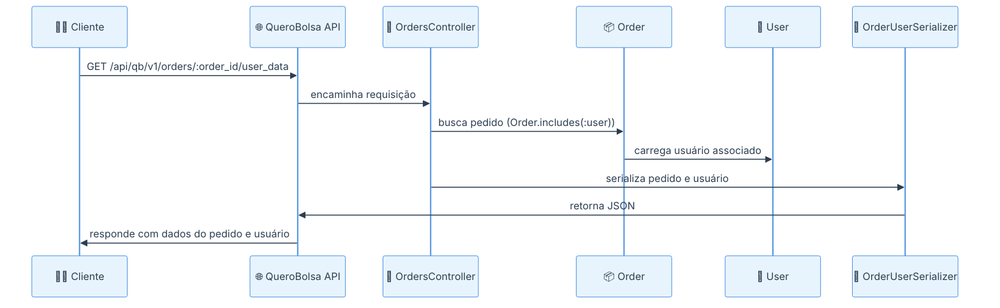
</details>

---

## 📚 Referências

Esta seção contém links para documentações técnicas detalhadas e guias de implementação relacionados ao projeto Anubis:

### 🔧 **Documentação Técnica**

- **[📊 Kafka Implementation Guide](../docs/kafka-implementation-guide.md)** - Guia completo de implementação Kafka
- **[🌐 Quero Deals](../docs/quero-deals.md)** - Documentação do sistema Quero Deals

### 💻 **Base do Código Existente**

- **[🔗 Projeto Anubis - GitHub](https://github.com/quero-edu/anubis)** - Repositório oficial do microserviço Anubis com estrutura Rails completa

### 🏢 **Integrações com Instituições**

- **[🎓 Estácio Lead Integration](https://github.com/quero-edu/estacio-lead-integration)** - Guia de integração com API da Estácio
- **[🎓 Kroton Lead Integration](https://github.com/quero-edu/kroton-lead-integration/blob/master/__docs__/kroton-lead-integration.md)** - Guia de integração com API da Kroton

### 📖 **Como Usar as Referências**

Estas documentações fornecem:

- **🔍 Detalhes de Implementação**: Especificações técnicas e exemplos de código
- **🔧 Guias de Configuração**: Configurações necessárias para cada integração
- **📊 Diagramas e Fluxos**: Visualizações detalhadas dos processos
- **🛡️ Tratamento de Erros**: Estratégias de resiliência e recuperação
- **🧪 Exemplos de Teste**: Cenários de teste e validação

> **💡 Dica**: Use estas referências como complemento a este documento principal para obter informações mais específicas sobre implementações e integrações.