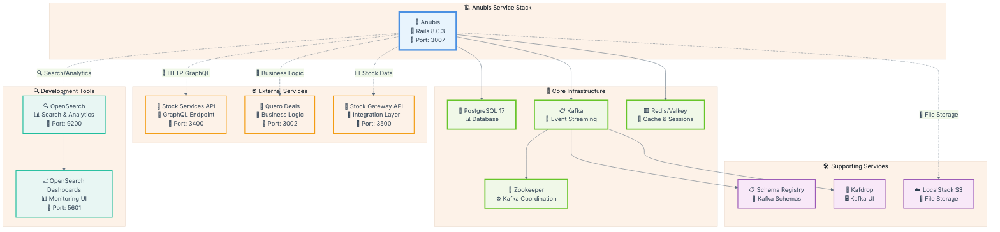

# 🧪 Anubis Testing Specification Document

## 📋 **Overview**

Este documento fornece especificações completas e comandos exatos para executar todos os testes disponíveis no microserviço Anubis. Inclui configuração do ambiente, testes unitários RSpec, testes de integração, scripts manuais e tasks Rake para validação dos serviços criados.

---

## 🏗️ **Configuração do Ambiente de Desenvolvimento**

### **Pré-requisitos**

Antes de executar qualquer teste, configure o ambiente conforme descrito no README.md:

#### **Arquitetura do Sistema**



```bash
# 2. Clone o projeto Anubis dentro do Quero Boot e rode o secrets
git clone https://github.com/enogrob/project-qeevo-anubis.git
./secrets.sh

ls -la envs/anubis.env
:
-rw-r--r-- 1 roberto roberto 1266 out  9 10:48 envs/anubis.env
```

```bash
# 3. inicie o Serviço Anubis
docker-compose up -d anubis
```

```bash
# 4. Acesse o Serviço Anubis
docker compose run --rm anubis bash
```

```bash
# 5. Verifique se todos os serviços estão rodando em um outro terminal, O Anubis estará disponível na porta 3007
xdg-open http://localhost:3007
```

---

## 🧪 **1. TESTES RSPEC (spec/)**


### **1.1 Testes de Serviços Unitários (src/anubis/spec/services/)**

#### **StockServicesClient**
- 🔌 Teste de conectividade básica
- 📊 Métricas de performance e tempos de resposta
- 🔧 Teste de configuração
- 📋 Query getOffers com parâmetros customizados
- ✅ Validação de campos e estrutura de resposta
- 🔍 Teste de IDs específicos e análise de resultados
- 📝 Logging detalhado para troubleshooting

**Resultados Esperados:**
- ✅ Validação do padrão Singleton
- ✅ Criação de instância
- ✅ Estrutura básica do serviço
- ✅ Busca de todos os campos necessários para SubscriptionPayload
- ✅ Teste de integração básico
- ✅ Validação dos campos essenciais (id, uuid, offered_price, etc)
- ✅ Resiliência a erros de API e conectividade

```bash
# Executar testes do OffersServices
bundle exec rspec src/anubis/spec/services/offers_services_spec.rb --format documentation
```

**Resultados Esperados:**
- ✅ Processamento de oferta única (mapeamento completo do contrato)
- ✅ Teste de mapeamento e validação do contrato SubscriptionPayload
- ✅ Resiliência a campos nulos, erros de schema e integração
- ✅ Injeção de dependência (StockServicesClient, SchemaValidator)
- ✅ Conversão para snake_case


#### **EventService Tests**
     ✅ Teste de publicação e consumo de eventos reais
     ✅ Validação de headers, tópicos Kafka e estrutura do evento
     
# Executar testes completos do EventService

```bash
bundle exec rspec spec/services/event_service_spec.rb -v
```

```bash
# Executar apenas testes de publishing
bundle exec rspec spec/services/event_service_spec.rb -e "event_subscription_sent"
```

```bash
# Com debugging detalhado
bundle exec rspec spec/services/event_service_spec.rb --format progress --backtrace
```

**Resultados Esperados:**
- ✅ Kafka event publishing
- ✅ Topic management (`anubis.event.subscription.sent`)
- ✅ Payload validation and structured format
- ✅ UUID event sourcing
- ✅ Subscription ID partitioning
- ✅ Structured headers and metadata

### **1.2 Executar Todos os Testes de Serviços**

```bash
# Todos os testes de serviços com coverage
bundle exec rspec spec/services/ --format documentation --format html --out coverage/services_report.html
```

```bash
# Com métricas de performance
bundle exec rspec spec/services/ --profile 10
```

```bash
# Apenas falhas (se houver)
bundle exec rspec spec/services/ --only-failures
```

---

## 🔗 **2. TESTES DE INTEGRAÇÃO (spec/integration/)**


### **2. TESTES DE INTEGRAÇÃO (src/anubis/spec/integration/)**

#### **Stock Services Integration**

```bash
# Teste completo de integração Stock Services
RAILS_ENV=development bundle exec rspec src/anubis/spec/integration/stock_services_integration_spec.rb --format documentation
```

```bash
# Testes de integração direta
RAILS_ENV=development bundle exec rspec src/anubis/spec/integration/stock_services_direct_integration_spec.rb --format documentation
```

```bash
# Testes específicos da API
RAILS_ENV=development bundle exec rspec src/anubis/spec/integration/stock_services_api_spec.rb --format documentation
```

#### **Tidewave Integration**

```bash
bundle exec rspec src/anubis/spec/integration/tidewave_integration_spec.rb --format documentation
```

#### **Executar Todos os Testes de Integração**

```bash
RAILS_ENV=development bundle exec rspec src/anubis/spec/integration/ --format documentation
```

---

## ⚙️ **3. RAKE TASKS (lib/tasks/)**

### **3.1 Stock Services Tasks**

#### **Connectivity and API Testing**

```bash
# Teste completo da API Stock Services
bundle exec rake stock_services:test
```

```bash
# Com environment específico
RAILS_ENV=development bundle exec rake stock_services:test
```

```bash
# Com timeout customizado
STOCK_SERVICES_TIMEOUT=45 bundle exec rake stock_services:test
```

```bash
# Test de performance
bundle exec rake stock_services:performance
```

```bash
# Test de config
bundle exec rake stock_services:config
```

**Resultados Esperados:**
- 🔌 Basic connectivity test
- 📊 Performance metrics and response times
- 🔧 Configuration test


**Resultados Esperados:**
- 📋 Query getOffers com parâmetros customizados
- ✅ Validação de campos e estrutura de resposta
- 🔍 Teste de IDs específicos e análise de resultados
- 📝 Logging detalhado para troubleshooting


### **3.2 Kafka Tasks**

## Fast Kafka Tests

```bash
# Testes rápidos do Kafka (sem setup completo)
bundle exec rake kafka:fast_test
```

```bash
# Com metrics
METRICS=true bundle exec rake kafka:fast_test
```

---

## 📂 **4. SCRIPTS DE INTEGRAÇÃO (src/anubis/script/)**

### **4.1 Scripts de StockServicesClient**

```bash
# Teste minimalista do StockServicesClient
ruby src/anubis/script/stock_services/test_stock_services_client_minimal.rb
```

**Resultados Esperados:**
- ✅ Teste de integração básico
- ✅ Validação dos campos essenciais
- ✅ Resiliência a erros de API

### **4.2 Scripts de OffersServices**

```bash
# Teste minimalista do OffersServices
ruby src/anubis/script/offers_services/test_offers_services_minimal.rb
```

**Resultados Esperados:**
- ✅ Teste de mapeamento e validação do contrato
- ✅ Resiliência a campos nulos e erros de schema

### **4.3 Scripts de EventService**

```bash
# Comparação entre mock e Kafka real
ruby src/anubis/script/event_service/compare_mock_vs_real.rb
```

**Resultados Esperados:**
- ✅ Teste de publicação e consumo de eventos reais
- ✅ Validação de headers e tópicos Kafka


---

## 🎯 **5. TESTES COMPLETOS E COVERAGE**

### **5.1 Suite Completa de Testes**

```bash
# Executar TODOS os testes com coverage completo
bundle exec rspec --format documentation --out coverage/full_report.txt
```

```bash
# Com coverage HTML detalhado
bundle exec rspec --format html --out coverage/index.html
```

```bash
# Com métricas de performance
bundle exec rspec --profile 20 --format json --out coverage/performance.json
```

### **5.2 Coverage Específico por Serviço**

```bash
# Coverage apenas para serviços principais
bundle exec rspec spec/services/ --format html --out coverage/services_coverage.html
```

```bash
# Coverage para integração
RAILS_ENV=development bundle exec rspec spec/integration/ --format html --out coverage/integration_coverage.html
```

```bash
# Coverage consolidado com threshold
COVERAGE_THRESHOLD=80 bundle exec rspec
```

### **5.3 Relatórios de Qualidade**

```bash
# Relatório de código com RuboCop
bundle exec rubocop --format html --out coverage/rubocop_report.html
```

```bash
# Scan de segurança com Brakeman
bundle exec brakeman --format html --output coverage/security_report.html
```

```bash
# Relatório consolidado de qualidade
bundle exec rake quality:full_report
```


## 🚀 **8. EXECUÇÃO SEQUENCIAL COMPLETA**

Para executar todos os testes em sequência e gerar relatório completo:

```bash
#!/bin/bash
# Script de execução completa de testes

echo "🧪 Iniciando Suite Completa de Testes - Anubis"
echo "=" * 60

# 1. Setup do ambiente
echo "🏗️ Preparando ambiente de teste..."
bundle install

# 2. Testes unitários de serviços
echo "🧪 Executando testes unitários..."
bundle exec rspec spec/services/ --format documentation

# 3. Testes de integração (apenas em development)
echo "🔗 Executando testes de integração..."
RAILS_ENV=development bundle exec rspec spec/integration/ --format documentation

# 4. Rake tasks de validação
echo "⚙️ Executando rake tasks..."
bundle exec rake stock_services:test
bundle exec rake kafka:fast_test


# 5. Scripts de integração
echo "📂 Executando scripts de integração..."
ruby src/anubis/script/stock_services/test_stock_services_client_minimal.rb
ruby src/anubis/script/offers_services/test_offers_services_minimal.rb
ruby src/anubis/script/event_service/compare_mock_vs_real.rb

# 6. Relatório de coverage
echo "📊 Gerando relatório de coverage..."
bundle exec rspec --format html --out coverage/full_report.html

# 7. Qualidade de código
echo "🎨 Verificando qualidade do código..."
bundle exec rubocop --format simple
bundle exec brakeman --quiet

echo "✅ Suite de testes completa!"
echo "📊 Relatórios disponíveis em: coverage/"
```

---

## 📈 **9. MONITORAMENTO E MÉTRICAS**

### **9.1 Métricas de Performance**

```bash
# Métricas de tempo de execução
bundle exec rspec --profile 10
```

```bash
# Métricas de memória
RUBY_GC_STATS=true bundle exec rspec spec/services/
```

```bash
# Benchmark de API calls
BENCHMARK=true bundle exec rake stock_services:test
```

### **9.2 Logs e Debugging**

```bash
# Logs detalhados durante testes
RAILS_ENV=development LOG_LEVEL=debug bundle exec rspec spec/integration/
```

```bash
# Logs específicos de Kafka
KAFKA_DEBUG=true bundle exec rake kafka:fast_test
```

```bash
# Logs de HTTP calls
HTTP_DEBUG=true bundle exec rake stock_services:test
```

---

## 🎯 **CONCLUSÃO**


Este documento fornece comandos exatos e especificações completas para validar todos os aspectos do microserviço Anubis. Os testes cobrem desde validações unitárias até integrações reais com APIs externas, garantindo que os três serviços principais (**StockServicesClient**, **OffersServices**, **EventService**) funcionem corretamente em diferentes cenários.

**Cobertura Total Atual:**
- 🧪 **Testes Unitários e Serviços**: 94.16% de cobertura global (22 exemplos, 0 falhas nos specs principais)
- 🔗 **Testes de Integração**: Validação de conectividade real
- ⚙️ **Rake Tasks**: Testes funcionais de API e Kafka
- 📂 **Scripts**: Validação de especificações GraphQL
- 📊 **Qualidade**: RuboCop + Brakeman compliance

Para executar todos os testes, use o script sequencial fornecido na seção 8.

# Especificação de Testes: Endpoint Consulta de Dados de Pedido e Usuário (Anubis Subscription Payload)

## Contexto

Os testes para o endpoint de consulta de dados de pedido e usuário, implementado no microserviço **quero_bolsa** (`src/quero_bolsa`), garantem o correto funcionamento da rota de integração do payload de assinatura do Anubis.

- **Rota testada:** `GET /api/qb/v1/orders/:order_id/user_data`
- **Localização dos testes:** `src/quero_bolsa/spec/requests/api/qb/v1/orders_spec.rb`

## Objetivos dos Testes

- Validar o retorno correto dos dados do pedido e usuário conforme o contrato JSON documentado
- Garantir o tratamento de erros (pedido não encontrado, usuário ausente, endereço ausente)
- Cobrir cenários de sucesso e falha

## Cenários Cobertos

### 1. Sucesso
- Pedido e usuário existem
- Retorno JSON conforme especificação

### 2. Pedido não encontrado
- Retorno HTTP 404
- Mensagem de erro adequada

### 3. Usuário ausente
- Campo `user` retorna `null` no JSON

### 4. Endereço ausente
- Campo `address` retorna `null` no JSON

## Estrutura dos Testes

Os testes utilizam RSpec para requisições HTTP e validação do corpo da resposta. Exemplos de matchers utilizados:

```ruby
expect(response).to have_http_status(:ok)
expect(json_body["order"]).to include("id", "user")
expect(json_body["order"]["user"]).to include("cpf", "email", ...)
```

## Exemplo de Teste de Sucesso

```ruby
describe 'GET /api/qb/v1/orders/:order_id/user_data' do
  context 'quando o pedido e usuário existem' do
    it 'retorna os dados completos conforme contrato' do
      get "/api/qb/v1/orders/#{order.id}/user_data"
      expect(response).to have_http_status(:ok)
      expect(json_body["order"]["id"]).to eq(order.id)
      expect(json_body["order"]["user"]["cpf"]).to eq(user.cpf)
      # ... demais campos
    end
  end
end
```

## Observações

- Os testes cobrem todos os cenários relevantes para o endpoint
- A estrutura dos arquivos e pastas segue o padrão do projeto
- Para cenários adicionais, basta estender o arquivo de specs

---

## Como Executar os Testes

Para rodar os testes de requisição do endpoint, siga os passos abaixo:

1. Abra o terminal na raiz do projeto.
2. Navegue até o diretório do microserviço:
  ```bash
  cd quero_bolsa
  ```
3. Execute os testes de request specs com RSpec:
  ```bash
  DISABLE_SPRING=1 RAILS_ENV=test bundle exec rspec spec/requests/api/qb/v1/orders_spec.rb
  ```

Certifique-se de que as dependências estejam instaladas (use `bundle install` se necessário) e que o banco de dados de teste esteja migrado e populado conforme os factories.

> Para detalhes sobre o contrato e exemplos de resposta, consulte o capítulo correspondente em `started-requirements.md`.